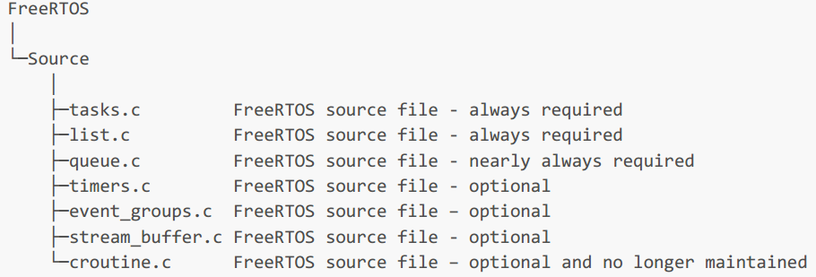
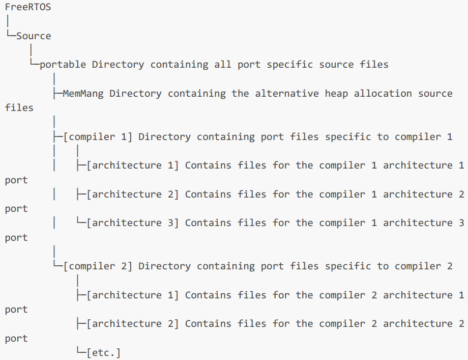

<center style="font-size: 36px; font-weight: bold;">Mastering the FreeRTOS™ Real Time Kernel</center>

本文档基于[Mastering-the-FreeRTOS-Real-Time-Kernel.v1.1.0.pdf](./Mastering-the-FreeRTOS-Real-Time-Kernel.v1.1.0.pdf)翻译

*==缩写表==*

| 缩写 |                    全称                     |       中文翻译        |
| :--: | :-----------------------------------------: | :-------------------: |
| ADC  |         Analog to Digital Converter         |    模拟数字转换器     |
| API  |      Application Programming Interface      |   应用程序编程接口    |
| DMA  |            Direct Memory Access             |     直接内存访问      |
| FAQ  |          Frequently Asked Question          |       常见问题        |
| FIFO |             First In First Out              |       先入先出        |
| HMI  |           Human Machine Interface           |       人机界面        |
| IDE  |     Integrated Development Environment      |     集成开发环境      |
| IRQ  |              Interrupt Request              |       中断请求        |
| ISR  |          Interrupt Service Routine          |     中断服务程序      |
| LCD  |           Liquid Crystal Display            |      液晶显示器       |
| MCU  |               Microcontroller               |       微控制器        |
| RMS  |          Rate Monotonic Scheduling          |     单调速率调度      |
| RTOS |         Real-time Operating System          |     实时操作系统      |
| SIL  |           Safety Integrity Level            |    完全完整性等级     |
| SPI  |         Serial Peripheral Interface         |     串行外设接口      |
| TCB  |             Task Control Block              |     任务控制模块      |
| UART | Universal Asynchronous Receiver/Transmitter | 通用异步接收器/发送器 |

[TOC]
# 前言

## 小型嵌入式系统中的多任务处理

### 关于FreeRTOS内核

FreeRTOS是C库的集合，由实时内核和一组实现互补功能的模块化库组成。Richard Barry最初于2003年左右开发了FreeRTOS，其公司Real-Time Engineers Ltd 与世界先进的芯片格式密密切合作，继续开发FreeRTOS。直到Web Services (AWS)于2016年接管FreeRTOS，Richard现作为AWS IoT团队的高级首席工程师继续从事FreeRTOS工作。 FreeRTOS 是基于MIT许可的开源代码，可用于任何目的，不需要成为AWS客户即可从AWS管理中收益。

FreeRTOS内核非常适合在微控制器或小型微处理器上运行的深度嵌入式应用程序。此类应用通常混合了软硬件实时要求。

软实时要求规定了一个时间期限——但超期并不会导致系统无用。例如，对按键的响应速度太慢可能让系统看上去迟钝，但实际上还不至于无法使用。

FreeRTOS内核是一个实时内核(或实时调度程序)，基于该内核构建的应用程序能够满足其硬实时要求。例如，在只有一个核心的处理器上，任何时候只能执行一个线程。内核通过检查应用程序设计者分配给每个线程的优先级来决定执行哪个线程。简单来说，应用程序设计者为硬实时要求高的线程分配较高优先级，为软实时要求高的线程分配较低优先级。这种方式分配优先级可以确保硬实时线程始终先于软实时线程执行，但优先级分配决策并非总是如此简单。
不用担心不理解上一段的概念。以下章节提供了详细的解释和示例，用于帮助了解如何使用实时内核，尤其是
FreeRTOS。

### 价值主张

FreeRTOS 内核在全球范围内取得的空前成功源自其引人注目的价值主张； FreeRTOS 是专业开发的，严格的质量控制，强大，受支持，不包含任何知识产权所有权模糊性，并且真正免费在商业应用程序中使用，无需公开您
的专有源代码。此外，AWS 的管理职责还提供全球影响力、专家安全事件响应程序、庞大且多元化的开发团队、形式验证、笔测试、内存安全证明和长期支持方面的专业知识，同时保持 FreeRTOS 作为硬件、开发工具和云服务中立的开源项目。 FreeRTOS 开发在 GitHub 中是透明且由社区驱动的，不需要任何特殊工具或开发实践。

您可以使用 FreeRTOS 将产品推向市场，甚至无需告诉我们，更不用说支付任何费用，成千上万的公司就是这么做的。如果您随时希望获得额外的备份，或者您的法律团队需要额外的书面保证或赔偿，那么我们的战略合作伙伴可以提供简单的低成本商业许可选项。当您知道您可以随时选择走商业路线时，您就可以安心无忧。

### 关于术语的解释

在FreeRTOS中，每个执行线程成为"任务"。嵌入式社区内的术语没有达成共识，但我更喜欢“任务”而不是“线
程”，因为线程在某些应用领域可以有更具体的含义。

### 为什么使用RTOS?

有许多成熟的技巧可用于编写高质量的嵌入式软件，而无需使用多线程内核。如果正在开发的系统较为简单，那么这些技巧可能会提供最合适的解决方案。在更复杂的场景中，使用内核可能更为合适，但具体的适用范围始终是主观的。

如前所述，任务优先级可以帮助确保应用程序满足其处理期限，但内核还可以带来其他不太明显的好处。下面简
要列出了其中一些。

* 抽象出计时信息
  * RTOS负责执行计时并向应用程序提供与时间相关的API。这使得应用程序代码的结构更加简单，并且整体代码大小更小。
* 可维护性和可扩展性
  * 忽略时间细节会使模块之间的相互依赖关系减少，并使软件能够以可控且可预测的方式进行发展。此外，内核负责处理时间问题，因此应用程序的性能对底层硬件的变化的敏感度会降低。
* 模块化
  * 任务是互相独立的模块，每个模块都应有明确用途。
* 团队发展
  * 任务还应该具有明确定义的接口，以便更轻松地进行团队开发。
* 易测试
  * 具有清晰接口的明确定义的独立模块的任务更容易单独测试。
* 代码复用
  * 具有更高模块化和更少相互依赖性的代码设计更容易重用
* 提高效率
  * 使用实时操作系统（RTOS）的应用程序代码可以完全实现事件驱动模式。无需因等待尚未发生的事件而浪费处理时间。
  * 与基于事件驱动所带来的效率相比，需要处理实时操作系统（RTOS）的时钟中断以及实现任务之间的切换执行是一个难题。然而，那些不使用RTOS的应用程序通常还是会包含某种形式的时钟中断。
* 空闲时间
  * 自动生成的空闲任务在没有需要处理的应用程序任务时执行。 空闲任务可以衡量剩余的处理能力，执行后台检查，或将处理器置于低功耗模式。
* 能耗管理
  * 采用实时操作系统（RTOS）所带来的效率提升，使得处理器能够花费更多时间处于低功耗模式。
  * 通过在每次空闲任务运行时将处理器置于低功耗状态，可以显著降低功耗。FreeRTOS还拥有一种特殊的无滴答模式。采用无滴答模式可以使处理器进入比通常情况下更低的功耗模式，并能在低功耗模式下保持更长时间
* 灵活的中断处理
  * 通过将处理工作推迟至由应用程序编写者创建的任务或者由实时操作系统自动创建的守护进程任务（也称为定时任务）中，中断处理程序可以被设计得非常简短。
* 混合处理需求
  * 简单的设计模式能够在应用程序中实现周期性、连续性和事件驱动处理方式的结合。此外，通过选择适当的任务和中断优先级，可以满足硬实时和软实时需求。

### FreeRTOS内核特性

FreeRTOS内核具有以下标准特性：

1. 预先抢占式或协作式运行
2. 可选时间切片
3. 非常灵活的任务优先级分配
4. 灵活、快速且轻量级任务通知机制
5. 队列
6. 二进制信号量
7. 信号量计数
8. 互斥锁
9. 递归互斥锁
10. 软件计时器
11. 事件组
12. 流缓冲区
13. 消息缓冲区
14. ~~协程(弃用)~~
15. 钩子函数
16. 空闲钩子函数
17. 栈溢出检查
18. 跟踪宏
19. 任务运行事件统计手机
20. 可选的商业许可与支持
21. 完整中断嵌套模型(针对某些架构)
22. 适用于极低功耗应用的无滴答功能(针对某些架构)
23. 内存保护单元(Memory Protection Unit, MPU)支持以隔离任务并提高程序安全性(针对某些架构)
24. 适当时候软件管理中断堆栈(有助于节省RAM)
25. 使用静态或动态分配的内存创建实时操作系统（RTOS）对象的能力

### FreeRTOS、OpenRTOS和SafeRTOS系列许可

FreeRTOS的MIT开源许可证旨在确保：

1. FreeRTOS 可用于商业应用。
2. FreeRTOS本身仍对所有人免费开放。
3. FreeRTOS用户保留其知识产权所有权。

请访问 https://www.FreeRTOS.org/license 以获取最新的开源许可证信息。

OpenRTOS 是由第三方在亚马逊网络服务（Amazon Web Services）的授权下提供的一种商业许可版本的FreeRTOS。

SafeRTOS 与 FreeRTOS 采用相同的用法模型，但其开发遵循了为声明符合各种国际公认安全相关标准所必需的实践、程序和流程。

##  包含源文件和项目

### 获取本书附带的示例

可以从以下链接下载的压缩文件<https://www.FreeRTOS.org/Documentation/code> 包含构建和执行本书中呈现的示例所需的所有源代码、预配置项目文件和指令。请注意，压缩文件可能不一定包含FreeRTOS的最新版本。

本书中包含的截图展示了在Microsoft Windows环境下使用FreeRTOS Windows端口执行示例。使用FreeRTOS Windows端口的项目已预配置为使用来自https://www.visualstudio.com/的免费社区版Visual Studio进行构建。请注意，虽然FreeRTOS Windows端口提供了一个便捷的评估、测试和开发平台，但它并不提供真正的实时行为。

# FreeRTOS内核发行版

## 介绍

为帮助用户熟悉FreeRTOS内核的文件和目录结构，本章：

1. 提供对FreeRTOS目录结构的顶层视图。
2. 描述了任何特定FreeRTOS项目所需的源文件。
3. 介绍演示应用程序。
4. 提供有关如何创建新 FreeRTOS 项目的信息

此处描述仅适用于官方FreeRTOS发行版。本书附带示例采用了略有不同的组织结构。

## 理解FreeRTOS发行版

### FreeRTOS端口定义

FreeRTOS 可以使用大约二十种不同的编译器进行构建，并且可以在超过四十种不同的处理器架构上运行。每个受支持的编译器和处理器的组合都被称为 FreeRTOS 端口。

### 编译FreeRTOS

FreeRTOS 是一个库，它为原本是单线程、无操作系统的应用程序提供了多任务处理能力。

FreeRTOS 以一组 C 源文件的形式提供。其中一些源文件是所有端口共有的，而另一些则是特定于某个端口的。将源文件构建为项目的一部分，使得 FreeRTOS API 对于您的应用程序可用。为每个官方 FreeRTOS 端口提供了一个示例应用程序，该应用程序可以作为参考使用。示例应用程序预先配置了构建正确的源文件并包含正确的头文件。

在创建时，每个“开箱即用”的演示应用程序均没有编译错误或警告。 请使用FreeRTOS支持论坛（https://forums.FreeRTOS.org）告知我们如果构建工具的后续更改导致情况不再如此。第2.3节描述了演示应用程序。

### FreeRTOSConfig.h

在名为FreeRTOSConfig.h的头文件中定义的常量用于配置内核。请勿直接将FreeRTOSConfig.h包含在源文件中！相反，应包含FreeRTOS.h，后者将在适当的时候自动包含FreeRTOSConfig.h。

FreeRTOSConfig.h 用于针对特定应用定制 FreeRTOS 内核。例如，FreeRTOSConfig.h 包含 configUSE_PREEMPTION 等常量，该常量定义了 FreeRTOS 采用协作式调度还是抢占式调度^[第4.13节描述了调度算法。]^。

FreeRTOSConfig.h 文件用于针对特定应用对 FreeRTOS 进行定制，因此它应位于应用本身的一部分目录中，而非包含 FreeRTOS 源代码的目录内。

在主要的FreeRTOS发行版中，包含了针对每种FreeRTOS目标平台的示例应用，而每一个示例应用都有其专属的FreeRTOSConfig.h文件。建议从开始使用并根据您所使用的FreeRTOS目标平台提供的示例应用所使用的FreeRTOSConfig.h文件进行调整，而不是从头开始创建。这种做法有助于确保配置文件与特定平台的兼容性和优化，从而提高应用的性能和稳定性。

FreeRTOS参考手册与https://www.freertos.org/a00110.html共同描述了FreeRTOSConfig.h文件中出现的常量。无需在FreeRTOSConfig.h中包含所有常量——若遗漏某些常量，它们通常会获得默认值。

### 官方发行版本

个人版本的FreeRTOS 库，包括内核，可以从各自的 Github 存储库或 zip 文件存档中获取。在生产代码中使用 FreeRTOS 时，能够获取单个库非常方便。 然而，从主要的 FreeRTOS 分发版开始下载更为理想，因为它包含了库和示例项目。

主发布包包含所有 FreeRTOS 库的源代码、所有 FreeRTOS 内核端口以及所有 FreeRTOS 演示应用程序的项目文件。不要被文件数量所劝退！应用程序仅需一小部分即可。

https://github.com/FreeRTOS/FreeRTOS/releases/latest 下载包含最新发行版的压缩文件。或者，可以使用以下 Git 命令之一从 GitHub 克隆主发行版，其中包括从各自 Git 仓库中子模块化的各个库：

```BASH
git clone https://github.com/FreeRTOS/FreeRTOS.git --recurse-submodules
git clone git@github.com:FreeRTOS/FreeRTOS.git --recurse-submodules
```

[图2.2.4-1](#fig-freertos-top)展示了FreeRTOS发行版的第1级和第2级目录。


<a id="fig-freertos-top"></a>

该发行版仅包含一份FreeRTOS内核源代码文件；所有示例项目均预期在FreeRTOS/Source目录中找到内核源代码文件，若目录结构发生变更，则可能无法构建。

### FreeRTOS 所有端口公共源文件

`tasks.c` 和 `list.c` 实现了 FreeRTOS 核心内核功能，并且总是必不可少的。它们直接位于 `FreeRTOS/Source` 目录下，如[图2.2.5-1](#Core FreeRTOS source files)所示。同一目录下还包含以下可选源文件：



<a id="Core FreeRTOS source files"></a>

* queue.c
  * `queue.c`文件提供了队列和信号量服务，这些内容将在本书后续章节中详细描述。queue.c文件几乎总是必需的。
* timers.c
  * `timers.c` 提供了软件定时器功能，这一功能将在本书后续部分进行详细描述。只有在应用程序使用软件定时器时，才需要构建此文件。
* event_groups.c
  * `event_groups.c `提供了事件组功能，具体内容将在本书后续章节中描述。只有当应用程序使用事件组时，才需要构建它。
* stream_buffer.c
  * `stream_buffer.c` 提供了流缓冲和消息缓冲功能，本书后面将对此进行描述。如果应用程序使用流或消息缓冲区，则只需编译此文件。
* croutine.c
  * `croutine.c`实现了FreeRTOS协程功能。只有当应用程序使用协程时才需要构建该文件。协程主要用于非常小的微控制器，目前已很少使用。因此，它们已不再维护，且不推荐在新设计中使用。本书不涉及协程的描述。

认识到在ZIP文件分发中使用的文件名可能导致命名空间冲突，因为许多项目已经使用了相同名称的文件。用户可以在必要时更改文件名，但分发中的名称不能更改，这样做将破坏现有用户项目以及FreeRTOS意识开发工具的兼容性。

### 针对特定端口的具体 FreeRTOS 源文件

FreeRTOS/Source/portable 目录包含了针对 FreeRTOS 的特定版本的源代码文件。这个 portable 目录以层次结构形式组织，首先按照编译器，然后按照处理器架构进行分类。[图2.2.6-1](#Port specific source files)展示了这个层次结构。

为了在具有`architecture`架构的处理器上使用`compiler`编译器运行FreeRTOS，除了核心FreeRTOS源文件之外，您还需要构建位于 FreeRTOS/Source/portable/[compiler]/[architecture] 目录下的文件。

如第三章《堆内存管理》所述，FreeRTOS也将堆内存分配视为可移植层的一部分。如果将configSUPPORT_DYNAMIC_ALLOCATION设置为0，则项目中无需包含堆内存分配方案。

FreeRTOS在FreeRTOS/Source/portable/MemMang目录下提供了示例堆内存分配方案。如果FreeRTOS配置为使用动态内存分配，则必须将此目录下之一堆实现源文件包含到您的项目中，或提供您自己的实现。

[^]: 在您的项目中，仅包含不超过一个示例堆分配实现。



<a id="Port specific source files"></a>

### 包含路径

FreeRTOS 需要在编译器的包含路径中包含三个目录。这些目录包括：

* 通往核心FreeRTOS内核头文件路径，FreeRTOS/Source/include。
* 通往当前使用的FreeRTOS端口的特定源文件路径为：FreeRTOS/Source/portable/[compiler]/[architecture]。
* 通往正确的FreeRTOSConfig.h头文件的路径。

### 头文件

使用 FreeRTOS API 的源文件必须首先包含 FreeRTOS.h，随后包含包含 API 函数原型的头文件——即 task.h、queue.h、semphr.h、timers.h、event_groups.h、stream_buffer.h、message_buffer.h 或 croutine.h 之一。不得显式包含任何其他 FreeRTOS 头文件——FreeRTOS.h 会自动包含 FreeRTOSConfig.h。

## 示例应用

每个 FreeRTOS 移植版本均附带至少一个演示应用程序，在创建时能够无需任何编译器错误或警告即可直接构建。若后续构建工具的变更导致该情况不再成立，请使用 FreeRTOS 支持论坛（https://forums.FreeRTOS.org）告知我们。

> 跨平台支持：FreeRTOS 在 Windows、Linux 和 MacOS 系统上进行开发与测试，并与多种工具链（包括嵌入式及传统工具链）兼容。然而，由于版本差异或测试遗漏，偶尔可能出现构建错误。请通过 FreeRTOS 支持论坛（https://forums.FreeRTOS.org）向我们报告此类错误。

示例应用程序具有多种用途：

1. 为了提供一个工作且预先配置好的项目示例，包含正确的文件和设置正确的编译选项。
2. 旨在允许用户进行“开箱即用”的实验，无需复杂的设置或先验知识。
3. 展示如何使用FreeRTOS API。
4. 作为创建实际应用的基础。
5. 进行内核实现的压力测试。

每个演示项目均位于 FreeRTOS/Demo 目录下独立的子目录中。该子目录的名称标明了演示项目所关联的端口。

FreeRTOS.org 网站为每个演示应用程序提供一个页面。该网页包含以下信息：

1. 如何定位FreeRTOS目录结构中演示项目的源文件。
2. 项目的硬件或模拟器配置。
3. 如何配置硬件以运行演示。
4. 如何构建演示。
5. 演示的预期行为。

所有演示项目均创建`common demo tasks`的一个子集，其实现代码位于FreeRTOS/Demo/Common/Minimal目录下。common demo tasks的存在是为了演示如何使用FreeRTOS API以及测试FreeRTOS内核端口——它们并未实现任何特定的实用功能。

许多演示项目也可以配置为创建一个简单的“闪烁”样式启动项目，该项目通常创建两个实时操作系统任务和一个队列。

每个演示项目都包含一个名为 main.c 的文件，其中包含 main() 函数，该函数在启动 FreeRTOS 内核之前创建演示应用程序任务。有关特定演示的信息，请参阅各个 main.c 文件中的注释。


<a id="The demo directory hierarchy"></a>

## 创建FreeRTOS项目

### 调整其中一个供应的演示项目

每个 FreeRTOS 兼容端口均至少附带一个预配置的演示应用程序。建议通过适配其中一个现有项目来创建新项目，以确保新项目包含正确的文件、安装正确的中断处理程序并设置了正确的编译选项。

从现有演示项目创建新应用：

1. 打开提供的演示项目，并确保其能够按预期构建和执行。
2. 移除实现演示任务的源文件，这些文件位于Demo/Common目录下。
3. main()函数中，除了`prvSetupHardware()`和`vTaskStartScheduler()`函数以外，删除所有其他函数调用，如[表2.4.1-1](#The template for a new main function)所示。

*==一个新的主函数模板==*

```cpp
int main( void )
{
 /* Perform any hardware setup necessary. */
 prvSetupHardware();
 /* --- APPLICATION TASKS CAN BE CREATED HERE --- */
 /* Start the created tasks running. */
 vTaskStartScheduler();
 /* Execution will only reach here if there was insufficient heap to
 start the scheduler. */
 for( ;; );
 return 0;
}
```

<a id="The template for a new main function"></a>

### 从零开始创建新项目

如前所述，建议从现有的演示项目创建新项目。如果不宜如此，则使用下列步骤创建新项目：

1. 使用您选择的工具链，创建一个不包含任何 FreeRTOS 源文件的新项目。
2. 确保新项目能够成功构建，下载至目标硬件设备，并正常执行。
3. 仅当您确信您已经拥有一个运行中的项目时，再将[表2.4.2-1](#FreeRTOS source files to include in the project)中详细说明的FreeRTOS源代码文件添加到项目中。

*==项目需要包含的FreeRTOS源代码文件==*

| 文件                      | 位置                                                         |
| ------------------------- | ------------------------------------------------------------ |
| task.c                    | FreeRTOS/Source                                              |
| queue.c                   | FreeRTOS/Source                                              |
| list.c                    | FreeRTOS/Source                                              |
| timers.c                  | FreeRTOS/Source                                              |
| event_groups.c            | FreeRTOS/Source                                              |
| stream_buffer.c           | FreeRTOS/Source                                              |
| All C and assembler files | FreeRTOS/Source/portable/[compiler]/[architecture]           |
| heap_n.c                  | FreeRTOS/Source/portable/MemMang, where n is either 1,2,3,4 or 4 |

<a id="FreeRTOS source files to include in the project"></a>

关于堆内存的说明：若`configSUPPORT_DYNAMIC_ALLOCATION`的值为0，则勿在您的项目中包含堆内存分配方案。否则，请在项目中包含堆内存分配方案，可选择heap_n.c文件中的一个，或自行提供。欲了解更多信息，请参阅第三章“堆内存管理”。

## 数据类型与编码风格指南

### 数据类型

每个FreeRTOS的端口都有一个独特的`portmacro.h`头文件，其中包含（除其他内容外）两个特定端口的数据类型定义：`TickType_t `和 `BaseType_t`。以下列表描述了所使用的宏或typedef以及实际类型：

1. TickType_t

FreeRTOS 配置了一个周期性的中断，称为滴答中断。

自FreeRTOS应用程序启动以来发生的滴答中断次数称为滴答计数。时钟计数被用作时间的度量。

两个时钟中断之间的时间被称为时钟周期。时间以时钟周期的倍数来指定。

TickType_t是用于存储计数值和指定时间的数据类型。

TickType_t可以是一个无符号16位类型、无符号32位类型或无符号64位类型，具体取决于FreeRTOSConfig.h中 `configTICK_TYPE_WIDTH_IN_BITS`的设置。`configTICK_TYPE_WIDTH_IN_BITS`的设置与架构相关。FreeRTOS移植版本还会检查该设置是否有效。

使用16位类型可以在8位和16位架构上显著提高效率，但严重限制了在FreeRTOS API调用中可指定的最大块时间。在32位或64位架构上没有理由使用16位的TickType_t类型。

先前对configUSE_16_BIT_TICKS的使用已被configTICK_TYPE_WIDTH_IN_BITS所取代，以支持超过32位的计数器。新设计应使用configTICK_TYPE_WIDTH_IN_BITS而非configUSE_16_BIT_TICKS。

*==TickType_t数据内息那个和`configTICK_TYPE_WIDTH_IN_BITS`配置==*

| configTICK_TYPE_WIDTH_IN_BITS | 8-bit architectures | 16-bit architectures | 32-bit architectures | 64-bit architectures |
| ----------------------------- | ------------------- | -------------------- | -------------------- | -------------------- |
| TICK_TYPE_WIDTH_16_BITS       | uint16_t            | uint16_t             | uint16_t             | N/A                  |
| TICK_TYPE_WIDTH_32_BITS       | uint32_t            | uint32_t             | uint32_t             | N/A                  |
| TICK_TYPE_WIDTH_64_BITS       | N/A                 | N/A                  | uint64_t             | uint64_t             |

2. BaseType_t

这总是被定义为最适合该架构的数据类型。通常，在64位架构上它是一个64位类型，在32位架构上是32位类型，在16位架构上是16位类型，而在8位架构上是8位类型。

BaseType_t通常用于表示仅包含非常有限值域的返回类型，以及pdTRUE/pdFALSE类型的布尔值。

### 变量名

变量以其类型为前缀：'c' 代表 char，'s' 代表 int16_t（短整型），'l' 代表 int32_t（长整型），以及 'x' 代表 BaseType_t和任何其他非标准类型（如结构体、任务句柄、队列句柄等）。

如果一个变量是无符号的，它也会以'u'作为前缀。如果一个变量是指针，它也会以'p'作为前缀。例如，类型为uint8_t的变量将以'uc'作为前缀，而类型为指向char的指针（char *）的变量将以'pc'作为前缀。

### 函数名

函数前缀包含它们返回的类型以及它们定义在其中的文件。例如：

* v**Task**PrioritySet()返回void类型并且定义在**tasks**.c
* x**Queue**Receive()返回BaseType_t类型并且定义在**queue**.c
* pv**Timer**GetTimerID()返回指针指向void类型并且定义在**timer**.c

文件作用域（私有）函数以"prv"为前缀。

### 格式化


在某些示例应用程序中，一个标签始终设置为等价于四个空格，因此使用了标签。内核不再使用标签。

### 宏定义

大多数宏以大写字母编写，并以前缀小写字母标明其定义位置。[表2.5.5-1](#Macro prefixes)列出了前缀列表。

*==宏前缀==*

| 前缀                           | 宏定义位置             |
| ------------------------------ | ---------------------- |
| port(如portMAX_DELAY)          | portabel.h/portmacro.h |
| task(如taskENTER_CRITICAL())   | task.h                 |
| pd(如pdTURE)                   | projdefs.h             |
| config(如configUSE_PREEMPTION) | FreeRTOSConfig.h       |
| err(如errQUEUE_FULL)           | projdefs.h             |

<a id="Macro prefixes"></a>

> 请注意，信号量API几乎完全以宏的形式编写，但其遵循函数命名约定，而非宏命名约定。[表2.5.5-2](#Common macro definitions)中定义的宏在整个FreeRTOS源代码中被广泛使用。

*==公用g==*

| 宏定义  | 值   |
| ------- | ---- |
| pdTRUE  | 1    |
| pdFALSE | 0    |
| pdPASS  | 1    |
| pdFAIL  | 0    |

<a id="Common macro definitions"></a>

### 过度类型转换的合理性

FreeRTOS源代码可以与多种编译器一起编译，这些编译器在生成警告的方式和时机上存在差异。尤其是，不同的编译器在使用类型转换时有不同偏好。因此，FreeRTOS源代码中包含的类型转换比通常情况下所需的要多。

# 堆内存管理

## 介绍

### 预备知识

成为一名合格的C语言程序员是使用FreeRTOS的先决条件，因此本章假设读者熟悉以下概念：

* 构建C项目时的不同编译和链接阶段
* 堆栈是什么
* 基础C库的`malloc`和`free`函数

### 范围

本章包含：

* FreeRTOS什么时候分配内存
* FreeRTOS附带的五种内存分配方案
* 选择哪种内存分配方案

### 静动态内存分配之间的切换

以下章节将介绍内核对象，如任务、队列、信号量和事件组。这些对象所需持有的内存空间可以在编译时静态分配，也可以在运行时动态分配。 动态分配内存可以降低设计和规划工作量，简化API，并最小化RAM占用量。 静态分配内存通常更为确定，可以消除处理内存分配失败的需求，同时避免内存碎片化的问题（即虽然有足够未使用的内存，但这些内存并未连续分布）。 因此，动态分配内存提供了灵活性和便利性，而静态分配内存则更侧重于稳定性和效率。选择哪种方式取决于特定应用的需求和对资源管理的偏好。

FreeRTOS API中用于创建使用静态分配内存的内核对象的函数，仅在FreeRTOSConfig.h中将configSUPPORT_STATIC_ALLOCATION设置为1时才可用。用于创建使用动态分配内存的内核对象的FreeRTOS API函数，仅在FreeRTOSConfig.h中将configSUPPORT_DYNAMIC_ALLOCATION设置为1或保留为未定义时才可用。同时将这两个常量设置为1是有效的。

关于configSUPPORT_STATIC_ALLOCATION的更多信息请参见3.4节使用静态内存分配。

### 使用动态内存分配

动态内存分配是C编程中的一个概念，而非仅限于FreeRTOS或多任务操作系统的特定概念。其与FreeRTOS相关，是因为内核对象可以可选地使用动态分配的内存进行创建，此外，通用的C库中的malloc()和free()函数可能不适合以下一个或多个原因：

1. 它们并不总是适用于小型嵌入式系统。
2. 它们的实现可能相对较大，占用宝贵的代码空间。
3. 它们很少是线程安全的。
4. 它们并非确定性函数；函数执行所需的时间将在不同的调用间有所差异。
5. 他们可能会受到碎片化（堆有足够的自由内存，但不是在一个可用的连续块）的困扰。
6. 它们可能使链接器配置变得复杂。
7. 若允许堆空间增长至其他变量所使用的内存区域，则可能引发难以调试的错误。

### 动态内存分配选项

早期的FreeRTOS版本采用了内存池分配方案，即在编译时预先分配不同大小内存块的内存池，然后由内存分配函数返回。尽管块分配在实时系统中很常见，但FreeRTOS中移除了这一方案，原因在于它在真正小型嵌入式系统中对RAM的低效使用导致了大量技术支持请求。

FreeRTOS现在将内存分配视为可移植层的一部分（而非核心代码库的一部分）。这是因为不同的嵌入式系统具有不同的动态内存分配和时间要求，因此单一的动态内存分配算法仅适用于应用集中的部分。此外，将动态内存分配从核心代码库中移除，使得当适用时，应用程序编写者能够提供他们自己的特定实现。

当FreeRTOS需要RAM时，它调用pvPortMalloc()而不是malloc()。同样，当FreeRTOS释放先前分配的RAM时，它调用vPortFree()而不是free()。pvPortMalloc()具有与标准C库malloc()函数相同的原型，而vPortFree()具有与标准C库free()函数相同的原型。

`pvPortMalloc()` 和 `vPortFree()` 是公共函数，因此它们也可以从应用程序代码中被调用。

FreeRTOS 附带了五个 pvPortMalloc() 和 vPortFree() 的示例实现，这些示例在本书的这一章都有详细记录。FreeRTOS 应用程序可以使用其中一个示例实现，也可以提供自己的实现。

这五个示例分别定义在heap_1.c、heap_2.c、heap_3.c、heap_4.c和heap_5.c源文件中，这些文件均位于FreeRTOS/Source/portable/MemMang目录下。

## 示例内存分配方案

### Heap_1

对于小型、专门化的嵌入式系统而言，在启动FreeRTOS调度器之前，通常仅会创建任务和其他内核对象。在这种情况之下，内存仅会在应用程序开始执行任何实时功能之前（动态地）分配，并且该内存在应用程序的生命周期内保持分配状态。这意味着所选择的分配方案无需考虑诸如确定性和碎片化等更复杂的内存分配问题，而是可以优先考虑代码大小和简单性等特性。

Heap_1.c 实现了一个非常基本的pvPortMalloc()版本，并没有实现vPortFree()。 从不删除任务或其他内核对象的应用程序有可能使用heap_1。一些商业关键和安全性关键的系统，如果它们否则禁止使用动态内存分配，也有可能使用heap_1。关键系统通常禁止动态内存分配，因为非确定性、内存碎片化和分配失败的不确定性。 Heap_1总是确定性的，不能造成内存碎片化。

Heap_1的pvPortMalloc()实现每次调用时，都会将名为FreeRTOS堆的简单uint8_t数组细分为更小的块。FreeRTOSConfig.h中的常量configTOTAL_HEAP_SIZE设置了该数组的大小（单位为字节）。将堆实现为静态分配的数组，使得FreeRTOS看起来像是在大量消耗RAM，因为堆成为了FreeRTOS数据的一部分。

每个动态分配的任务会导致对pvPortMalloc()的两次调用。第一次调用分配一个任务控制块（TCB），第二次调用分配任务的堆栈。[图3.2.1-1](#figure3.1)展示了随着任务的创建，heap_1如何将简单数组细分为小块。

参见[图3.2.1-1](#figure3.1)：

* A显示了创建任何任务之前的数组——整个数组是空闲的。
* B显示创建了一个任务后的数组。
* C展示了在创建三个任务后数组的状态。


<a id="figure3.1"></a>
