<center style="font-size: 36px; font-weight: bold;">Mastering the FreeRTOS™ Real Time Kernel</center>

本文档基于[Mastering-the-FreeRTOS-Real-Time-Kernel.v1.1.0.pdf](./Mastering-the-FreeRTOS-Real-Time-Kernel.v1.1.0.pdf)翻译

*==缩写表==*

| 缩写 |                    全称                     |       中文翻译        |
| :--: | :-----------------------------------------: | :-------------------: |
| ADC  |         Analog to Digital Converter         |    模拟数字转换器     |
| API  |      Application Programming Interface      |   应用程序编程接口    |
| DMA  |            Direct Memory Access             |     直接内存访问      |
| FAQ  |          Frequently Asked Question          |       常见问题        |
| FIFO |             First In First Out              |       先入先出        |
| HMI  |           Human Machine Interface           |       人机界面        |
| IDE  |     Integrated Development Environment      |     集成开发环境      |
| IRQ  |              Interrupt Request              |       中断请求        |
| ISR  |          Interrupt Service Routine          |     中断服务程序      |
| LCD  |           Liquid Crystal Display            |      液晶显示器       |
| MCU  |               Microcontroller               |       微控制器        |
| RMS  |          Rate Monotonic Scheduling          |     单调速率调度      |
| RTOS |         Real-time Operating System          |     实时操作系统      |
| SIL  |           Safety Integrity Level            |    完全完整性等级     |
| SPI  |         Serial Peripheral Interface         |     串行外设接口      |
| TCB  |             Task Control Block              |     任务控制模块      |
| UART | Universal Asynchronous Receiver/Transmitter | 通用异步接收器/发送器 |

[TOC]
# 前言

## 小型嵌入式系统中的多任务处理

### 关于FreeRTOS内核

FreeRTOS是C库的集合，由实时内核和一组实现互补功能的模块化库组成。Richard Barry最初于2003年左右开发了FreeRTOS，其公司Real-Time Engineers Ltd 与世界先进的芯片格式密密切合作，继续开发FreeRTOS。直到Web Services (AWS)于2016年接管FreeRTOS，Richard现作为AWS IoT团队的高级首席工程师继续从事FreeRTOS工作。 FreeRTOS 是基于MIT许可的开源代码，可用于任何目的，不需要成为AWS客户即可从AWS管理中收益。

FreeRTOS内核非常适合在微控制器或小型微处理器上运行的深度嵌入式应用程序。此类应用通常混合了软硬件实时要求。

软实时要求规定了一个时间期限——但超期并不会导致系统无用。例如，对按键的响应速度太慢可能让系统看上去迟钝，但实际上还不至于无法使用。

FreeRTOS内核是一个实时内核(或实时调度程序)，基于该内核构建的应用程序能够满足其硬实时要求。例如，在只有一个核心的处理器上，任何时候只能执行一个线程。内核通过检查应用程序设计者分配给每个线程的优先级来决定执行哪个线程。简单来说，应用程序设计者为硬实时要求高的线程分配较高优先级，为软实时要求高的线程分配较低优先级。这种方式分配优先级可以确保硬实时线程始终先于软实时线程执行，但优先级分配决策并非总是如此简单。
不用担心不理解上一段的概念。以下章节提供了详细的解释和示例，用于帮助了解如何使用实时内核，尤其是
FreeRTOS。

### 价值主张

FreeRTOS 内核在全球范围内取得的空前成功源自其引人注目的价值主张； FreeRTOS 是专业开发的，严格的质量控制，强大，受支持，不包含任何知识产权所有权模糊性，并且真正免费在商业应用程序中使用，无需公开您
的专有源代码。此外，AWS 的管理职责还提供全球影响力、专家安全事件响应程序、庞大且多元化的开发团队、形式验证、笔测试、内存安全证明和长期支持方面的专业知识，同时保持 FreeRTOS 作为硬件、开发工具和云服务中立的开源项目。 FreeRTOS 开发在 GitHub 中是透明且由社区驱动的，不需要任何特殊工具或开发实践。

您可以使用 FreeRTOS 将产品推向市场，甚至无需告诉我们，更不用说支付任何费用，成千上万的公司就是这么做的。如果您随时希望获得额外的备份，或者您的法律团队需要额外的书面保证或赔偿，那么我们的战略合作伙伴可以提供简单的低成本商业许可选项。当您知道您可以随时选择走商业路线时，您就可以安心无忧。

### 关于术语的解释

在FreeRTOS中，每个执行线程成为"任务"。嵌入式社区内的术语没有达成共识，但我更喜欢“任务”而不是“线
程”，因为线程在某些应用领域可以有更具体的含义。

### 为什么使用RTOS?

有许多成熟的技巧可用于编写高质量的嵌入式软件，而无需使用多线程内核。如果正在开发的系统较为简单，那么这些技巧可能会提供最合适的解决方案。在更复杂的场景中，使用内核可能更为合适，但具体的适用范围始终是主观的。

如前所述，任务优先级可以帮助确保应用程序满足其处理期限，但内核还可以带来其他不太明显的好处。下面简
要列出了其中一些。

* 抽象出计时信息
  * RTOS负责执行计时并向应用程序提供与时间相关的API。这使得应用程序代码的结构更加简单，并且整体代码大小更小。
* 可维护性和可扩展性
  * 忽略时间细节会使模块之间的相互依赖关系减少，并使软件能够以可控且可预测的方式进行发展。此外，内核负责处理时间问题，因此应用程序的性能对底层硬件的变化的敏感度会降低。
* 模块化
  * 任务是互相独立的模块，每个模块都应有明确用途。
* 团队发展
  * 任务还应该具有明确定义的接口，以便更轻松地进行团队开发。
* 易测试
  * 具有清晰接口的明确定义的独立模块的任务更容易单独测试。
* 代码复用
  * 具有更高模块化和更少相互依赖性的代码设计更容易重用
* 提高效率
  * 使用实时操作系统（RTOS）的应用程序代码可以完全实现事件驱动模式。无需因等待尚未发生的事件而浪费处理时间。
  * 与基于事件驱动所带来的效率相比，需要处理实时操作系统（RTOS）的时钟中断以及实现任务之间的切换执行是一个难题。然而，那些不使用RTOS的应用程序通常还是会包含某种形式的时钟中断。
* 空闲时间
  * 自动生成的空闲任务在没有需要处理的应用程序任务时执行。 空闲任务可以衡量剩余的处理能力，执行后台检查，或将处理器置于低功耗模式。
* 能耗管理
  * 采用实时操作系统（RTOS）所带来的效率提升，使得处理器能够花费更多时间处于低功耗模式。
  * 通过在每次空闲任务运行时将处理器置于低功耗状态，可以显著降低功耗。FreeRTOS还拥有一种特殊的无滴答模式。采用无滴答模式可以使处理器进入比通常情况下更低的功耗模式，并能在低功耗模式下保持更长时间
* 灵活的中断处理
  * 通过将处理工作推迟至由应用程序编写者创建的任务或者由实时操作系统自动创建的守护进程任务（也称为定时任务）中，中断处理程序可以被设计得非常简短。
* 混合处理需求
  * 简单的设计模式能够在应用程序中实现周期性、连续性和事件驱动处理方式的结合。此外，通过选择适当的任务和中断优先级，可以满足硬实时和软实时需求。

### FreeRTOS内核特性

FreeRTOS内核具有以下标准特性：

1. 预先抢占式或协作式运行
2. 可选时间切片
3. 非常灵活的任务优先级分配
4. 灵活、快速且轻量级任务通知机制
5. 队列
6. 二进制信号量
7. 信号量计数
8. 互斥锁
9. 递归互斥锁
10. 软件计时器
11. 事件组
12. 流缓冲区
13. 消息缓冲区
14. ~~协程(弃用)~~
15. 钩子函数
16. 空闲钩子函数
17. 栈溢出检查
18. 跟踪宏
19. 任务运行事件统计手机
20. 可选的商业许可与支持
21. 完整中断嵌套模型(针对某些架构)
22. 适用于极低功耗应用的无滴答功能(针对某些架构)
23. 内存保护单元(Memory Protection Unit, MPU)支持以隔离任务并提高程序安全性(针对某些架构)
24. 适当时候软件管理中断堆栈(有助于节省RAM)
25. 使用静态或动态分配的内存创建实时操作系统（RTOS）对象的能力

### FreeRTOS、OpenRTOS和SafeRTOS系列许可

FreeRTOS的MIT开源许可证旨在确保：

1. FreeRTOS 可用于商业应用。
2. FreeRTOS本身仍对所有人免费开放。
3. FreeRTOS用户保留其知识产权所有权。

请访问 https://www.FreeRTOS.org/license 以获取最新的开源许可证信息。

OpenRTOS 是由第三方在亚马逊网络服务（Amazon Web Services）的授权下提供的一种商业许可版本的FreeRTOS。

SafeRTOS 与 FreeRTOS 采用相同的用法模型，但其开发遵循了为声明符合各种国际公认安全相关标准所必需的实践、程序和流程。

##  包含源文件和项目

### 获取本书附带的示例

可以从以下链接下载的压缩文件<https://www.FreeRTOS.org/Documentation/code> 包含构建和执行本书中呈现的示例所需的所有源代码、预配置项目文件和指令。请注意，压缩文件可能不一定包含FreeRTOS的最新版本。

本书中包含的截图展示了在Microsoft Windows环境下使用FreeRTOS Windows端口执行示例。使用FreeRTOS Windows端口的项目已预配置为使用来自https://www.visualstudio.com/的免费社区版Visual Studio进行构建。请注意，虽然FreeRTOS Windows端口提供了一个便捷的评估、测试和开发平台，但它并不提供真正的实时行为。

# FreeRTOS内核发行版

## 介绍

为帮助用户熟悉FreeRTOS内核的文件和目录结构，本章：

1. 提供对FreeRTOS目录结构的顶层视图。
2. 描述了任何特定FreeRTOS项目所需的源文件。
3. 介绍演示应用程序。
4. 提供有关如何创建新 FreeRTOS 项目的信息

此处描述仅适用于官方FreeRTOS发行版。本书附带示例采用了略有不同的组织结构。

## 理解FreeRTOS发行版

### FreeRTOS端口定义

FreeRTOS 可以使用大约二十种不同的编译器进行构建，并且可以在超过四十种不同的处理器架构上运行。每个受支持的编译器和处理器的组合都被称为 FreeRTOS 端口。

### 编译FreeRTOS

FreeRTOS 是一个库，它为原本是单线程、无操作系统的应用程序提供了多任务处理能力。

FreeRTOS 以一组 C 源文件的形式提供。其中一些源文件是所有端口共有的，而另一些则是特定于某个端口的。将源文件构建为项目的一部分，使得 FreeRTOS API 对于您的应用程序可用。为每个官方 FreeRTOS 端口提供了一个示例应用程序，该应用程序可以作为参考使用。示例应用程序预先配置了构建正确的源文件并包含正确的头文件。

在创建时，每个“开箱即用”的演示应用程序均没有编译错误或警告。 请使用FreeRTOS支持论坛（https://forums.FreeRTOS.org）告知我们如果构建工具的后续更改导致情况不再如此。第2.3节描述了演示应用程序。

### FreeRTOSConfig.h

在名为FreeRTOSConfig.h的头文件中定义的常量用于配置内核。请勿直接将FreeRTOSConfig.h包含在源文件中！相反，应包含FreeRTOS.h，后者将在适当的时候自动包含FreeRTOSConfig.h。

FreeRTOSConfig.h 用于针对特定应用定制 FreeRTOS 内核。例如，FreeRTOSConfig.h 包含 configUSE_PREEMPTION 等常量，该常量定义了 FreeRTOS 采用协作式调度还是抢占式调度[^1]。

FreeRTOSConfig.h 文件用于针对特定应用对 FreeRTOS 进行定制，因此它应位于应用本身的一部分目录中，而非包含 FreeRTOS 源代码的目录内。

在主要的FreeRTOS发行版中，包含了针对每种FreeRTOS目标平台的示例应用，而每一个示例应用都有其专属的FreeRTOSConfig.h文件。建议从开始使用并根据您所使用的FreeRTOS目标平台提供的示例应用所使用的FreeRTOSConfig.h文件进行调整，而不是从头开始创建。这种做法有助于确保配置文件与特定平台的兼容性和优化，从而提高应用的性能和稳定性。

FreeRTOS参考手册与https://www.freertos.org/a00110.html共同描述了FreeRTOSConfig.h文件中出现的常量。无需在FreeRTOSConfig.h中包含所有常量——若遗漏某些常量，它们通常会获得默认值。

### 官方发行版本

个人版本的FreeRTOS 库，包括内核，可以从各自的 Github 存储库或 zip 文件存档中获取。在生产代码中使用 FreeRTOS 时，能够获取单个库非常方便。 然而，从主要的 FreeRTOS 分发版开始下载更为理想，因为它包含了库和示例项目。

主发布包包含所有 FreeRTOS 库的源代码、所有 FreeRTOS 内核端口以及所有 FreeRTOS 演示应用程序的项目文件。不要被文件数量所劝退！应用程序仅需一小部分即可。

https://github.com/FreeRTOS/FreeRTOS/releases/latest 下载包含最新发行版的压缩文件。或者，可以使用以下 Git 命令之一从 GitHub 克隆主发行版，其中包括从各自 Git 仓库中子模块化的各个库：

```BASH
git clone https://github.com/FreeRTOS/FreeRTOS.git --recurse-submodules
git clone git@github.com:FreeRTOS/FreeRTOS.git --recurse-submodules
```

[图2.2.4-1](#fig-freertos-top)展示了FreeRTOS发行版的第1级和第2级目录。

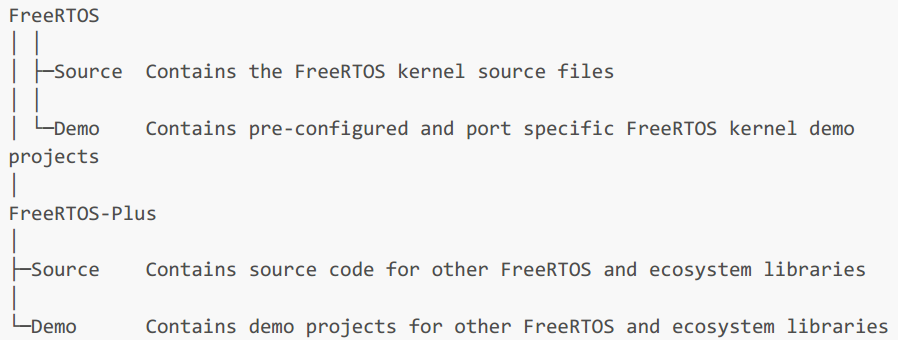

<a id="fig-freertos-top"></a>

该发行版仅包含一份FreeRTOS内核源代码文件；所有示例项目均预期在FreeRTOS/Source目录中找到内核源代码文件，若目录结构发生变更，则可能无法构建。

### FreeRTOS 所有端口公共源文件

`tasks.c` 和 `list.c` 实现了 FreeRTOS 核心内核功能，并且总是必不可少的。它们直接位于 `FreeRTOS/Source` 目录下，如[图2.2.5-1](#Core FreeRTOS source files)所示。同一目录下还包含以下可选源文件：

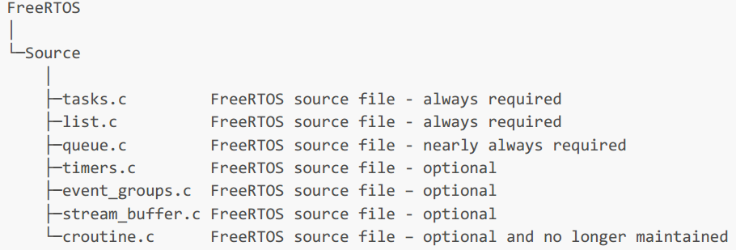

<a id="Core FreeRTOS source files"></a>

* queue.c
  * `queue.c`文件提供了队列和信号量服务，这些内容将在本书后续章节中详细描述。queue.c文件几乎总是必需的。
* timers.c
  * `timers.c` 提供了软件定时器功能，这一功能将在本书后续部分进行详细描述。只有在应用程序使用软件定时器时，才需要构建此文件。
* event_groups.c
  * `event_groups.c `提供了事件组功能，具体内容将在本书后续章节中描述。只有当应用程序使用事件组时，才需要构建它。
* stream_buffer.c
  * `stream_buffer.c` 提供了流缓冲和消息缓冲功能，本书后面将对此进行描述。如果应用程序使用流或消息缓冲区，则只需编译此文件。
* croutine.c
  * `croutine.c`实现了FreeRTOS协程功能。只有当应用程序使用协程时才需要构建该文件。协程主要用于非常小的微控制器，目前已很少使用。因此，它们已不再维护，且不推荐在新设计中使用。本书不涉及协程的描述。

认识到在ZIP文件分发中使用的文件名可能导致命名空间冲突，因为许多项目已经使用了相同名称的文件。用户可以在必要时更改文件名，但分发中的名称不能更改，这样做将破坏现有用户项目以及FreeRTOS意识开发工具的兼容性。

### 针对特定端口的具体 FreeRTOS 源文件

FreeRTOS/Source/portable 目录包含了针对 FreeRTOS 的特定版本的源代码文件。这个 portable 目录以层次结构形式组织，首先按照编译器，然后按照处理器架构进行分类。[图2.2.6-1](#Port specific source files)展示了这个层次结构。

为了在具有`architecture`架构的处理器上使用`compiler`编译器运行FreeRTOS，除了核心FreeRTOS源文件之外，您还需要构建位于 FreeRTOS/Source/portable/[compiler]/[architecture] 目录下的文件。

如第三章《堆内存管理》所述，FreeRTOS也将堆内存分配视为可移植层的一部分。如果将configSUPPORT_DYNAMIC_ALLOCATION设置为0，则项目中无需包含堆内存分配方案。

FreeRTOS在FreeRTOS/Source/portable/MemMang目录下提供了示例堆内存分配方案。如果FreeRTOS配置为使用动态内存分配，则必须将此目录下之一堆实现源文件包含到您的项目中，或提供您自己的实现。

[^]: 在您的项目中，仅包含不超过一个示例堆分配实现。

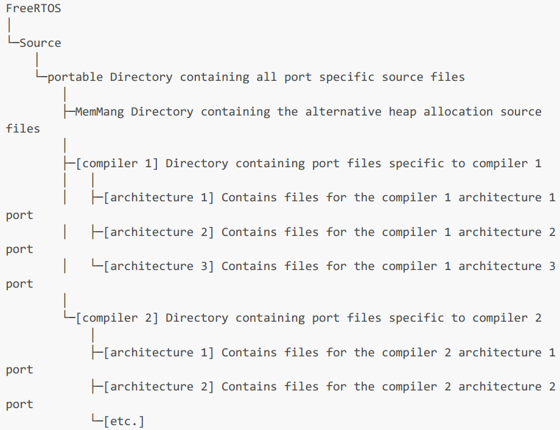

<a id="Port specific source files"></a>

### 包含路径

FreeRTOS 需要在编译器的包含路径中包含三个目录。这些目录包括：

* 通往核心FreeRTOS内核头文件路径，FreeRTOS/Source/include。
* 通往当前使用的FreeRTOS端口的特定源文件路径为：FreeRTOS/Source/portable/[compiler]/[architecture]。
* 通往正确的FreeRTOSConfig.h头文件的路径。

### 头文件

使用 FreeRTOS API 的源文件必须首先包含 FreeRTOS.h，随后包含包含 API 函数原型的头文件——即 task.h、queue.h、semphr.h、timers.h、event_groups.h、stream_buffer.h、message_buffer.h 或 croutine.h 之一。不得显式包含任何其他 FreeRTOS 头文件——FreeRTOS.h 会自动包含 FreeRTOSConfig.h。

## 示例应用

每个 FreeRTOS 移植版本均附带至少一个演示应用程序，在创建时能够无需任何编译器错误或警告即可直接构建。若后续构建工具的变更导致该情况不再成立，请使用 FreeRTOS 支持论坛（https://forums.FreeRTOS.org）告知我们。

> 跨平台支持：FreeRTOS 在 Windows、Linux 和 MacOS 系统上进行开发与测试，并与多种工具链（包括嵌入式及传统工具链）兼容。然而，由于版本差异或测试遗漏，偶尔可能出现构建错误。请通过 FreeRTOS 支持论坛（https://forums.FreeRTOS.org）向我们报告此类错误。

示例应用程序具有多种用途：

1. 为了提供一个工作且预先配置好的项目示例，包含正确的文件和设置正确的编译选项。
2. 旨在允许用户进行“开箱即用”的实验，无需复杂的设置或先验知识。
3. 展示如何使用FreeRTOS API。
4. 作为创建实际应用的基础。
5. 进行内核实现的压力测试。

每个演示项目均位于 FreeRTOS/Demo 目录下独立的子目录中。该子目录的名称标明了演示项目所关联的端口。

FreeRTOS.org 网站为每个演示应用程序提供一个页面。该网页包含以下信息：

1. 如何定位FreeRTOS目录结构中演示项目的源文件。
2. 项目的硬件或模拟器配置。
3. 如何配置硬件以运行演示。
4. 如何构建演示。
5. 演示的预期行为。

所有演示项目均创建`common demo tasks`的一个子集，其实现代码位于FreeRTOS/Demo/Common/Minimal目录下。common demo tasks的存在是为了演示如何使用FreeRTOS API以及测试FreeRTOS内核端口——它们并未实现任何特定的实用功能。

许多演示项目也可以配置为创建一个简单的“闪烁”样式启动项目，该项目通常创建两个实时操作系统任务和一个队列。

每个演示项目都包含一个名为 main.c 的文件，其中包含 main() 函数，该函数在启动 FreeRTOS 内核之前创建演示应用程序任务。有关特定演示的信息，请参阅各个 main.c 文件中的注释。

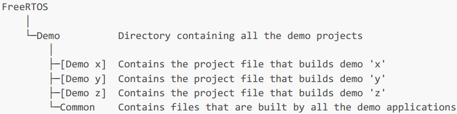

<a id="The demo directory hierarchy"></a>

## 创建FreeRTOS项目

### 调整其中一个供应的演示项目

每个 FreeRTOS 兼容端口均至少附带一个预配置的演示应用程序。建议通过适配其中一个现有项目来创建新项目，以确保新项目包含正确的文件、安装正确的中断处理程序并设置了正确的编译选项。

从现有演示项目创建新应用：

1. 打开提供的演示项目，并确保其能够按预期构建和执行。
2. 移除实现演示任务的源文件，这些文件位于Demo/Common目录下。
3. main()函数中，除了`prvSetupHardware()`和`vTaskStartScheduler()`函数以外，删除所有其他函数调用，如[表2.4.1-1](#The template for a new main function)所示。

*==一个新的主函数模板==*

```cpp
int main( void )
{
 /* Perform any hardware setup necessary. */
 prvSetupHardware();
 /* --- APPLICATION TASKS CAN BE CREATED HERE --- */
 /* Start the created tasks running. */
 vTaskStartScheduler();
 /* Execution will only reach here if there was insufficient heap to
 start the scheduler. */
 for( ;; );
 return 0;
}
```

<a id="The template for a new main function"></a>

### 从零开始创建新项目

如前所述，建议从现有的演示项目创建新项目。如果不宜如此，则使用下列步骤创建新项目：

1. 使用您选择的工具链，创建一个不包含任何 FreeRTOS 源文件的新项目。
2. 确保新项目能够成功构建，下载至目标硬件设备，并正常执行。
3. 仅当您确信您已经拥有一个运行中的项目时，再将[表2.4.2-1](#FreeRTOS source files to include in the project)中详细说明的FreeRTOS源代码文件添加到项目中。

*==项目需要包含的FreeRTOS源代码文件==*

| 文件                      | 位置                                                         |
| ------------------------- | ------------------------------------------------------------ |
| task.c                    | FreeRTOS/Source                                              |
| queue.c                   | FreeRTOS/Source                                              |
| list.c                    | FreeRTOS/Source                                              |
| timers.c                  | FreeRTOS/Source                                              |
| event_groups.c            | FreeRTOS/Source                                              |
| stream_buffer.c           | FreeRTOS/Source                                              |
| All C and assembler files | FreeRTOS/Source/portable/[compiler]/[architecture]           |
| heap_n.c                  | FreeRTOS/Source/portable/MemMang, where n is either 1,2,3,4 or 4 |

<a id="FreeRTOS source files to include in the project"></a>

关于堆内存的说明：若`configSUPPORT_DYNAMIC_ALLOCATION`的值为0，则勿在您的项目中包含堆内存分配方案。否则，请在项目中包含堆内存分配方案，可选择heap_n.c文件中的一个，或自行提供。欲了解更多信息，请参阅第三章“堆内存管理”。

## 数据类型与编码风格指南

<a id="Section2.5"></a>

### 数据类型

每个FreeRTOS的端口都有一个独特的`portmacro.h`头文件，其中包含（除其他内容外）两个特定端口的数据类型定义：`TickType_t `和 `BaseType_t`。以下列表描述了所使用的宏或typedef以及实际类型：

1. TickType_t

FreeRTOS 配置了一个周期性的中断，称为滴答中断。

自FreeRTOS应用程序启动以来发生的滴答中断次数称为滴答计数。时钟计数被用作时间的度量。

两个时钟中断之间的时间被称为时钟周期。时间以时钟周期的倍数来指定。

TickType_t是用于存储计数值和指定时间的数据类型。

TickType_t可以是一个无符号16位类型、无符号32位类型或无符号64位类型，具体取决于FreeRTOSConfig.h中 `configTICK_TYPE_WIDTH_IN_BITS`的设置。`configTICK_TYPE_WIDTH_IN_BITS`的设置与架构相关。FreeRTOS移植版本还会检查该设置是否有效。

使用16位类型可以在8位和16位架构上显著提高效率，但严重限制了在FreeRTOS API调用中可指定的最大块时间。在32位或64位架构上没有理由使用16位的TickType_t类型。

先前对configUSE_16_BIT_TICKS的使用已被configTICK_TYPE_WIDTH_IN_BITS所取代，以支持超过32位的计数器。新设计应使用configTICK_TYPE_WIDTH_IN_BITS而非configUSE_16_BIT_TICKS。

*==TickType_t数据内息那个和`configTICK_TYPE_WIDTH_IN_BITS`配置==*

| configTICK_TYPE_WIDTH_IN_BITS | 8-bit architectures | 16-bit architectures | 32-bit architectures | 64-bit architectures |
| ----------------------------- | ------------------- | -------------------- | -------------------- | -------------------- |
| TICK_TYPE_WIDTH_16_BITS       | uint16_t            | uint16_t             | uint16_t             | N/A                  |
| TICK_TYPE_WIDTH_32_BITS       | uint32_t            | uint32_t             | uint32_t             | N/A                  |
| TICK_TYPE_WIDTH_64_BITS       | N/A                 | N/A                  | uint64_t             | uint64_t             |

2. BaseType_t

这总是被定义为最适合该架构的数据类型。通常，在64位架构上它是一个64位类型，在32位架构上是32位类型，在16位架构上是16位类型，而在8位架构上是8位类型。

BaseType_t通常用于表示仅包含非常有限值域的返回类型，以及pdTRUE/pdFALSE类型的布尔值。

### 变量名

变量以其类型为前缀：'c' 代表 char，'s' 代表 int16_t（短整型），'l' 代表 int32_t（长整型），以及 'x' 代表 BaseType_t和任何其他非标准类型（如结构体、任务句柄、队列句柄等）。

如果一个变量是无符号的，它也会以'u'作为前缀。如果一个变量是指针，它也会以'p'作为前缀。例如，类型为uint8_t的变量将以'uc'作为前缀，而类型为指向char的指针（char *）的变量将以'pc'作为前缀。

### 函数名

函数前缀包含它们返回的类型以及它们定义在其中的文件。例如：

* v**Task**PrioritySet()返回void类型并且定义在**tasks**.c
* x**Queue**Receive()返回BaseType_t类型并且定义在**queue**.c
* pv**Timer**GetTimerID()返回指针指向void类型并且定义在**timer**.c

文件作用域（私有）函数以"prv"为前缀。

### 格式化


在某些示例应用程序中，一个标签始终设置为等价于四个空格，因此使用了标签。内核不再使用标签。

### 宏定义

大多数宏以大写字母编写，并以前缀小写字母标明其定义位置。[表2.5.5-1](#Macro prefixes)列出了前缀列表。

*==宏前缀==*

| 前缀                           | 宏定义位置             |
| ------------------------------ | ---------------------- |
| port(如portMAX_DELAY)          | portabel.h/portmacro.h |
| task(如taskENTER_CRITICAL())   | task.h                 |
| pd(如pdTURE)                   | projdefs.h             |
| config(如configUSE_PREEMPTION) | FreeRTOSConfig.h       |
| err(如errQUEUE_FULL)           | projdefs.h             |

<a id="Macro prefixes"></a>

> 请注意，信号量API几乎完全以宏的形式编写，但其遵循函数命名约定，而非宏命名约定。[表2.5.5-2](#Common macro definitions)中定义的宏在整个FreeRTOS源代码中被广泛使用。

*==公用宏==*

| 宏定义  | 值   |
| ------- | ---- |
| pdTRUE  | 1    |
| pdFALSE | 0    |
| pdPASS  | 1    |
| pdFAIL  | 0    |

<a id="Common macro definitions"></a>

### 过度类型转换的合理性

FreeRTOS源代码可以与多种编译器一起编译，这些编译器在生成警告的方式和时机上存在差异。尤其是，不同的编译器在使用类型转换时有不同偏好。因此，FreeRTOS源代码中包含的类型转换比通常情况下所需的要多。

# 堆内存管理

## 介绍

### 预备知识

成为一名合格的C语言程序员是使用FreeRTOS的先决条件，因此本章假设读者熟悉以下概念：

* 构建C项目时的不同编译和链接阶段
* 堆栈是什么
* 基础C库的`malloc`和`free`函数

### 范围

本章包含：

* FreeRTOS什么时候分配内存
* FreeRTOS附带的五种内存分配方案
* 选择哪种内存分配方案

### 静动态内存分配之间的切换

以下章节将介绍内核对象，如任务、队列、信号量和事件组。这些对象所需持有的内存空间可以在编译时静态分配，也可以在运行时动态分配。 动态分配内存可以降低设计和规划工作量，简化API，并最小化RAM占用量。 静态分配内存通常更为确定，可以消除处理内存分配失败的需求，同时避免内存碎片化的问题（即虽然有足够未使用的内存，但这些内存并未连续分布）。 因此，动态分配内存提供了灵活性和便利性，而静态分配内存则更侧重于稳定性和效率。选择哪种方式取决于特定应用的需求和对资源管理的偏好。

FreeRTOS API中用于创建使用静态分配内存的内核对象的函数，仅在FreeRTOSConfig.h中将configSUPPORT_STATIC_ALLOCATION设置为1时才可用。用于创建使用动态分配内存的内核对象的FreeRTOS API函数，仅在FreeRTOSConfig.h中将configSUPPORT_DYNAMIC_ALLOCATION设置为1或保留为未定义时才可用。同时将这两个常量设置为1是有效的。

关于configSUPPORT_STATIC_ALLOCATION的更多信息请参见3.4节使用静态内存分配。

### 使用动态内存分配

<a id="Section3.1.4"></a>

动态内存分配是C编程中的一个概念，而非仅限于FreeRTOS或多任务操作系统的特定概念。其与FreeRTOS相关，是因为内核对象可以可选地使用动态分配的内存进行创建，此外，通用的C库中的malloc()和free()函数可能不适合以下一个或多个原因：

1. 它们并不总是适用于小型嵌入式系统。
2. 它们的实现可能相对较大，占用宝贵的代码空间。
3. 它们很少是线程安全的。
4. 它们并非确定性函数；函数执行所需的时间将在不同的调用间有所差异。
5. 他们可能会受到碎片化（堆有足够的自由内存，但不是在一个可用的连续块）的困扰。
6. 它们可能使链接器配置变得复杂。
7. 若允许堆空间增长至其他变量所使用的内存区域，则可能引发难以调试的错误。

### 动态内存分配选项

早期的FreeRTOS版本采用了内存池分配方案，即在编译时预先分配不同大小内存块的内存池，然后由内存分配函数返回。尽管块分配在实时系统中很常见，但FreeRTOS中移除了这一方案，原因在于它在真正小型嵌入式系统中对RAM的低效使用导致了大量技术支持请求。

FreeRTOS现在将内存分配视为可移植层的一部分（而非核心代码库的一部分）。这是因为不同的嵌入式系统具有不同的动态内存分配和时间要求，因此单一的动态内存分配算法仅适用于应用集中的部分。此外，将动态内存分配从核心代码库中移除，使得当适用时，应用程序编写者能够提供他们自己的特定实现。

当FreeRTOS需要RAM时，它调用pvPortMalloc()而不是malloc()。同样，当FreeRTOS释放先前分配的RAM时，它调用vPortFree()而不是free()。pvPortMalloc()具有与标准C库malloc()函数相同的原型，而vPortFree()具有与标准C库free()函数相同的原型。

`pvPortMalloc()` 和 `vPortFree()` 是公共函数，因此它们也可以从应用程序代码中被调用。

FreeRTOS 附带了五个 pvPortMalloc() 和 vPortFree() 的示例实现，这些示例在本书的这一章都有详细记录。FreeRTOS 应用程序可以使用其中一个示例实现，也可以提供自己的实现。

这五个示例分别定义在heap_1.c、heap_2.c、heap_3.c、heap_4.c和heap_5.c源文件中，这些文件均位于FreeRTOS/Source/portable/MemMang目录下。

## 示例内存分配方案

### Heap_1

对于小型、专门化的嵌入式系统而言，在启动FreeRTOS调度器之前，通常仅会创建任务和其他内核对象。在这种情况之下，内存仅会在应用程序开始执行任何实时功能之前（动态地）分配，并且该内存在应用程序的生命周期内保持分配状态。这意味着所选择的分配方案无需考虑诸如确定性和碎片化等更复杂的内存分配问题，而是可以优先考虑代码大小和简单性等特性。

Heap_1.c 实现了一个非常基本的pvPortMalloc()版本，并没有实现vPortFree()。 从不删除任务或其他内核对象的应用程序有可能使用heap_1。一些商业关键和安全性关键的系统，如果它们否则禁止使用动态内存分配，也有可能使用heap_1。关键系统通常禁止动态内存分配，因为非确定性、内存碎片化和分配失败的不确定性。 Heap_1总是确定性的，不能造成内存碎片化。

Heap_1的pvPortMalloc()实现每次调用时，都会将名为FreeRTOS堆的简单uint8_t数组细分为更小的块。FreeRTOSConfig.h中的常量configTOTAL_HEAP_SIZE设置了该数组的大小（单位为字节）。将堆实现为静态分配的数组，使得FreeRTOS看起来像是在大量消耗RAM，因为堆成为了FreeRTOS数据的一部分。

每个动态分配的任务会导致对pvPortMalloc()的两次调用。第一次调用分配一个任务控制块（TCB），第二次调用分配任务的堆栈。[图3.2.1-1](#figure3.1)展示了随着任务的创建，heap_1如何将简单数组细分为小块。

参见[图3.2.1-1](#figure3.1)：

* A显示了创建任何任务之前的数组——整个数组是空闲的。
* B显示创建了一个任务后的数组。
* C展示了在创建三个任务后数组的状态。

*==每次创建任务时，从堆1数组中分配RAM。==*

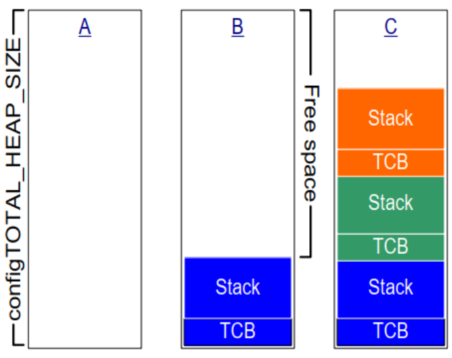

<a id="figure3.1"></a>

### Heap_2

Heap_2已被Heap_4超越，后者包含了增强的功能性，为了保持向后的兼容性，Heap_2保留在FreeRTOS发行版中，但不推荐用于新设计。

Heap_2.c 同样通过将数组大小设置为常量configTOTAL_HEAP_SIZE来细分数组。它使用最佳适应算法进行内存分配，与 heap_1 不同的是，它确实实现了vPortFree()。再次，将堆实现为静态分配的数组使得 FreeRTOS 看起来消耗大量 RAM，因为堆成为 FreeRTOS 数据的一部分。

最佳拟合算法确保pvPortMalloc()使用与请求的字节数最接近大小的空闲内存块。例如，考虑以下场景：

* 堆中包含三块连续的空闲内存块，大小分别为5字节、25字节和100字节。
* `pvPortMalloc()` 函数请求分配 20 字节的 RAM 内存。

请求的字节数能够完全容纳在RAM中的最小空闲块中，这个块是25字节块。因此，pvPortMalloc()函数在返回指向20字节块的指针之前，会将25字节的块分割成一个20字节的块和一个5字节的块[^2]。新的5字节块仍然可供将来调用pvPortMalloc()函数时使用。


与heap_4不同，heap_2不会将相邻的空闲块合并成单个更大的块，因此它比heap_4更容易发生碎片化。然而，如果分配和随后释放的块始终是相同的尺寸，那么碎片化就不会成为问题。

[图Figure3.2.2-1](#Figure3.2.2-1)展示了在创建、删除及再次创建任务时，最佳拟合算法的工作原理：

* 在分配了三个任务后，A 显示了数组的状态。数组顶部保留了一个较大的空闲块。
* B 展示了删除一个任务后的数组。数组顶部的大空闲块依然存在。 现在，在之前保存已删除任务 TCB 和栈的较小空闲块中，也出现了两个较小的空闲块。
* C呈现了创建另一个任务之后的情况。创建任务导致xTaskCreate() API函数内部调用了两次pvPortMalloc()，一次用于分配一个新的任务控制块（TCB），另一次用于分配任务堆栈。本书的第3.4节描述了xTaskCreate()。
  * 每个TCB的大小都相同，因此最佳适配算法会重用存储已删除任务TCB的RAM块来存储新创建任务的TCB。
  * 若新创建任务分配的栈大小与先前已删除任务分配的栈大小相同，则最佳适配算法将重用先前已删除任务栈所占用的内存块来存放新创建任务的栈。
  * 数组顶部较大的未分配块保持未动。

*==RAM的堆分配和释放随着任务的创建与删除进行==*

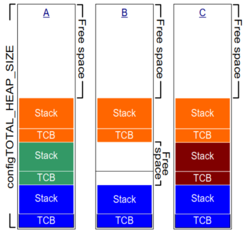

<a id="Figure3.2.2-1"></a>

Heap_2是非确定的，但比大多数标准库中的malloc()和free()实现更快。

### Heap_3

Heap_3.c使用标准库中的malloc()和free()函数，因此链接器配置定义了堆大小，且不使用configTOTAL_HEAP_SIZE常量。

Heap_3 通过在执行期间暂时挂起 FreeRTOS 调度程序来使 malloc() 和 free() 线程安全。第 8 章“资源管理”涉及线程安全性和调度程序挂起。

### Heap_4

如heap_1和heap_2一样，heap_4通过将数组分割为更小的块来工作。如同之前所述，数组是静态分配的，并由configTOTAL_HEAP_SIZE配置得出，这使得FreeRTOS似乎使用了大量的RAM，因为堆成为FreeRTOS数据的一部分。

Heap_4使用首次适应算法分配内存。与Heap_2不同，Heap_4将相邻的空闲内存块合并成更大的单一块，从而最小化了内存碎片的风险。

第一个适配算法确保 `pvPortMalloc()` 使用第一个可用的、足够大的内存块来满足请求的字节数。例如，考虑以下场景：

* 堆中包含三个空闲内存块，按照它们在数组中出现的顺序，分别是5字节、200字节和100字节。
* pvPortMalloc() 请求分配 20 字节的 RAM。

请求的字节数适合的第一个空闲RAM块是200字节的块，因此pvPortMalloc()将200字节的块分割为一个20字节的块和一个180字节的块[^3]，在返回20字节块的指针之前。新的180字节块仍然可供未来对pvPortMalloc()的调用使用。

Heap_4将相邻的空闲块合并为一个更大的块，最小化了碎片化的风险，使得它适合于重复分配和释放不同大小RAM块的应用程序。

[图3.2.4-1](#Figure3.2.4-1)展示了如何使用内存合并的Heap_4首次适应算法工作：

* A展示了创建三个任务后的数组。数组顶部保留了一个大空闲块。
* B展示了删除一项任务后的数组。数组顶部的大空闲区块仍然存在。 现在，在删除任务的TCB和栈曾经所在的位置，又出现了一个空闲区块。与heap_2示例不同，heap_4将之前分别存放删除任务的TCB和栈的两个内存区块合并为一个更大的单个空闲区块。
* C展示了创建FreeRTOS队列后的情况。本书第5.3节描述了用于动态分配队列的xQueueCreate() API函数。xQueueCreate()调用pvPortMalloc()来分配队列使用的RAM。由于heap_4使用首次适配算法，pvPortMalloc()会从第一个足够容纳队列的空闲RAM块中分配内存，如[图3.2.4-1](#Figure3.2.4-1)所示，该内存块是由删除任务所释放的。队列并未占用空闲块中的全部RAM，因此该块被分割为两个部分，未使用的部分保留供未来对pvPortMalloc()的调用使用。
* D显示从应用程序代码直接调用pvPortMalloc()而非间接通过调用FreeRTOS API函数时的情形。用户分配的内存块足够小，能够容纳第一个空闲内存块，该空闲内存块位于分配给队列的内存与其后分配给TCB的内存之间。
  * 删除任务释放的内存现已分割为三个独立的块；第一个块包含队列，第二个块包含用户分配的内存，第三个块保持空闲状态。
* E展示了在删除队列后的情况，这自动释放了被删除队列分配的内存。现在，在用户分配的块的两侧都有了空闲内存。
* F展示了在释放用户分配内存后的情况。用户分配的内存块所占用的内存已被与两侧的空闲内存合并，形成一个更大的单一空闲内存块。

*==RAM的分配和从heap_4数组中释放==*

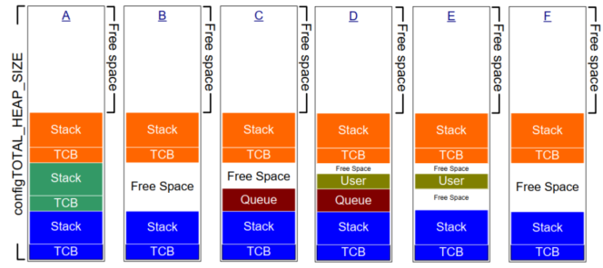

<a id="Figure3.2.4-1"></a>

Heap_4并非确定性的，但它比大多数标准库中malloc()和free()的实现更快。

### Heap_5

Heap_5采用与heap_4相同的内存分配算法。与heap_4不同，后者仅限于从单一数组中分配内存，heap_5能够将来自多个独立内存空间的内存合并为单个堆。当FreeRTOS运行系统所提供的RAM在系统内存映射中呈现为非连续（存在间隙）的块时，heap_5具有实用价值。

### 初始化Heap_5：vPortDefineHeapRegions() API 函数

`vPortDefineHeapRegions()`函数通过指定堆管理器 `heap_5`中每个单独内存区域的起始地址和大小，初始化了`heap_5`。`Heap_5`是唯一需要显式初始化且在调用 `vPortDefineHeapRegions()`之后才能使用的堆分配方案。这意味着在调用 `vPortDefineHeapRegions()`之后，诸如任务、队列和信号量之类的内核对象才能动态创建。

*==vPortDefineHeapRegions() API函数原型==*

```cpp
void vPortDefineHeapRegions( const HeapRegion_t * const pxHeapRegions );
```

`vPortDefineHeapRegions()`函数仅接受一个 `HeapRegion_t`结构体数组作为参数。每个结构体定义了将构成堆的一部分内存块起始地址和大小。整个数组定义了整个堆空间。

*==HeapRegion_t结构体==*

```cpp
typedef struct HeapRegion
{
 /* 内存块开始地址，该内存块将作为堆的一部分。*/
 uint8_t *pucStartAddress;
 /* 内存块大小的字节数量。 */
 size_t xSizeInBytes;
} HeapRegion_t;
```

参数：

* `pxHeapRegions`
  * 指向`HeapRegion_t`结构体数组的起始地址。每个结构体定义了一个将构成堆的内存块的起始地址和大小。
  * 数组中的`HeapRegion_t`结构必须按照起始地址排序；描述具有最低起始地址内存区域的`HeapRegion_t`结构必须是数组中的第一个结构，而描述具有最高起始地址内存区域的`HeapRegion_t`结构必须是数组中的最后一个结构。
  * 在数组的末尾使用`HeapRegion_t`结构标记，其中pucStartAddress成员被设置为NULL。

作为示例，考虑[图3.2.6-1](#Memory Map)所示的一个假设内存映射，其中包含三个独立的RAM块：RAM1、RAM2和RAM3。假定可执行代码放置在只读存储器中，该存储器未在图中显示。

*==内存映射==*

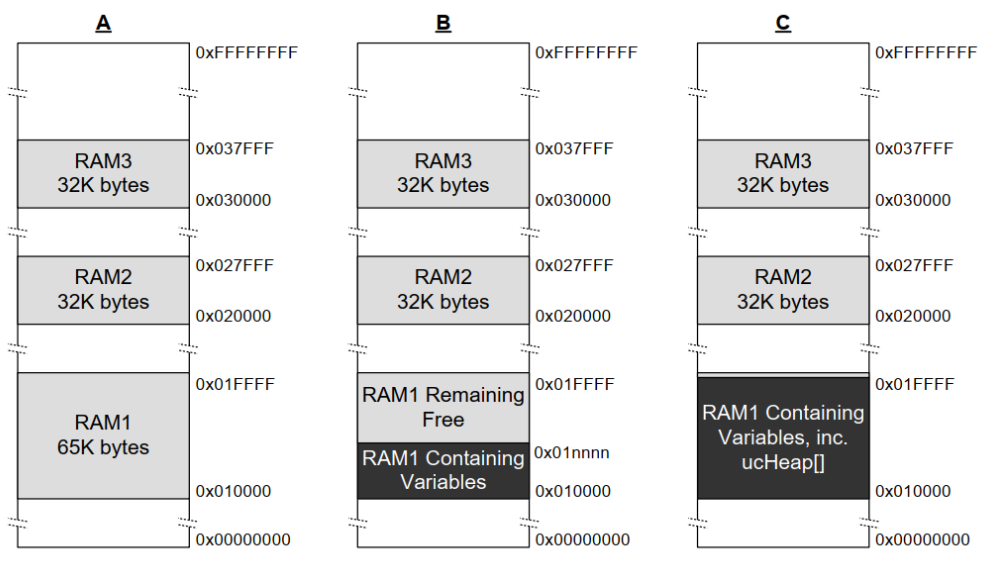

<a id="Memory Map"></a>

[代码块3.2.6-3](#3.2.6-3)展示了一个HeapRegion_t结构数组，该数组共同完整描述了三块RAM。

*==一个 HeapRegion_t 结构数组，共同完整地描述了 RAM 的 3 个区域==*

```cpp
/* 定义三个RAM区域的起始地址和大小。 */
#define RAM1_START_ADDRESS ( ( uint8_t * ) 0x00010000 )
#define RAM1_SIZE ( 64 * 1024 )
#define RAM2_START_ADDRESS ( ( uint8_t * ) 0x00020000 )
#define RAM2_SIZE ( 32 * 1024 )
#define RAM3_START_ADDRESS ( ( uint8_t * ) 0x00030000 )
#define RAM3_SIZE ( 32 * 1024 )
/* 创建一个包含HeapRegion_t定义的数组，为三个RAM区域各分配一个索引，并以包含NULL地址的HeapRegion_t结构终止该数组。HeapRegion_t结构必须按照起始地址的顺序排列，起始地址最低的结构应排在首位。 */
const HeapRegion_t xHeapRegions[] =
{
 { RAM1_START_ADDRESS, RAM1_SIZE },
 { RAM2_START_ADDRESS, RAM2_SIZE },
 { RAM3_START_ADDRESS, RAM3_SIZE },
 { NULL, 0 } /* 标记数组的结束。 */
};
int main( void )
{
 /* Initialize heap_5. */
 vPortDefineHeapRegions( xHeapRegions );
 /* Add application code here. */
}   
```

<a id="3.2.6-3"></a>

尽管[代码块3.2.6-3](#3.2.6-3)正确描述了RAM，但它并未展示一个可用的实例，因为它将所有的RAM都分配给了堆区，从而使得没有足够的RAM可供其他变量使用。

构建过程的连接阶段为每个变量分配内存地址。连接器可用的内存通常由连接器配置文件（如连接器脚本）进行描述。在[图3.2.6-1](#Memory Map) B中，假设连接器脚本包含了关于RAM1的信息，但没有包含关于RAM2或RAM3的信息。 因此，连接器将变量放在RAM1中，仅RAM1中地址0x0001nnnn以上的部分可用于heap_5使用。0x0001nnnn的实际值取决于应用中包含的所有变量的大小之和。连接器留下了RAM2和RAM3的全部空间未使用，使得RAM2和RAM3的全部可用于heap_5使用。

所展示的[代码块3.2.6-3](#3.2.6-3)中的代码会导致分配给heap_5的RAM与用于存储变量的RAM重叠。如果您将xHeapRegions数组中第一个HeapRegion_t结构的起始地址设置为0x0001nnnn，而不是0x00010000的起始地址，则堆不会与链接器使用的RAM重叠。然而，这不是一个推荐解决方案，因为：

* 起始位置可能难以确定
* 未来构建中链接器使用的内存（RAM）量可能会发生变化，这将需要对HeapRegion_t结构中使用的起始地址进行更新。
* 构建工具将无法知晓，因此也无法向应用程序开发者发出警告，如果链接器使用的RAM与堆_5使用的RAM发生重叠。

以下是更便捷且易于维护的一个示例，如[代码块3.2.6.-4](#3.2.6-4)所示。它声明了一个名为ucHeap的数组。 ucHeap是一个正常的变量，因此它成为了连接器分配给RAM1的数据的一部分。xHeapRegions数组中的第一个HeapRegion_t结构体描述了ucHeap的起始地址和大小，因此ucHeap成为了heap_5管理的内存的一部分。ucHeap的大小可以不断增加，直到链接器分配的RAM1被耗尽，如[图3.2.6-1](#Memory Map)C所示。

*==一组描述 RAM2 和 RAM3 所有内存区域的结构体 HeapRegion_t，但仅部分描述 RAM1。==*

```cpp
/* 定义链接器未使用的两个RAM区域的开始地址和大小。 */
#define RAM2_START_ADDRESS ( ( uint8_t * ) 0x00020000 )
#define RAM2_SIZE ( 32 * 1024 )
#define RAM3_START_ADDRESS ( ( uint8_t * ) 0x00030000 )
#define RAM3_SIZE ( 32 * 1024 )
/* 声明一个数组，该数组将作为heap_5使用的堆的一部分。该数组将由链接器放置在RAM1中。 */
#define RAM1_HEAP_SIZE ( 30 * 1024 )
static uint8_t ucHeap[ RAM1_HEAP_SIZE ];
/* 创建一个HeapRegion_t定义的数组。在代码块3.3.1-1中，第一个条目描述了所有RAM1的内容，因此heap_5将使用全部的RAM1；这次，第一个条目仅描述了ucHeap数组，因此heap_5只会使用包含ucHeap数组的那一部分RAM1。 HeapRegion_t结构仍然需要按照起始地址的顺序排列，包含最低起始地址的结构首先出现。 */
const HeapRegion_t xHeapRegions[] =
{
 { ucHeap, RAM1_HEAP_SIZE },
 { RAM2_START_ADDRESS, RAM2_SIZE },
 { RAM3_START_ADDRESS, RAM3_SIZE },
 { NULL, 0 } /* Marks the end of the array. */
};
```

[代码块3.2.6.-4](#3.2.6-4)中演示的该技术的优势包括：

* 无需使用硬编码的起始地址。
* 在`HeapRegion_t`结构中使用的地址将自动由链接器设置，因此无论将来构建过程中链接器使用的RAM量如何变化，它始终都是正确的。
* 由于链接器将数据放置在 RAM1 中，因此无法将堆5分配的 RAM 与 RAM1 中的数据重叠。
* 如果ucHeap过大，应用程序将无法链接。

## 堆相关效用函数与宏

### 确定堆起始地址

Heap_1,heap_2和heap_4从静态分配数组中分配内存，该数组的维度由configTOTAL_HEAP_SIZE决定。本节将这些分配方案统称为heap_n。

有时堆需要放置在特定的内存地址。例如，动态创建的任务所分配的栈来自堆，因此可能需要将堆定位在快速内部存储器而非慢速外部存储器中。（另请参见下文“将任务栈放置在快速存储器中”小节，了解在快速存储器中分配任务栈的另一种方法）。configAPPLICATION_ALLOCATED_HEAP 编译时配置常量使应用程序能够在heap_n.c 源文件中原有的声明之外，声明该数组。在应用程序代码中声明数组，允许应用程序编写者指定其起始地址。

如果FreeRTOSConfig.h中配置应用程序分配的堆（configAPPLICATION_ALLOCATED_HEAP）设置为1，或者留为未定义，则使用FreeRTOS的应用程序必须分配一个名为ucHeap的uint8_t数组，其大小由configTOTAL_HEAP_SIZE常量指定。

将变量放置于特定内存地址所需的语法取决于所使用的编译器，因此请参阅您所使用的编译器的文档。以下为两种编译器的示例：

[代码块3.3.1-1](#Code3.3.1-1)展示GCC编译器所需用于声明数组并将其放入名为.my_heap的内存区段的语法。

*==使用GCC语法声明将被heap_4使用的数组，并将数组放置在名为.my_heap的内存段中。==*

```cpp
uint8_t ucHeap[ configTOTAL_HEAP_SIZE ] __attribute__ ( ( section( ".my_heap" ) )
);
```

<a id="Code3.3.1-1"></a>

[代码块3.3.1-2](#Code3.3.1-2)展示由IAR编译器所需的语法来声明数组，并将数组放置于绝对内存地址0x20000000。

*==使用IAR语法声明将被heap_4使用的数组，并将该数组放置在绝对地址0x20000000处。==*

```cpp
uint8_t ucHeap[ configTOTAL_HEAP_SIZE ] __attribute__ ( ( section( ".my_heap" ) )
);
```

<a id="Code3.3.1-2"></a>

### xPortGetFreeHeapSize()函数

`xPortGetFreeHeapSize()`API函数在被调用时返回堆中可用的字节数。它不提供关于堆碎片化的信息。

*==xPortGetFreeHeapSize() API函数原型==*

```cpp
size_t xPortGetFreeHeapSize( void );
//xPortGetFreeHeapSize() 函数返回在被调用时堆中剩余未分配的字节数。
```

### xPortGetMinimumEverFreeHeapSize()函数

`xPortGetMinimumEverFreeHeapSize()`API函数返回从FreeRTOS应用程序开始执行以来堆中曾经存在的最小数量的未分配字节。

`xPortGetMinimumEverFreeHeapSize()`函数返回的值表明应用程序曾经接近耗尽堆空间的程度。例如，如果 xPortGetMinimumEverFreeHeapSize() 返回 200，则意味着自应用程序开始执行以来的某个时间点，应用程序的堆空间使用量距离耗尽仅剩下 200 字节。

xPortGetMinimumEverFreeHeapSize() 也可用于优化堆大小。例如，若在执行已知具有最高堆使用量的代码后，xPortGetMinimumEverFreeHeapSize() 返回 2000，则configTOTAL_HEAP_SIZE 可减少高达 2000 字节。

xPortGetMinimumEverFreeHeapSize() 函数仅在 heap_4 和 heap_5 中实现。

*==xPortGetMinimumEverFreeHeapSize()API函数原型==*

```cpp
size_t xPortGetMinimumEverFreeHeapSize( void );
// xPortGetMinimumEverFreeHeapSize() 函数返回自 FreeRTOS 应用程序开始执行以来堆中存在过的最小未分配字节数量。
```

### vPortGetHeapStats()函数

Heap_4和heap_5实现了vPortGetHeapStats()函数，该函数以引用方式将HeapStats_t结构体作为其唯一参数来完成结构体的传递。

[代码块3.3.4-1](#3.3.4-1)展示了`vPortGetHeapStats()`函数的函数原型和`HeapStats_t`结构。

```cpp
void vPortGetHeapStats( HeapStats_t *xHeapStats );

/* Definition of the HeapStats_t structure. All sizes specified in bytes. */
typedef struct xHeapStats
{
 /* 当前堆总大小 - 这是所有可用空闲块之和，而不是最大可用块的大小。 */
 size_t xAvailableHeapSpaceInBytes;
 /* 调用vPortGetHeapStats()时堆内最大空闲块的大小。 */
 size_t xSizeOfLargestFreeBlockInBytes;
 /* 调用vPortGetHeapStats()时堆中最小空闲块的大小。 */
 size_t xSizeOfSmallestFreeBlockInBytes;
 /* 在调用 vPortGetHeapStats() 时，堆内空闲内存块的数量。 */
 size_t xNumberOfFreeBlocks;
 /* 自系统启动以来，堆内存中出现的总空闲内存（所有空闲块的合计）的最小值。 */
 size_t xMinimumEverFreeBytesRemaining;
 /* pvPortMalloc()函数成功返回有效内存块的调用次数。 */
 size_t xNumberOfSuccessfulAllocations;
 /* 成功调用 vPortFree() 函数释放内存块的数量。 */
 size_t xNumberOfSuccessfulFrees;
} HeapStats_t;
```

<a id="Code3.3.4-1"></a>

### 收集每任务堆使用情况统计

《本书记录的待定章节TBD-RB》中描述的vTaskGetInfo() API函数，用于向TaskStatus_t结构体填充关于一个任务的信息。若在FreeRTOSConfig.h中将编译时常量configTRACK_TASK_MEMORY_ALLOCATIONS设置为1，则该结构体将包含以下附加信息：

* 任务调用pvPortMalloc()的次数。
* vPortFree() 被调用的次数
* 在 vTaskGetInfo() 被调用时，该任务未被任何任务释放的堆字节数。
* 任务自启动以来在任何给定时间分配的最大堆内存量。

### 内存分配失败钩子函数

如同标准库中的malloc()函数，pvPortMalloc()在无法分配请求的RAM数量时会返回NULL。如果pvPortMalloc()返回NULL，malloc失败回调函数（或回调）将由应用程序提供并被调用。为了使回调发生，您必须在FreeRTOSConfig.h中将configUSE_MALLOC_FAILED_HOOK设置为1。如果在使用动态内存分配来创建内核对象的FreeRTOS API函数中调用malloc失败回调函数，则该对象不会被创建。

如果在FreeRTOSConfig.h中将configUSE_MALLOC_FAILED_HOOK设置为1，则应用程序必须提供一个名为并具有如[代码块3.3.6-1](#Code3.3.6-1)所示原型的malloc失败挂钩函数。应用程序可以以适合应用的方式实现该函数。所提供的FreeRTOS示例应用程序可能将分配失败视为致命错误，但这不是生产系统中的最佳实践，生产系统应能够优雅地从分配失败中恢复。

*==malloc失败回调函数的名称和原型==*

```cpp
void vApplicationMallocFailedHook( void );
```

<a id="Code3.3.6-1"></a>

### 将任务栈放置在快速内存中

由于堆栈需要以高频率进行读写操作，因此应将其放置在快速内存中，但这可能并非堆所期望驻留的位置。FreeRTOS 使用 `pvPortMallocStack()` 和 `vPortFreeStack()` 宏来可选地启用在 FreeRTOS API 代码中分配的堆栈，使其拥有独立的内存分配器。若希望堆栈来源于由 `pvPortMalloc()` 管理的堆内存，则应保持 `pvPortMallocStack()` 和 `vPortFreeStack()` 未定义状态，因为它们分别默认调用 `pvPortMalloc()` 和 `vPortFree()`。否则，应定义这些宏以调用应用程序提供的函数，具体示例如[代码块3.3.7-1](#Code3.3.7-1)所示。

*==将 `pvPortMallocStack()` 和 `vPortFreeStack()` 宏映射到应用程序定义的内存分配器。==*

```cpp
/* 应用程序作者提供的函数，这些函数从快速RAM区域分配和释放内存。 */
void *pvMallocFastMemory( size_t xWantedSize );
void vPortFreeFastMemory( void *pvBlockToFree );
/* 在 FreeRTOSConfig.h 中添加以下内容，以将 pvPortMallocStack() 和 vPortFreeStack() 宏映射到使用快速内存的函数。 */
#define pvPortMallocStack( x ) pvMallocFastMemory( x )
#define vPortFreeStack( x ) vPortFreeFastMemory( x )
```

<a id="Code3.3.7-1"></a>

## 使用静态内存分配

[3.1.4节](#Section3.1.4)列出了动态内存分配带来的某些缺点。为了避免这些问题，静态内存分配允许开发人员显式地为应用程序创建所需的每个内存块。这有以下优点：

* 所有必需的内存都在编译时已知。 
* 所有内存都是确定性的。

除此之外，还有其他优势，但伴随着这些优势，也会带来一些复杂性。主要的复杂性在于需要添加一些额外的用户函数来管理一部分内核内存，而第二个复杂性则是确保所有静态内存都在合适的范围内声明。

### 启用静态内存分配

静态内存分配通过在FreeRTOSConfig.h中将configSUPPORT_STATIC_ALLOCATION设置为1来启用。当此配置启用时，内核将启用所有内核函数的静态版本。这些包括：

* xTaskCreateStatic
* xEventGroupCreateStatic
* xEventGroupGetStaticBuffer
* xQueueGenericCreateStatic
* xQueueGenericGetStaticBuffers
* xQueueCreateMutexStatic
  * if `configUSE_MUTEXES `is 1
* xQueueCreateCountingSemaphoreStatic
  * if `configUSE_COUNTING_SEMAPHORES `is 1
* xStreamBufferGenericCreateStatic
* xStreamBufferGetStaticBuffers
* xTimerCreateStatic
  * if `configUSE_TIMERS `is 1
* xTimerGetStaticBuffer
  * if `configUSE_TIMERS `is 1

这些功能将在本书的相应章节予以解释。

### 静态内部内核内存

当静态内存分配器被启用时，空闲任务和计时器任务（如果已启用）将使用由用户函数提供的静态内存。这些用户函数是：

* vApplicationGetTimerTaskMemory
  * if `configUSE_TIMERS` is 1
* vApplicationGetIdleTaskMemory

#### vApplicationGetTimerTaskMemory

如果configSUPPORT_STATIC_ALLOCATION和configUSE_TIMERS都被启用，内核将调用vApplicationGetTimerTaskMemory()函数，以允许应用程序创建和返回一个内存缓冲区用于定时器任务的TCB和堆栈。该函数还将返回定时器任务堆栈的大小。在[代码块3.4.2.1-1](#Code3.4.2.1-1)中展示了定时器任务内存函数的一个建议实现。

*==vApplicationGetTimerTaskMemory的典型实现==*

```cpp
void vApplicationGetTimerTaskMemory( StaticTask_t **ppxTimerTaskTCBBuffer,
 StackType_t **ppxTimerTaskStackBuffer,
 uint32_t *pulTimerTaskStackSize )
{
 /* 如果要在此函数中声明定时器任务所需的缓冲区，则必须将其声明为静态 - 否则它们将在堆栈上分配，因此在该函数退出后将不再存在。*/
 static StaticTask_t xTimerTaskTCB;
 static StackType_t uxTimerTaskStack[ configMINIMAL_STACK_SIZE ];
 /* 分发一个指向StaticTask_t结构的指针，其中将存储计时器任务的状态。*/
 *ppxTimerTaskTCBBuffer = &xTimerTaskTCB;
 /* 分发将用于作为计时器任务的堆栈的数组。 */
 *ppxTimerTaskStackBuffer = uxTimerTaskStack;
 /* 分配由*ppxTimerTaskStackBuffer指向的数组的堆栈大小。 请注意，堆栈大小是以`StackType_t`的数量来计数的。 */
 *pulTimerTaskStackSize = sizeof(uxTimerTaskStack) / sizeof(*uxTimerTaskStack);
}
```

<a id="Code3.4.2.1-1"></a>

由于在任何系统（包括SMP系统）中只有一个定时器任务，解决定时器任务内存问题的有效方案是在vApplicationGetTimeTaskMemory()函数中分配静态缓冲区，并将缓冲区指针返回给内核。

#### vApplicationGetIdleTaskMemory

当核心耗尽预定工作后，将执行空闲任务。空闲任务执行一些维护工作，如果启用，还可以触发用户的vTaskIdleHook()。在对称多处理系统（Symetric Multiprocessing System，SMP）中，对于剩余的每个核心，也存在非维护的空闲任务，但这些任务在内部静态分配，大小为configMINIMUM_STACK_SIZE字节。

vApplicationGetIdleTaskMemory函数用于允许应用程序为“主”空闲任务创建所需的缓冲区。[代码块3.4.2.2-1](#Code3.4.2.2-1)展示了使用静态局部变量创建所需缓冲区的vApplicationIdleTaskMemory()函数典型实现。

*==典型的 vApplicationGetIdleTaskMemory 实现==*

```cpp
void vApplicationGetIdleTaskMemory( StaticTask_t **ppxIdleTaskTCBBuffer,
 StackType_t **ppxIdleTaskStackBuffer,
 uint32_t *pulIdleTaskStackSize )
{
 static StaticTask_t xIdleTaskTCB;
 static StackType_t uxIdleTaskStack[ configMINIMAL_STACK_SIZE ];
 *ppxIdleTaskTCBBuffer = &xIdleTaskTCB;
 *ppxIdleTaskStackBuffer = uxIdleTaskStack;
 *pulIdleTaskStackSize = configMINIMAL_STACK_SIZE;
}
```

<a id="Code3.4.2.2-1"></a>

# 任务管理

## 介绍

### 范围

本章包括：

* FreeRTOS如何在应用程序中为每个任务分配处理时间。
* FreeRTOS如何选择在任何给定时间执行哪个任务。
* 每个任务的相对优先级如何影响系统行为。
* 任务可存在的状态。

本章也讨论：

* 如何实施任务。
* 如何创建一个或多个任务实例。
* 如何使用任务参数。
* 如何更改已创建任务的优先级。
* 如何删除一个任务
* 如何使用任务实现周期性处理。（后续章节将描述如何使用软件定时器实现相同的功能。）
* 当空闲任务将执行及其应用方式。

本章所阐述的概念是理解如何使用 FreeRTOS 以及 FreeRTOS 应用程序如何运行的基础。因此，这是本书中最详细的章节。

## 任务功能

任务被实现为C函数。任务必须实现预期的函数原型，如[代码块4.2-1](#Code4.2-1)所示，该原型接收一个void指针参数并返回void。

*==任务功能原型==*

```cpp
void vATaskFunction( void * pvParameters );
```

<a id="Code4.2-1"></a>

每个任务自身就是一个小型程序。它具有入口点，通常会在无限循环中持续运行，并不会终止。典型的任务结构如[代码块4.2-2](#Code4.2-2)所示。

FreeRTOS任务不得在任何形式下从实现它的函数中返回。它不得包含'返回'语句，并且不得允许执行超出其实现函数的末尾。如果一个任务不再需要，应按照[代码块4.2-2](#Code4.2-2)显式地将其删除。

一个单一的任务函数定义可用于创建任意数量的任务，其中每个创建的任务都是一个独立的执行实例。每个实例拥有自己的栈，因此在其内部定义的任何自动（栈）变量都有其自己的副本。

```cpp
void vATaskFunction( void * pvParameters )
{
 /*
	栈分配变量可以在函数内部正常声明。
	使用此示例函数创建的每个任务实例都将在任务的栈上分配其自lStackVariable 的独立实例。
 */
 long lStackVariable = 0;
 /*
	与栈分配变量不同，使用`static`关键字声明的变量由链接器在内存中分配到特定位置。
	这意味着所有调用vATaskFunction的任务将共享lStaticVariable的同一实例。
 */
 static long lStaticVariable = 0;
 for( ;; )
 {
 /* The code to implement the task functionality will go here. */
 }
 /*
	如果任务实现程序在循环之外退出，则必须在执行其实现函数结束之前删除该任务。
	当将NULL作为参数传递给vTaskDelete() API函数时，这表示要删除的任务是调用（当前）任务。
 */
 vTaskDelete( NULL );
}
```

<a id="Code4.2-2"></a>

## 顶级任务状态

一个应用可能包含许多任务。如果执行应用的处理器包含单个核心，则任何给定时刻仅能执行一个任务。这意味着任务可能存在于两种状态之一：运行和非运行。我们首先考虑这种简单的模型。本章后续部分描述了非运行状态的几个子状态。

当处理器正在执行该任务的代码时，任务处于运行状态。当任务未运行时，该任务被暂停，并且已保存其状态，以便下次调度程序决定应进入运行状态时恢复执行。当任务恢复执行时，它会从它离开运行状态之前即将执行的指令处继续执行。

从一个非运行状态过渡到运行状态的任务称为“切换进入”或“交换进入”。反之，从一个运行状态过渡到非运行状态的任务称为“切换出去”或“交换出去”。FreeRTOS调度器是唯一能够将任务切换进或切换出运行状态的主体。

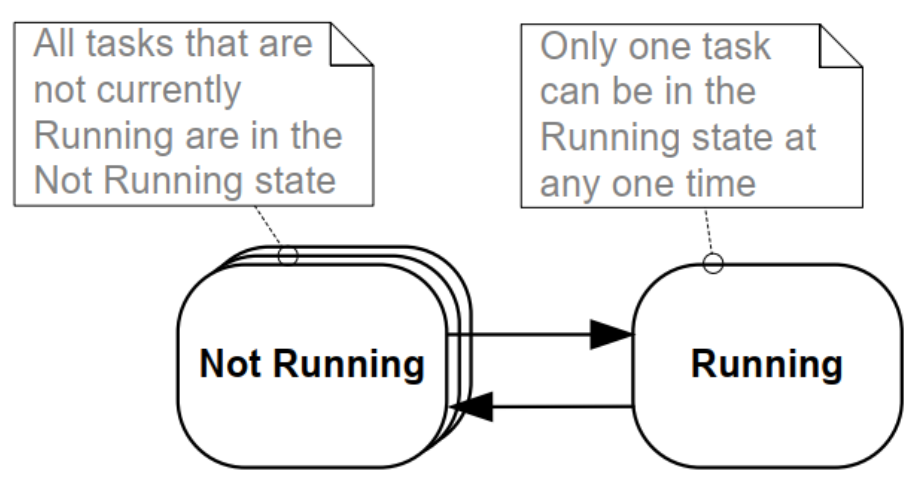

## 任务创建

可以使用六个API函数来创建任务：xTaskCreate()、xTaskCreateStatic()、xTaskCreateRestricted()、xTaskCreateRestrictedStatic()、xTaskCreateAffinitySet()和xTaskCreateStaticAffinitySet()。

每个任务需要两块内存：一块用于存储其任务控制块（TCB），另一块用于存储其堆栈。 名称中包含“Static”的FreeRTOS API函数使用作为参数传递给函数的预分配内存块。相反，名称中不包含“Static”的API函数在运行时从系统堆栈动态分配所需的内存。

某些FreeRTOS端口支持任务在“受限”(restricted)或“非特权”(unprivileged)模式下运行。名称中包含“受限”的FreeRTOS API函数创建的任务以有限访问系统内存的方式执行。名称中不包含“受限”的API函数创建的任务在“特权模式”下执行，并能够访问系统整个内存映射。

支持对称多处理（SMP）的FreeRTOS内核允许同一CPU的多个核心上并发运行不同的任务。对于这些内核，可以通过带有“Affinity”命名的函数指定任务将在哪个核心上运行。

FreeRTOS任务创建API函数较为复杂。本文档中的大多数示例使用xTaskCreate()，因为它在这类函数中是最简单的。

### xTaskCreate() API函数

[代码块4.4.1-1](#Code4.4.1-1)展示了xTaskCreate() API函数的原型。xTaskCreateStatic()函数有两个额外的参数，分别指向用于存储任务数据结构和堆栈的预分配内存。 [第2.5节：数据类型与编码风格指南](#Section2.5)描述了所使用的数据类型和命名规范。

*==xTaskCreate函数原型==*

```cpp
BaseType_t xTaskCreate(  TaskFunction_t pvTaskCode,
                         const char * const pcName,
                         configSTACK_DEPTH_TYPE usStackDepth,
                         void * pvParameters,
                         UBaseType_t uxPriority,
                         TaskHandle_t * pxCreatedTask );
```

xTaskCreate()入参出参介绍：

* pvTaskCode
  * 任务本质上是不退出的C函数，因此通常以无限循环的形式实现。pvTaskCode参数简单地是指向实现任务的函数的指针（实质上就是函数的名称）。
* pcName
  * 任务的一个描述性名称。FreeRTOS 并未以任何方式使用此名称，其包含纯粹作为调试辅助。通过人类可读名称识别任务比通过其句柄识别任务要简单得多。
  * 应用定义的常量configMAX_TASK_NAME_LEN定义了任务名称的最大长度，包括空终止符。提供较长的字符串会导致字符串被截断。
* usStackDepth
  * 指定任务使用的栈大小。若要使用预分配内存而非动态分配内存，应使用 xTaskCreateStatic() 而非 xTaskCreate()。
  * 请注意，该值指定的是栈可以容纳的单词数量，而不是字节数。例如，如果栈的宽度为32位，且usStackDepth为128，则xTaskCreate()将分配512字节的栈空间（128 * 4字节）。
  * `configSTACK_DEPTH_TYPE` 是一个宏，允许应用程序开发者指定用于存储栈大小的数据类型。如果未定义，则`configSTACK_DEPTH_TYPE`默认为`uint16_t`。如果栈深度乘以栈宽度超过了65535（即最大的16位数字），则在`FreeRTOSConfig.h`中应定义`configSTACK_DEPTH_TYPE`为`unsigned long`或`size_t`。
  * 13.3小节介绍了一个选择最优栈大小的实用方法
* pvParameters
  * 实现任务功能的函数接受一个单空的指针（void *）参数。pvParameters是通过该参数传递到任务中的值。
* uxPriority
  * 定义任务的优先级。数值0代表最低优先级，而(configMAX_PRIORITIES – 1)则代表最高优先级。第4.5节详细描述了用户自定义的configMAX_PRIORITIES常量。
  * 如果定义的uxPriority值大于（configMAX_PRIORITIES - 1），则该值将被限制为（configMAX_PRIORITIES - 1）。
* pxCreatedTask
  * 指向用于存储创建任务句柄的位置。该句柄可在后续 API 调用中被用于，例如更改任务的优先级或删除任务。
  * `pxCreatedTask`是一个可选参数，如果不需要任务的句柄，则可以设置`NULL`。
* 返回值
  * pdPASS：暗示任务创建成功。
  * pdFAIL：这表明创建任务时可用的堆内存不足。第3章提供了有关堆内存管理的更多信息。

#### 示例4.4.1.1创建任务

以下示例演示了创建两个简单任务并启动新创建任务的步骤。这两个任务通过使用粗糙的忙等循环来创建周期性延迟，简单地定期打印出一个字符串。两个任务具有相同的优先级，除了它们打印的字符串不同——请参阅[代码块4.4.1.1-1](#Code4.4.1.1-1)以获取各自的实现代码。关于在任务中使用printf()的警告，请参阅第8章。

*==实施示例4.1中所用的第一个任务的执行==*

```cpp
void vTask1( void * pvParameters )
{
 /* ulCount is declared volatile to ensure it is not optimized out. */
 volatile unsigned long ulCount;
 for( ;; )
 {
 /* Print out the name of the current task task. */
 vPrintLine( "Task 1 is running" );
 /* Delay for a period. */
 for( ulCount = 0; ulCount < mainDELAY_LOOP_COUNT; ulCount++ )
 {
	 /*
		这个循环只是一个非常粗糙的延时实现。在此处没有任何操作。
		后续的示例将用合适的延时/休眠函数替换。
	 */
 }
 }
}

void vTask2( void * pvParameters )
{
 /* 为了确保 `ulCount` 不会被优化掉，我们将其声明为 `volatile`。 */
 volatile unsigned long ulCount;
 /* 根据大多数任务的情况，该任务是在一个无限循环中实现的 */
 for( ;; )
 {
 /* 打印出此任务的名称。 */
 vPrintLine( "Task 2 is running" );
 /* 延迟一段时间。 */
 for( ulCount = 0; ulCount < mainDELAY_LOOP_COUNT; ulCount++ )
 {
     /*
    	此循环仅是一个非常粗略的延迟实现。此处无任何操作。后继示例将用合适的延迟/休眠函数替换此粗略循环。
     */
 }
 }
}

主函数 `main()` 在启动调度器之前创建任务
int main( void )
{
 /*
	在此处声明的变量在 FreeRTOS 调度器启动之后可能不再存在。请勿尝试从任务中访问由 main() 使用的栈上声明的变量。
 */
 /*
	创建两个任务之一。请注意，在实际应用中，应检查xTaskCreate()调用的返回值，以确保任务创建成功。
 */
 xTaskCreate( vTask1, /* 指向实现任务功能的函数指针。*/
 "Task 1",/* 任务名称*/
 1000, /* 栈深度 */
 NULL, /* 本例未使用任务参数。 */
 1, /* 该任务将以优先级1运行。 */
 NULL ); /* 本例未使用任务句柄。 */

 //请以完全相同的方式并使用相同的优先级创建另一项任务。
 xTaskCreate( vTask2, "Task 2", 1000, NULL, 1, NULL );
 /* 启动调度器以使任务开始执行。 */
 vTaskStartScheduler();
 /*
    若一切正常，main() 程序将不会执行至此处，因为调度器将开始运行所创建的任务。若main()程序执行至此处，则表示系统内存堆（heap memory）不足，无法创建空闲任务（idle task）或定时任务（timer task）（详见本书后续章节）。第三章将提供更多关于内存堆管理的详细信息。
 */
 for( ;; );
}

结果输出：
C:\Temp>rtosdemo
Task 1 is running
Task 2 is running
Task 1 is running
Task 2 is running
Task 1 is running
Task 2 is running
Task 1 is running
Task 2 is running
Task 1 is running
Task 2 is running
Task 1 is running
Task 2 is running
Task 1 is running
Task 2 is running
```

<a id="Code4.4.1.1-1"></a>

结果[^4]表明了两个任务似乎同时执行；然而，这两个任务都在同一个处理器内核上执行，因此这种情况并不存在。实际上，两个任务都在迅速地进入并退出运行状态。由于两个任务的优先级相同，因此它们共享同一个处理器内核上的时间。[图4.4.1.1-1](#Pic4.4.1.1-1)展示了它们的实际执行模式。

[图4.4.1.1-1](#Pic4.41.1-1)底部的箭头显示时间从时间t1开始向后推移。彩色线条显示了每个时间点正在执行的任务——例如，在时间t1和t2之间，任务1正在执行。

*==两个示例任务的实际执行模式==*

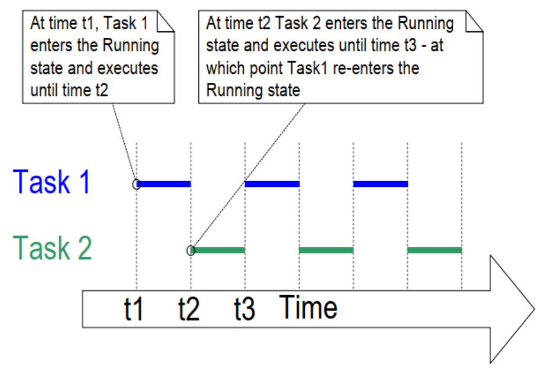

<a id="Pic4.4.1.1-1"></a>

任何时候只能存在一个任务处于运行状态。因此，当一个任务进入运行状态（任务被切换进来）时，另一个任务则进入非运行状态（任务被切换出去）。

[代码块4.4.1.1-1](#Code4.4.1.1-1)在调度器启动之前从main()函数内部创建了这两个任务。同时，任务也可以从另一个任务内部创建。例如，任务2可以像[代码块4.4.1.2-2](#Code4.4.1.2-2)所示的那样从任务1内部创建。

*==调度器启动后从另一个任务中创建任务==*

```cpp
void vTask1( void * pvParameters )
{
 const char *pcTaskName = "Task 1 is running\r\n";
 volatile unsigned long ul; /* volatile to ensure ul is not optimized away. */
 /*
 * If this task code is executing then the scheduler must already have * been started. Create the other task before entering the infinite loop.
 */
 xTaskCreate( vTask2, "Task 2", 1000, NULL, 1, NULL );
 for( ;; )
 {
 /* Print out the name of this task. */
 vPrintLine( pcTaskName );
 /* Delay for a period. */
 for( ul = 0; ul < mainDELAY_LOOP_COUNT; ul++ )
 {
 /*
 * This loop is just a very crude delay implementation. There is
 * nothing to do in here. Later examples will replace this crude
 * loop with a proper delay/sleep function.
 */
 }
 }
}
```

<a id="Code4.4.1.2-2"></a>

#### 使用任务入参

在示例4.4.1.1中创建的两个任务几乎完全相同，它们之间唯一的区别在于打印出的文本字符串。如果你创建一个单一任务实现的两个实例，并使用任务参数将字符串传递给每个实例，这将消除冗余。

示例4.4.1.2用名为vTaskFunction()的单个任务函数替换了示例4.4.1.1中使用的两个任务函数，如[代码块4.4.1.2-1](#Code4.4.1.2-1)所示。请注意，任务参数被强制转换为char*以获取任务应打印出的字符串。

*==所使用的单一任务函数曾用于在示例4.4.1.2中创建两个任务。==*

```cpp
void vTaskFunction( void * pvParameters )
{
 char *pcTaskName;
 volatile unsigned long ul; /* volatile to ensure ul is not optimized away. */
 /*
 * The string to print out is passed in via the parameter. Cast this to a
 * character pointer.
 */
 pcTaskName = ( char * ) pvParameters;
 /* As per most tasks, this task is implemented in an infinite loop. */
 for( ;; )
 {
 /* Print out the name of this task. */
 vPrintLine( pcTaskName ); /* Delay for a period. */
 for( ul = 0; ul < mainDELAY_LOOP_COUNT; ul++ )
 {
 /*
 * This loop is just a very crude delay implementation. There is
 * nothing to do in here. Later exercises will replace this crude
 * loop with a proper delay/sleep function.
 */
 }
 }
}
```

<a id="Code4.4.1.2-1"></a>

[代码块4.4.1.2-2](#Code4.4.1.2-2)创建了两个由vTaskFunction()实现的任务实例，利用任务的参数将不同的字符串传递给每个实例。这两个任务在FreeRTOS调度器的控制下独立执行，各自拥有自己的栈空间，因此它们各自拥有自己独立的pcTaskName和ul变量副本。

*==示例4.4.1.2的main函数==*

```cpp
/*
 * Define the strings that will be passed in as the task parameters. These are
 * defined const and not on the stack used by main() to ensure they remain
 * valid when the tasks are executing.
 */
static const char * pcTextForTask1 = "Task 1 is running";
static const char * pcTextForTask2 = "Task 2 is running";
int main( void )
{
 /*
 * Variables declared here may no longer exist after starting the FreeRTOS
 * scheduler. Do not attempt to access variables declared on the stack used
 * by main() from tasks.
 */
 /* Create one of the two tasks. */
 xTaskCreate( vTaskFunction, /* Pointer to the function that
 implements the task. */
 "Task 1", /* Text name for the task. This is to
 facilitate debugging only. */
 1000, /* Stack depth - small
microcontrollers
 will use much less stack than
this.*/
 ( void * ) pcTextForTask1, /* Pass the text to be printed into
 the task using the task parameter.
*/
 1, /* This task will run at priority 1.
*/
 NULL ); /* The task handle is not used in
 this example. */ /*
 * Create the other task in exactly the same way. Note this time that
 * multiple tasks are being created from the SAME task implementation
 * (vTaskFunction). Only the value passed in the parameter is different.
 * Two instances of the same task definition are being created.
 */
 xTaskCreate( vTaskFunction,
 "Task 2",
 1000,
 ( void * ) pcTextForTask2,
 1,
 NULL );
 /* Start the scheduler so the tasks start executing. */
 vTaskStartScheduler();
 /*
 * If all is well main() will not reach here because the scheduler will
 * now be running the created tasks. If main() does reach here then there
 * was not enough heap memory to create either the idle or timer tasks
 * (described later in this book). Chapter 3 provides more information on
 * heap memory management.
 */
 for( ;; )
 {
 }
}
```

<a id="Code4.4.1.2-2"></a>

结果与[图4.4.1.1-1](#Pic4.41.1-1)一致。

## 任务优先级

FreeRTOS调度器始终确保可以运行的最高优先级任务是被选中进入运行状态的任务。具有相同优先级的任务会依次转换进入和退出运行状态。

API函数创建任务时使用的uxPriority参数为任务赋予其初始优先级。vTaskPrioritySet() API函数用于在任务创建后更改任务的优先级。

应用定义的编译时配置常量configMAX_PRIORITIES设置可用优先级的数量。数值较低的优先级表示低优先级任务，其中优先级0为最低优先级——因此有效优先级范围介于0至(configMAX_PRIORITIES – 1)。任意数量的任务可共享同一优先级。

FreeRTOS 任务调度器存在两种用于选择运行状态任务（Running state task）的算法实现，而configMAX_PRIORITIES的最大允许值则取决于所使用的具体实现：

### 通用调度器

通用的调度程序是用C语言编写的，可以与FreeRTOS架构的所有端口一起使用。它不设configMAX_PRIORITEIS的上限。通常，建议尽量减少configMAX_PRIORITIES的值，因为更多的值需要更多的RAM，并且会导致更长的最坏情况执行时间。

### 优化架构的调度器

针对特定架构的优化实现是用架构特定的汇编代码编写的，其性能优于通用的C语言实现，并且对于所有configMAX_PRIORITIES值，最坏情况下的执行时间相同。

针对优化的架构实现，在32位架构上对configMAX_PRIORITIES施加的最大值为32，在64位架构上施加的最大值为64。与通用方法相同，建议将configMAX_PRIORITIES保持在最实用的最低值，因为更高的值需要更多的RAM。

在`FreeRTOSConfig.h`中设置`configUSE_PORT_optimized_TASK_SELECTION`为1以使用架构优化实现，或设置为0以使用通用实现。并非所有`FreeRTOS`内核都具有架构优化实现。对于具备优化实现的内核，默认值为`configUSE_PORT_optimized_TASK_SELECTION`为1，如果该值未定义。而对于不具备优化实现的内核，如果`configUSE_PORT_optimized_TASK_SELECTION`未定义，则默认值为0。

## 时间测量与时钟中断

第4.12节“调度算法”介绍了一项可选功能，称为“时间片”。时间片在迄今为止提供的示例中使用，并且是它们产生的输出中观察到的行为。在示例中，两个任务均以相同优先级创建，并且两个任务始终能够运行。因此，每个任务执行一个“时间片”，在时间片开始时进入运行状态，并在时间片结束时退出运行状态。在[图4.4.1.1-1](#Pic4.41.1-1)中，t1和t2之间的时间间隔等于一个时间片。

调度器在每个时间片结束时执行，用于选择下一个要运行的任务[^5]。为此目的，使用了一种周期性中断，称为“滴答中断”（tick interrupt）。编译时配置常量configTICK_RATE_HZ设定了滴答中断的频率，并因此也决定了每个时间片的长度。例如，将configTICK_RATE_HZ设置为100（赫兹）会导致每个时间片持续10毫秒。两次滴答中断之间的时间间隔称为“滴答周期”——因此一个时间片等于一个滴答周期。

[图4.6-1](#Pic4.6-1)在[图4.4.1.1-1](#Pic4.41.1-1)的基础上进一步扩展，以展示调度器的执行过程。在[图4.6-1](#Pic4.6-1)中，最上方的一行表示调度器的执行时刻，细箭头显示了从任务到滴答中断，再从滴答中断返回不同任务的执行顺序。

configTICK_RATE_HZ 的最佳值取决于具体应用，尽管100是一个典型值。

*==执行序列扩展以展示计时器中断的执行==*

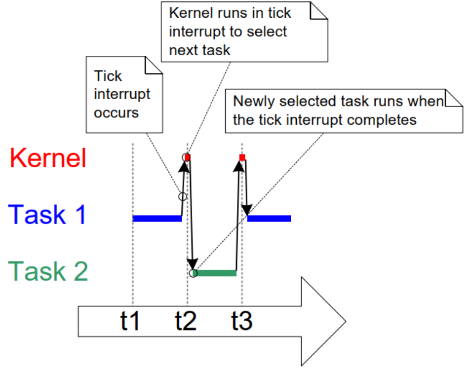

<a id="Pic4.6-1"></a>

FreeRTOS API调用以tick周期倍数来指定时间，也被成为"ticks"。pdMS_TO_TICKS()宏用以将毫秒为单位的事件转换为以tick为单位的时间。可用的分辨率取决于定义的tick频率，如果tick频率高于1kHz（如果configTICK_RATE_HZ大于1000），则不能使用pdMS_TO_TICKS()。[代码块4.6-1](#Code4.6-1)展示了如何使用pdMS_TO_TICKS()将指定为200毫秒的时间转换为等价于以tick为单位的时间。

*==使用 `pdMS_TO_TICKS()` 宏将 200 毫秒转换为等效的滴答周期时间==*

```cpp
/* pdMS_TO_TICKS() 接受毫秒作为唯一的参数，并计算出等效的tick周期数。以下示例展示了如何将xTimeInTicks设置为与200毫秒等效的tick周期数。 */ 
TickType_t xTimeInTicks = pdMS_TO_TICKS(200);
```

<a id="Code4.6-1"></a>

使用pdMS_TO_TICKS()函数以毫秒为单位指定时间，而非直接以时钟滴答计数表示，可确保应用程序中指定的时间在时钟频率变更时保持不变。"时钟滴答计数"是指自调度器启动以来发生的时钟滴答中断总数，前提是时钟滴答计数未发生溢出。用户应用程序在指定延时周期时无需考虑溢出问题，因为FreeRTOS内部会自行管理时间一致性。 

第4.12节："调度算法"描述了影响调度器何时选择新任务运行以及时钟滴答中断何时执行的配置常量。

### 优先级实验

<a id="Exp4.3"></a>

调度器将始终确保能够运行的最高优先级任务是被选定为进入运行状态的任务。前文中的示例创建了两个相同优先级的任务，因此它们交替进入和退出运行状态。本示例探讨了当任务具有不同优先级时会发生什么。[代码块4.6.1-1](#Code4.6.1-1)展示了用于创建任务的代码，第一个任务优先级为1，第二个任务优先级为2。实现这两个任务的单个函数未发生变化；它仍然周期性地打印一条字符串，使用空循环来创建延迟。

调度器总是会选择能够运行的最高优先级任务。任务2的优先级比任务1高，并且总是能够运行；因此，调度器总是选择任务2，而任务1从不执行。任务1被称为被任务2“饿死”，即它无法打印字符串，因为它从未处于运行状态。

任务2始终可以运行，因为它从不需要等待任何事物——它要么在空循环中循环，要么向终端打印输出。

*==创建两个不同优先级的任务==*

```cpp
/*
   定义将作为任务参数传递的字符串。
   这些字符串被定义为常量，而不是在堆栈上定义，以确保在任务执行时它们保持有效。
 */
static const char * pcTextForTask1 = "Task 1 is running";
static const char * pcTextForTask2 = "Task 2 is running";
int main( void )
{
 /* Create the first task with a priority of 1. */
 xTaskCreate( vTaskFunction, /* Task Function */
 "Task 1", /* Task Name */
 1000, /* Task Stack Depth */
 ( void * ) pcTextForTask1, /* Task Parameter */
 1, /* Task Priority */
 NULL );
 /* Create the second task at a higher priority of 2. */
 xTaskCreate( vTaskFunction, /* Task Function */
 "Task 2", /* Task Name */
 1000, /* Task Stack Depth */
 ( void * ) pcTextForTask2, /* Task Parameter */
 2, /* Task Priority */
 NULL );
 /* Start the scheduler so the tasks start executing. */
 vTaskStartScheduler();
 /* Will not reach here. */
 return 0;
}

// 结果
C:\Temp>rtosdemo
Task 2 is running
Task 2 is running
Task 2 is running
Task 2 is running
Task 2 is running
Task 2 is running
Task 2 is running
Task 2 is running
Task 2 is running
Task 2 is running
Task 2 is running
Task 2 is running
Task 2 is running
Task 2 is running
Task 2 is running
```

<a id="Code4.6.1-1"></a>

*==当一项任务比另一项任务具有更高优先级时的执行模式，参见例4.6.1==*

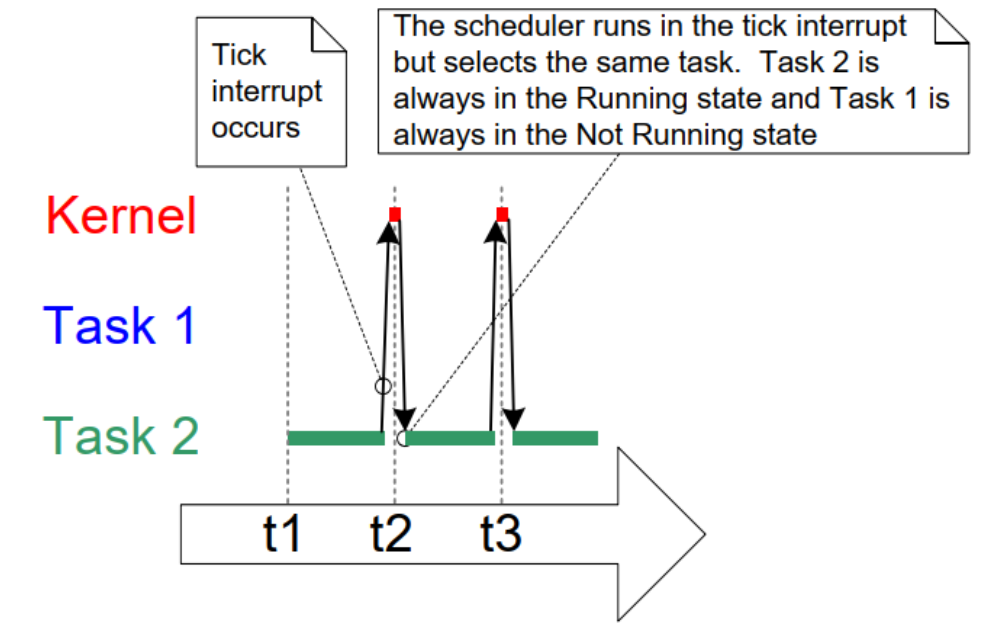

<a id="Pic4.6.1-1"></a>

## 扩展未运行状态

迄今为止，创建的线程总是有处理任务需要执行，而从未需要等待任何事情——由于它们从未需要等待，它们总是能够进入运行状态。这种“持续处理”的任务具有有限的实用性，因为它们只能在最低优先级上创建。如果它们以其他优先级运行，它们将阻止低优先级任务永远运行。

为了使这些任务变得有用，它们必须被重写为事件驱动的。一个事件驱动的任务只有在事件触发它之后才有工作（处理）要做，并且在那之前不能进入运行状态。调度器总是选择能够运行的最高优先级任务。如果由于等待事件而无法选择高优先级任务，调度器必须相反地选择能够运行的低优先级任务。 因此，编写事件驱动的任务意味着可以在不同的优先级下创建任务，而不会让高优先级任务耗尽处理时间，从而使低优先级任务得不到处理。

### 阻塞状态

一个等待事件的任务被称为处于“阻塞”状态，这是“未运行”状态的一个子状态。

任务可以进入阻塞状态，以等待两种不同类型的事件：

1. 时间相关事件——这些事件发生在延迟周期到期或达到绝对时间时。例如，一个任务可能进入阻塞状态，等待10毫秒过去。
2. 同步事件——这些事件源自另一个任务或中断。例如，一个任务可能会进入阻塞状态以等待数据到达队列。同步事件涵盖了广泛的事件类型。

FreeRTOS队列、二进制信号量、计数信号量、互斥锁、递归互斥锁、事件组、流缓冲区、消息缓冲区以及直接任务通知均可创建同步事件。后续章节将涵盖这些功能的大部分内容。

一个任务可以阻塞于具有超时的同步事件上，从而有效地在两种类型的事件上同时阻塞。例如，一个任务可以选择等待最多10毫秒以等待队列中的数据到达。如果数据在10毫秒内到达，或者10毫秒内没有数据到达，任务将离开阻塞状态。

### 悬置状态

挂起（Suspended）也是非运行（Not Running）状态的一种亚状态。处于挂起状态的任务对调度器不可用。 进入挂起状态唯一途径是通过调用vTaskSuspend() API函数，而退出该状态唯一方式是调用vTaskResume()或xTaskResumeFromISR() API函数。绝大多数应用程序不使用挂起状态。

### 完成状态转换图

[图4.7.3-1](#Pic4.7.3-1)扩展了简化的状态图，以包括本节中描述的所有“未运行”子状态。到目前为止创建的示例任务都没有使用阻塞或挂起状态。它们仅在[图4.7.3-1](#Pic4.7.3-1)中用粗线所示的“就绪”状态和“运行”状态之间转换。

*==全任务状态机==*

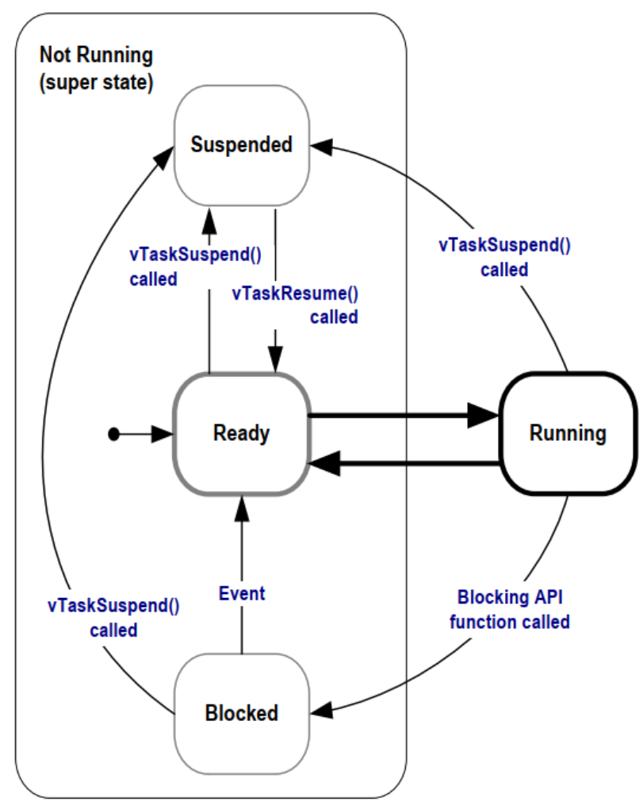

<a id="Pic4.7.3-1"></a>

#### 示例使用阻塞状态创建延时

目前所展示的示例中创建的所有任务均为“周期性”任务——它们在延迟一段时间后打印出字符串，然后再延迟，如此循环。延迟是通过使用空循环非常粗糙地生成的——任务通过轮询一个递增的循环计数器，直到达到一个固定值。[优先级实验](#Exp4.3)明显展示了这种方法的不利之处。在执行空循环期间，高优先级任务保持在运行状态，导致低优先级任务缺乏任何处理时间。

以下是另一种形式的轮询的若干缺点，其中最重要的一点是它的低效率。在轮询期间，任务实际上没有真正的工作要做，但它仍然使用最大处理时间，从而浪费了处理器周期。示例通过将轮询的空循环替换为调用vTaskDelay() API函数来纠正这一行为，其原型和新的任务定义在[代码块4.7.3.1-1](#Code4.7.3.1-1)中显示。请注意，只有在FreeRTOSConfig.h中INCLUDE_vTaskDelay设置为1时，vTaskDelay() API函数才可用。

```cpp
void vTaskDelay( TickType_t xTicksToDelay );

void vTaskFunction( void * pvParameters )
{
 char * pcTaskName;
 const TickType_t xDelay250ms = pdMS_TO_TICKS( 250 );
 /*
	打印字符串通过参数传入。将其转换为字符指针类型。
 */
 pcTaskName = ( char * ) pvParameters;
 /* 根据大多数任务的情况，该任务是在一个无限循环中实现的。 */
 for( ;; )
 {
 /* Print out the name of this task. */
 vPrintLine( pcTaskName );
 /*
在一定时间内延迟。此时，使用vTaskDelay()函数调用，该函数将任务置于阻塞状态，直到延迟期满。参数指定以‘ticks’为单位的时间，并使用pdMS_TO_TICKS()宏（其中xDelay250ms常量已声明）将250毫秒转换为等效的tick时间。
*/
 vTaskDelay( xDelay250ms );
 }
}

C:\Temp>rtosdemo
Task 2 is running
Task 1 is running
Task 2 is running
Task 1 is running
Task 2 is running
Task 1 is running
Task 2 is running
Task 1 is running
Task 2 is running
Task 1 is running
Task 2 is running
Task 1 is running
Task 2 is running
Task 1 is running
Task 2 is running
Task 1 is running
```

<a id="Cpde4.7.3.1-1"></a>

vTaskDelay函数参数：

* xTicksToDelay
  * 调用任务在转变为就绪状态之前，处于阻塞状态的次数取决于被打断的tick的数目。
  * 例如，若在计时器计数为10,000时执行名为vTaskDelay(100)的任务，则该任务会立即进入阻塞状态，并保持在阻塞状态直至计时器计数达到10,100。
  * 宏定义 `pdMS_TO_TICKS()` 可用于将指定的时间戳（以毫秒计）转换为以时钟周期计的时间戳。例如，调用 `vTaskDelay(pdMS_TO_TICKS(100))` 将导致调用任务的阻塞状态保持 100 毫秒。

[图4.7.3.1-1](#Pic4.7.3.1-1)所示的执行顺序解释了为何两个任务即使在不同的优先级下创建，仍能运行。为了简化起见，调度器自身的执行过程被省略了。

*==使用vTaskDelay()代替空循环时的执行顺序==*

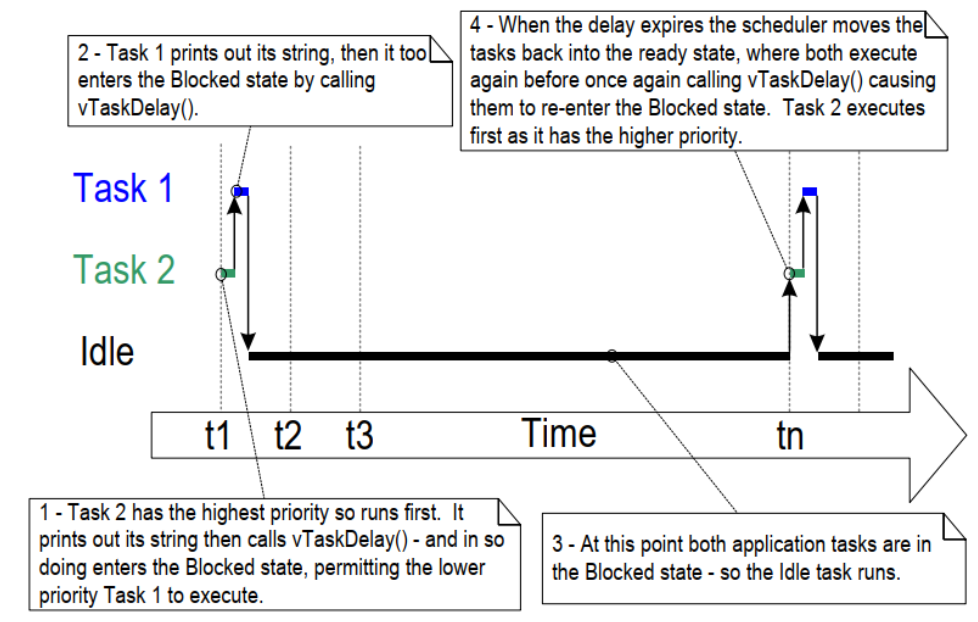

<a id="Pic4.7.3.1-1"></a>

仅改变了两个任务的执行方式，并未改变其功能。[图4.6-1](#Pic4.6-1)和[图4.7.3.1-1](#Pic4.7.3.1-1)对比，可以清晰看到，这种功能的实现变得更加高效。

[图4.6-1](#Pic4.6-1)展示了任务使用空循环来创建延迟，从而始终能够运行的执行模式。在这种情况下，所有任务共同使用了100%的可用处理器时间。而[图4.7.3.1-1](#Pic4.7.3.1-1)则展示了当任务在整个延迟期间都处于阻塞状态的执行模式。只有在它们实际需要执行工作（例如，仅仅需要打印一条消息）时，这些任务才会使用处理器时间，因此仅使用了极小比例的可用处理时间。

在[图4.7.3.1-1](#Pic4.7.3.1-1)所示的场景中，每当任务离开“阻塞”状态后，它们会在重新进入“阻塞”状态之前执行一小段时间（一个tick周期的一部分）。大多数时候，并没有可以运行的应用任务（即，没有处于“就绪”状态的应用任务），因此也就没有可以被选择进入“运行”状态的应用任务。在这种情况持续期间，空闲任务运行。分配给空闲任务的处理时间是系统中剩余处理能力的一个度量。通过使用实时操作系统（RTOS），仅通过允许应用程序完全基于事件驱动，就可以显著增加系统的剩余处理能力。

[图4.7.3.1-2](#Pic4.7.3.1-1)中的粗线显示了示例4.7.3.1中任务执行的转换，每个任务现在都会经过阻塞状态，然后再返回到就绪状态。

*==粗线表示了示例4.7.3.1中的任务所执行的状态转换。==*

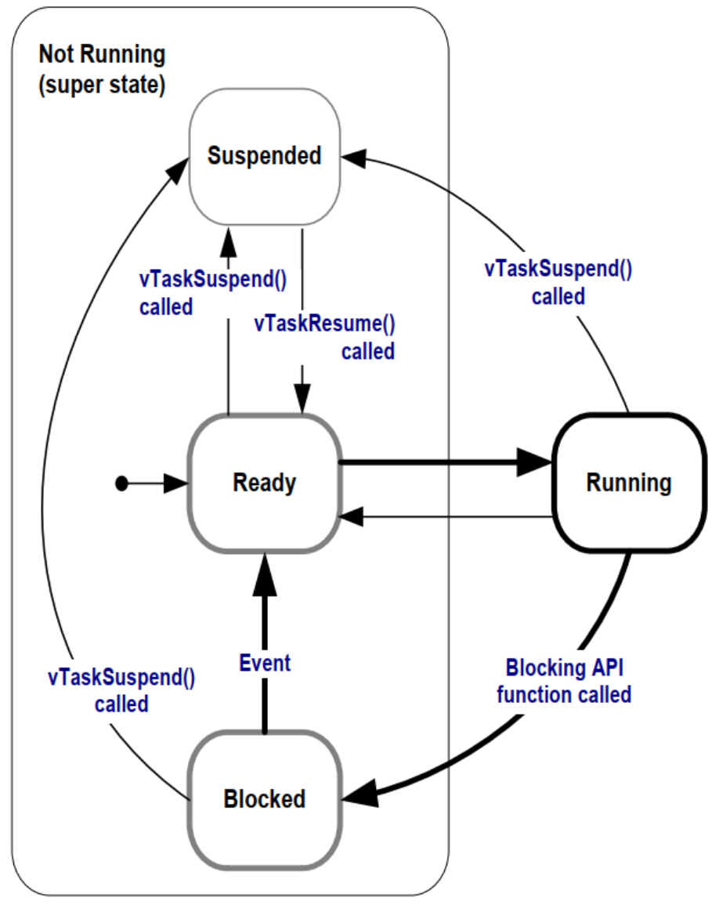

<a id="Pic4.7.3.1-1"></a>

### vTaskDelayUntil函数

vTaskDelayUntil() 与 vTaskDelay() 类似。正如刚才所演示的，vTaskDelay() 的参数指定了调用 vTaskDelay() 的任务与该任务再次退出阻塞状态之间应发生的tick中断次数。任务在阻塞状态下停留的时间由 vTaskDelay() 的参数指定，但任务离开阻塞状态的时间相对于 vTaskDelay() 被调用时的时间。

vTaskDelayUntil() 函数的参数指定的是调用的任务应当从阻塞状态转移到就绪状态的确切 tick 计数值。当需要固定执行周期（即希望任务以固定的频率周期性执行）时，应使用 vTaskDelayUntil() 接口函数。与 vTaskDelay() 不同的是，调用任务被解阻的状态是绝对时间，而不是相对于函数被调用的时间（这是 vTaskDelay() 的情况）。

vTaskDelayUntil参数：

* pxPreviousWakeTime
  * 此参数以假设vTaskDelayUntil()用于实现一个周期性执行且具有固定频率的任务为前提进行命名。在此情况下，pxPreviousWakeTime存储了任务上次离开阻塞状态的时间（即“被唤醒”）。此时间被用作参考点，以计算任务下次离开阻塞状态的时间。
  * pxPreviousWakeTime 指针所指向的变量在 vTaskDelayUntil() 函数中会自动更新；通常情况下，应用程序代码不会对其进行修改，但在首次使用前必须将其初始化为当前的滴答计数。
* xTimeIncrement
  * 此参数亦如此命名，其前提是vTaskDelayUntil()函数正被用于实现一个以固定频率周期性执行的任务，而该频率由xTimeIncrement值设定。
  * xTimeIncrement以“滴答”为单位指定。可以使用宏pdMS_TO_TICKS()将指定为毫秒的时间转换为以滴答为单位的时间。

在[代码块4.7.4-1](#Code4.7.4-1)中创建的两个任务为周期性任务，但使用vTaskDelay()并不能保证它们运行频率的固定性，因为任务离开阻塞状态的时间相对于它们调用vTaskDelay()的时间是相对的。将任务转换为使用vTaskDelayUntil()而不是vTaskDelay()可以解决这一潜在问题。

*==将使用 vTaskDelayUntil() 函数实现示例任务。==*

```cpp
void vTaskDelayUntil( TickType_t * pxPreviousWakeTime,
 TickType_t xTimeIncrement );

void vTaskFunction( void * pvParameters )
{
 char * pcTaskName;
 TickType_t xLastWakeTime;
 /*
 * The string to print out is passed in via the parameter. Cast this to a
 * character pointer.
 */ pcTaskName = ( char * ) pvParameters;
 /*
变量xLastWakeTime 需要初始化为当前的tick 计数。请注意，这是唯一一次显式写入该变量的操作。在执行vTaskDelayUntil()之后，xLastWakeTime 自动更新。
 */
 xLastWakeTime = xTaskGetTickCount();
 /* As per most tasks, this task is implemented in an infinite loop. */
 for( ;; )
 {
 /* Print out the name of this task. */
 vPrintLine( pcTaskName );
 /*
本任务应精确执行每250毫秒一次。根据vTaskDelay()函数，时间以“节拍”为单位测量，而pdMS_TO_TICKS()宏用于将毫秒转换为节拍。 在vTaskDelayUntil()函数内，xLastWakeTime自动更新，因此任务本身不需要明确更新该变量。
 */
 vTaskDelayUntil( &xLastWakeTime, pdMS_TO_TICKS( 250 ) );
 }
}
```

<a id="Code4.7.4-1"></a>

#### 将阻塞和非阻塞任务结合起来

之前的例子单独考察了轮询和阻塞任务的执行行为。此示例重申了我们之前关于预期系统行为的讨论，并展示了当这两个方案结合执行时的执行序列，如下：

1. 创建两个优先级为1的任务，这些任务不间断打印一个字符串
   1. 这些任务永远不会发起可能导致它们进入阻塞状态的API函数调用，因此它们始终处于准备就绪（Ready）或运行（Running）状态。这类任务被称为“持续处理”任务，因为它们总是有工作要做（尽管在这种情况下，工作相对简单）。[代码块4.7.4.1-1](#Code4.7.4.1-1)展示了连续处理任务的源代码。

2. 第三项任务被创建，其优先级为2，高于其他两项任务的优先级。第三项任务同样输出字符串，但这一次是周期性地，因此它使用vTaskDelayUntil() API函数在每次打印迭代之间将自己置于阻塞状态。

```cpp
void vContinuousProcessingTask( void * pvParameters )
{
 char * pcTaskName;
 /*
 * The string to print out is passed in via the parameter. Cast this to a
 * character pointer.
 */
 pcTaskName = ( char * ) pvParameters;
 /* As per most tasks, this task is implemented in an infinite loop. */
 for( ;; )
 {
 /*
 * Print out the name of this task. This task just does this repeatedly
 * without ever blocking or delaying.
 */
 vPrintLine( pcTaskName );
 }
}

void vPeriodicTask( void * pvParameters )
{
 TickType_t xLastWakeTime;
 const TickType_t xDelay3ms = pdMS_TO_TICKS( 3 );
 /*
 * The xLastWakeTime variable needs to be initialized with the current tick
 * count. Note that this is the only time the variable is explicitly
 * written to. After this xLastWakeTime is managed automatically by the
 * vTaskDelayUntil() API function.
 */
 xLastWakeTime = xTaskGetTickCount();
 /* As per most tasks, this task is implemented in an infinite loop. */
 for( ;; )
 {
 /* Print out the name of this task. */
 vPrintLine( "Periodic task is running" );
 /*
 * The task should execute every 3 milliseconds exactly – see the
 * declaration of xDelay3ms in this function.
 */
 vTaskDelayUntil( &xLastWakeTime, xDelay3ms );
 }
}

// 输出
Continuous task 2 running
Continuous task 2 running
Periodic task is running
Continuous task 1 running
Continuous task 1 running
Continuous task 1 running
Continuous task 1 running
Continuous task 1 running
Continuous task 2 running
Continuous task 2 running
Continuous task 2 running
Continuous task 2 running
Continuous task 2 running
Continuous task 1 running
Continuous task 1 running
Continuous task 1 running
Continuous task 1 running
Continuous task 1 running
Continuous task 1 running
Continuous task 1 running
Continuous task 1 running
Continuous task 1 running
Periodic task is running
Continuous task 2 running
Continuous task 2 running
```

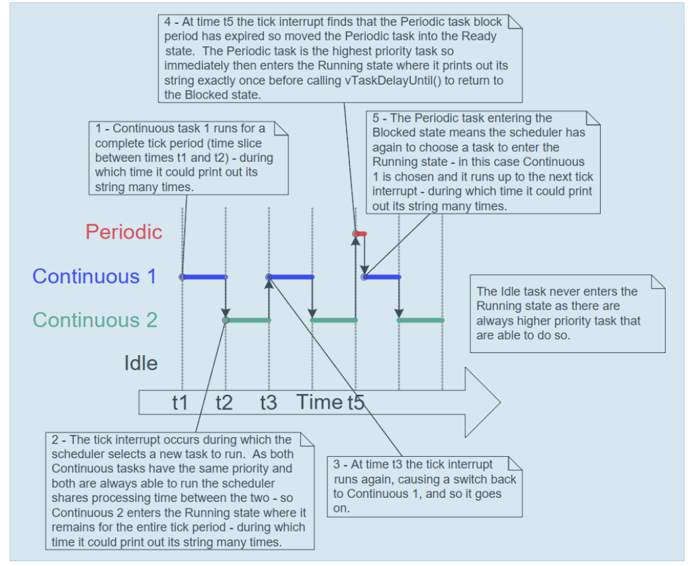

## 空闲任务与空闲任务钩子

上述示例创建的任务大部分时间都处于阻塞状态。这种状态下，它们无法运行，因此调度程序无法选择它们。

在调用 vTaskStartScheduler() 时，为了确保至少有一项任务能够进入 Running 状态[^6]，调度器会自动创建一个 Idle 任务。Idle 任务除了在循环中等待之外几乎不执行其他操作，因此与前面的示例中的任务一样，它总是能够运行。

空闲任务具有最低的优先级（优先级为零），以确保它永远不会阻止具有较高优先级的应用程序任务进入运行状态。然而，应用程序设计师可以创建优先级与空闲任务相同或相同的任务，如果需要的话。FreeRTOSConfig.h中的编译时配置常量configIDLE_SHOULD_YIELD可以用来防止空闲任务消耗本应更高效分配给具有相同优先级0的应用程序任务的处理时间。第4.12节，调度算法，描述了configIDLE_SHOULD_YIELD。

运行于最低优先级确保了空闲任务在更高优先级任务进入就绪状态时立即从运行状态过渡出来。这可以在[图4.7.3.1-1](#Pic4.7.3.1-1)中的时间tn观察到，此时空闲任务立即被交换出去，以便在任务2离开阻塞状态的同时执行。任务2被说成是抢占空闲任务。抢占是自动发生的，且无需抢占任务的知晓。

> 注：如果一个任务使用vTaskDelete() API函数删除自身，那么确保空闲任务不缺乏处理时间至关重要。这是因为空闲任务负责清理由自行删除的任务所使用的内核资源。

### 空闲任务钩子

通过使用空闲钩（或空闲回调）函数，可以直接在空闲任务中添加针对特定应用的功能。空闲钩函数是一种在空闲任务循环的每一次迭代后自动被调用的函数。

空闲任务钩子的常见用途包括：

1. 在不为执行目的而创建应用程序任务所带来的RAM开销的情况下，执行低优先级、后台或连续处理功能。
2. 测量剩余处理能力的数量。（空闲任务仅在所有更高优先级的应用任务均无工作可执行时才会运行；因此，测量分配给空闲任务的处理时间可以提供关于剩余处理时间的明确指示。）
3. 将处理器置于低功耗模式，提供了一种简便且自动化的方法，以便在没有应用程序处理需要执行时随时节省功耗（尽管其所能实现的节能效果不如tick-less空闲模式）。

### 在实现空闲任务钩子函数时存在的限制

空闲任务钩子函数必须遵守以下规则：

1. 闲置任务钩子函数绝不应尝试阻塞或挂起自身。任何形式的阻止空闲任务都可能导致一种情况，即没有任务可供进入运行状态。
2. 若应用程序任务使用vTaskDelete() API函数删除自身，则空闲任务钩子必须在合理时间内返回给调用者。这是因为空闲任务负责清理被删除任务所分配的内核资源。若空闲任务永久驻留在空闲钩子函数中，则清理工作无法进行。

空闲任务钩子函数必须具有下面代码块中所示的名字和原型。

```cpp
void vApplicationIdleHook( void );
```

#### 示例定义一个空闲任务钩子函数

对阻塞型任务延时API（blocking vTaskDelay() API）的使用导致产生了大量空闲时间，即应用程序任务均处于阻塞状态时，空闲任务（Idle task）得以执行的时间段。示例4.7通过引入空闲钩子函数（Idle hook function）利用了这种空闲时间，其源代码如下所示。

```cpp
/* Declare a variable that will be incremented by the hook function. */
volatile unsigned long ulIdleCycleCount = 0UL;
/*
 * Idle hook functions MUST be called vApplicationIdleHook(), take no
 * parameters, and return void.
 */
void vApplicationIdleHook( void )
{
 /* This hook function does nothing but increment a counter. */
 ulIdleCycleCount++;
}

/*
为了使空闲钩子函数被调用，在FreeRTOSConfig.h文件中必须将configUSE_IDLE_HOOK设置为1。实现创建的任务的函数稍作修改，以便打印ulIdleCycleCount值，如下所示。
*/

void vTaskFunction( void * pvParameters )
{
 char * pcTaskName;
 const TickType_t xDelay250ms = pdMS_TO_TICKS( 250 );
 /*
 * The string to print out is passed in via the parameter. Cast this to
 * a character pointer.
 */
 pcTaskName = ( char * ) pvParameters;
 /* As per most tasks, this task is implemented in an infinite loop. */
 for( ;; )
 {
 /*
 * Print out the name of this task AND the number of times
 * ulIdleCycleCount has been incremented.
 */
 vPrintLineAndNumber( pcTaskName, ulIdleCycleCount );
 /* Delay for a period of 250 milliseconds. */
 vTaskDelay( xDelay250ms ); }
}

// 可以观察到，空闲任务钩子函数在应用程序任务每次迭代之间执行约400万次（迭代次数取决于硬件速度）。
C:\Temp>rtosdemo
Task 2 is running
ulIdleCycleCount = 0
Task 1 is running
ulIdleCycleCount = 0
Task 2 is running
ulIdleCycleCount = 3869504
Task 1 is running
ulIdleCycleCount = 3869504
Task 2 is running
ulIdleCycleCount = 8564623
Task 1 is running
ulIdleCycleCount = 8564623
Task 2 is running
ulIdleCycleCount = 13181489
Task 1 is running
ulIdleCycleCount = 13181489
Task 2 is running
ulIdleCycleCount = 17838406
Task 1 is running
ulIdleCycleCount = 17838406
Task 2 is running
```

## 改变任务优先级

### vTaskPrioritySet函数

vTaskPrioritySet() API 函数用于在调度器启动后更改任务优先级。vTaskPrioritySet() API 函数仅在 FreeRTOSConfig.h 中将 INCLUDE_vTaskPrioritySet 设置为 1 时才可用。

```cpp
void vTaskPrioritySet( TaskHandle_t pxTask, UBaseType_t uxNewPriority );
```

vTaskPrioritySet参数：

* pxTask
  * 正在被修改优先级的任务句柄（即目标任务）。有关获取任务句柄的信息，请参阅 xTaskCreate() API 函数的 pxCreatedTask 参数，或 xTaskCreateStatic() API 函数的返回值。
  * 任务可以通过用有效的任务句柄替代NULL来改变自己的优先级。
* uxNewPriority
  * 任务优先级的设定重点。这会自动限制到最大可用优先级（configMAX_PRIORITIES-1），其中configMAX_PRIORITIES是在FreeRTOSConfig.h头文件中作为编译时常量设置的。

### uxTaskPriority函数

uxTaskPriorityGet() API函数用于获取任务的优先级。当在FreeRTOSConfig.h中设置INCLUDE_uxTaskPriorityGet为1时，该uxTaskPriorityGet() API函数才可用。

```cpp
UBaseType_t uxTaskPriorityGet(TaskHandle_t xTask);
```

uxTaskPriorityGet入参和返回值：

* pxTask
  * 被查询优先级的任务句柄（主题任务）。有关如何获取任务句柄的信息，请参阅xTaskCreate() API函数的pxCreatedTask参数。
  * 一项任务可以通过在有效任务句柄的位置传递NULL来查询其自身的优先级。
* 返回值
  * 当前分配给查询任务的优先级。

### 示例：改变任务优先级

调度程序总是选择状态为就绪的最高优先级任务进入运行状态。该通过使用vTaskPrioritySet() API函数相对地改变两个任务之间的优先级来演示这一点。 

示例创建了两个不同优先级的任务。两个任务都没有调用任何可能导致其进入阻塞状态的API函数，因此它们始终处于就绪状态或运行状态。因此，具有最高相对优先级的任务将始终是被调度器选为运行状态的任务。

1. Task1以最高优先级创建，因此它被保证最先运行。在提高任务2优先级之前任务1先打印几行字符串。
2. Task2一旦具有最高相对优先级，就会开始执行（进入运行状态）。在任何时候，只有一项任务可以处于运行状态，因此当Task2处于运行状态时，任务1处于就绪状态。
3. 任务2在将其自身优先级重置回低于任务1的优先级之前，会打印一条消息。
4. 当任务2将其优先级降级后，任务1再次成为最高优先级任务，因此任务1重新进入运行状态，迫使任务2回到就绪状态。

每个任务都可以通过使用NULL代替有效的任务句柄来查询和设置自身的优先级。任务句柄仅在任务需要引用除自身以外的其他任务时才需要，例如当任务1更改任务2的优先级时。为了允许任务1执行此操作，在创建任务2时获取并保存任务2的句柄，如下注释所示。

```cpp
void vTask1(void *pvParameters)
{
    UBaseType_t uxPriority;
    /*
   此任务总是在任务 2 之前运行，因为它是在更高的优先级下创建的。 neither Task 1 或 Task 2 永远不会阻塞，因此它们总是处于运行或就绪状态。
    */
    /*
   查询此任务运行的优先级 - 传递 NULL 表示
   "返回调用任务的优先级"。
    */
    uxPriority = uxTaskPriorityGet(NULL);
    for (;;)
    {
        /* Print out the name of this task. */
        vPrintLine("Task 1 is running");
        /*
       将任务 2 的优先级设置为任务 1 优先级之上将导致任务 2 立即开始运行（因为此时任务 2 的优先级高于两个创建的任务中的较高优先级）。
       请注意在调用 vTaskPrioritySet() 时使用的任务 2 句柄 (xTask2Handle)。
        */
        vPrintLine("About to raise the Task 2 priority");
        vTaskPrioritySet(xTask2Handle, (uxPriority + 1));
        /*
       任务1仅当其优先级高于任务2时才会运行。
       因此，为了使此任务达到此点，任务2必须已经执行完毕并将其优先级降低到此任务的优先级以下。
        */
    }
}

void vTask2(void *pvParameters)
{
    UBaseType_t uxPriority;
    /*
   任务1将始终在当前任务之前执行，因为任务1是以更高的优先级创建的。任务1和任务2均不会发生阻塞，因此它们始终处于运行状态或就绪状态。
    *
   查询该任务运行的优先级 - 传入NULL表示“返回调用任务的优先级”
    */
    uxPriority = uxTaskPriorityGet(NULL);
    for (;;)
    {
        /*
       为使此项任务达到当前状态，任务1必须已运行，并已将此任务（的优先级）设高于其自身。
        */
        /* Print out the name of this task. */
        vPrintLine("Task 2 is running");
        /*
        * 将此任务优先级恢复至其原始值。
          将任务句柄传递为NULL表示“更改调用任务的优先级”。将优先级设置为低于任务1的优先级将导致任务1立即重新开始运行——抢占此任务。
        */
        vPrintLine("About to lower the Task 2 priority");
        vTaskPrioritySet(NULL, (uxPriority - 2));
    }
}

/* 声明一个用于存储任务2句柄的变量。*/
TaskHandle_t xTask2Handle = NULL;
int main(void)
{
    /*
    创建优先级为2的第一个任务。任务参数未使用，设置为NULL。任务句柄也未使用，同样设置为NULL。
    */
    xTaskCreate(vTask1, "Task 1", 1000, NULL, 2, NULL);
    /* The task is created at priority 2 ______^. */
    /*
   创建第二个任务，优先级为1 - 这个优先级低于为任务1分配的优先级。这次，任务参数并未使用，因此设置为NULL。然而，这次需要任务句柄，因此将xTask2Handle的地址作为最后一个参数传递进来。
    */
    xTaskCreate(vTask2, "Task 2", 1000, NULL, 1, &xTask2Handle);
    /* The task handle is the last parameter _____^^^^^^^^^^^^^ */
    /* 启动调度器以使任务开始执行。 */
    vTaskStartScheduler();
    /*
   如果一切顺利，main() 函数将不会到达此处，因为调度器现在将运行已创建的任务。如果main()函数确实到达此处，则说明堆内存不足以创建空闲任务或计时器任务（本书稍后部分将进行描述）。第二章提供了有关堆内存管理的更多信息。
    */
    for (;;)
    {
    }
}

// 输出
Task1 is running
About to raise the Task2 priority
Task2 is running
About to lower the Task2 priority
Task1 is running
About to raise the Task2 priority
Task2 is running
About to lower the Task2 priority
Task1 is running
About to raise the Task2 priority
Task2 is running
About to lower the Task2 priority
Task1 is running
```

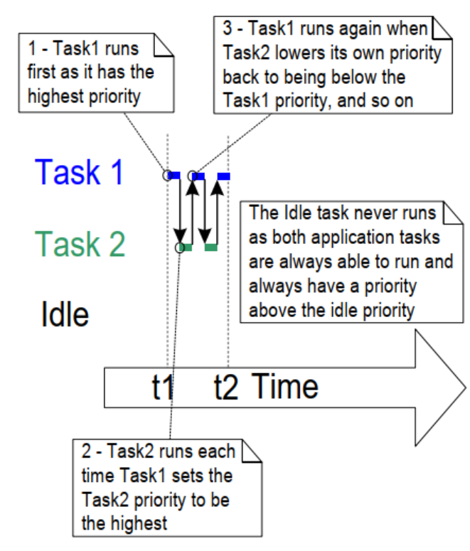

## 删除任务

### vTaskDelet函数

vTaskDelete() API函数用于删除任务。vTaskDelete() API函数仅在FreeRTOSConfig.h中将INCLUDE_vTaskDelete设置为1时才可用。

在运行时不断创建和删除任务并非良策，因此，当您发现自己需要此功能时，请考虑其他设计选项，例如重用任务。

删除的任务不再存在，无法再次进入运行状态。

如果使用动态内存分配创建的任务后来自行删除，空闲任务负责释放为其分配的内存，例如被删除任务的数据结构和堆栈。因此，在这种情况下，应用程序不应完全剥夺空闲任务所有的处理时间，这一点非常重要。

> 仅当任务被删除时，由内核自身为该任务分配的内存会被自动释放。 任何在任务实现过程中分配的内存或其他资源，如果不再需要，必须明确地释放。

vTaskDelete参数：

* pxTaskToDelete
  * 待删除任务的句柄（主任务）。有关获取任务句柄的信息，请参阅xTaskCreate() API函数的pxCreatedTask参数以及xTaskCreateStatic() API函数的返回值。
  * 可以将句柄替换为NULL来删除自己

```cpp
void vTaskDelete(TaskHandle_t xTaskToDelete);
```

#### 示例：删除任务

简单示例流程介绍：

1. 任务1由main()创建，优先级为1。当它运行时，在优先级2下创建任务2。任务2现在是最高优先级任务，因此它立即开始执行。
2. 任务2除删除自身外不做任何其他操作。它可以通过向vTaskDelete()传递NULL来删除自身，但为了演示目的，它使用了自身的任务句柄。列表4.29显示了任务2的源代码。
3. 当任务2被删除后，任务1再次成为最高优先级任务，因此它继续执行——此时它调用vTaskDelay()阻塞一小段时间。
4. 空闲任务在任务1处于阻塞状态时执行，并释放了现在已删除的任务2所分配的内存。

```cpp
int main(void)
{
    xTaskCreate(vTask1, "Task 1", 1000, NULL, 1, NULL);
    vTaskStartScheduler();
    for(;;)
    {
        
    }
}

TaskHandle_t xTask2Handle = NULL;

void vTask1(void* pvParameters)
{
    const TickType_t xDelay100ms = pdMS_TO_TICKS(100UL);
    for(;;)
    {
        vPrintLine("Task 1 is running");
        
        xTaskCreate(vTask2, "Task 2", 1000, NULL, 2, &xTask2Handle);
        
        vTaskDelay(xDelay100ms);
    }
}

void vTask2( void * pvParameters )
{
 /*
	任务2在启动时自我删除。
	为实现这一点，可以通过调用vTaskDelete()并使用NULL作为参数实现。
	为了演示目的，它调用呢vTaskDelete()并传入自己的任务句柄。
 */
 vPrintLine( "Task 2 is running and about to delete itself" );
 vTaskDelete( xTask2Handle );
}

// 输出
C:\Temp>rtosdemo
Task1 is running
Task2 is running and about to delete itself
Task1 is running
Task2 is running and about to delete itself
Task1 is running
Task2 is running and about to delete itself
Task1 is running
Task2 is running and about to delete itself
Task1 is running
Task2 is running and about to delete itself
Task1 is running
Task2 is running and about to delete itself
Task1 is running
Task2 is running and about to delete itself
Task1 is running
Task2 is running and about to delete itself
```

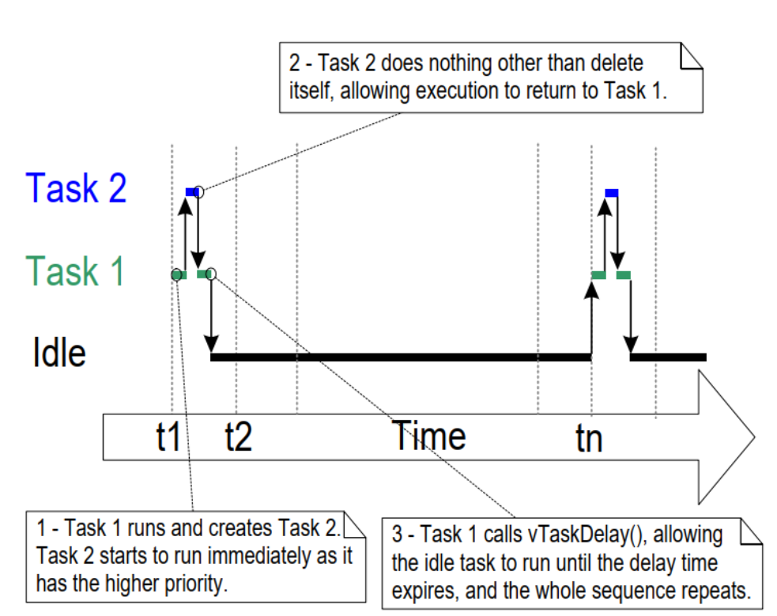

## 线程局部存储和可重入性

线程本地存储允许应用程序开发者在每个任务的任务控制块中存储任意数据。该特性通常用于存储本应被非可重入函数存储在全局变量中的数据。

可重入函数是指可以在多个线程中安全运行且不会产生副作用的函数。在多线程环境中使用非可重入函数且没有线程局部存储时，必须特别注意在临界区检查这些函数调用的非正常结果。过度使用临界区会降低实时操作系统（RTOS）的性能，因此通常更倾向于使用线程局部存储而非临界区。

迄今为止，线程本地存储最普遍的应用是ISO C标准中C标准库及POSIX系统所使用的errno全局变量。errno全局变量用于为常见的标准库函数（如strtof和strtol）提供扩展的函数结果或错误代码。

### C运行时线程局部存储实现

大多数内嵌式libc实现提供了API接口，以确保非递归函数能够在多线程环境中正确运行。FreeRTOS包含了对两个常用开源库（newlib和picolibc）递归API的支持。这些预先构建的C运行时线程局部存储实现可以通过在项目中的FreeRTOSConfig.h文件中定义以下列出的相应宏来启用。

* configUSE_NEWLIB_REENTRANT for newlib
* configUSE_PICOLIBC_TLS for picolibc

### 自定义C运行时线程本地存储

应用程序开发人员可以在其FreeRTOSConfig.h文件中定义以下宏来实施线程本地存储：

* 定义`configUSE_C_RUNTIME_TLS_SUPPORT`为 1 以启用 C 运行时线程局部存储支持。
* 将`configTLS_BLOCK_TYPE`定义为应用于存储C运行时线程局部存储数据的c类型。
* 定义`configINIT_TLS_BLOCK`为在初始化C运行时线程本地存储块时应执行的C代码。
* 将`configSET_TLS_BLOCK`定义为C代码，该代码应在切换到新任务时运行。
* 将`configDEINIT_TLS_BLOCK`定义为C代码，该代码应在解除初始化C运行时线程局部存储块时运行。

### 应用线程本地存储

除了C运行时线程局部存储之外，应用程序开发者还可以定义一组特定于应用程序的指针，这些指针将被包含在任务控制块中。此功能通过在项目中设置FreeRTOSConfig.h文件中的configNUM_THREAD_LOCAL_STORAGE_POINTERS为非零数来启用。 如下面中定义的vTaskSetThreadLocalStoragePointer和pvTaskGetThreadLocalStoragePointer函数分别用于在运行时设置和获取每个线程局部存储指针的值。

*==线程本地存储指针函数原型==*

```cpp
void * pvTaskGetThreadLocalStoragePointer( TaskHandle_t xTaskToQuery, BaseType_t xIndex);
void vTaskSetThreadLocalStoragePointer( TaskHandle_t xTaskToSet, BaseType_t xIndex, void * pvValue);
```

## 调度算法

### 任务状态与事件回顾

实际执行的任务（使用处理时间）处于运行状态。在单核处理器上，任何给定时刻只能存在一个任务处于运行状态。也有可能在多核处理器（异步多处理，AMP）上运行FreeRTOS，或者让FreeRTOS在多个核心上调度任务（同步多处理，SMP）。这两种情况在此处并未被描述。

不在实际运行中的任务，但又不在阻塞状态或挂起状态中的任务，处于就绪状态。处于就绪状态的任务可供调度程序选择，作为即将进入运行状态的任务。调度程序总是会选择优先级最高的就绪状态任务，使其进入运行状态。

任务在阻塞状态时可以等待事件的发生，并且在事件发生时会自动返回到就绪状态。时间事件发生在特定时间点，例如，当一个阻塞时间到期时，通常用于实现周期性或超时行为。同步事件发生在任务或中断服务例程通过任务通知、队列、事件组、消息缓冲区、流缓冲区或各种类型的信号量发送信息时。它们通常用于信号异步活动，例如数据到达外设。

### 选择调度算法

调度算法是决定将处于就绪状态的任务转换为运行状态的软件例行程序。

到目前为止，所有的示例都使用了相同的调度算法，但可以通过配置常量configUSE_PREEMPTION和configUSE_TIME_SLICING来更改算法。这两个常量在FreeRTOSConfig.h中定义。

第三个配置常量 `configUSE_TICKLESS_IDLE` 也会影响调度算法，因为其使用可能会导致时钟中断在较长的时间段内完全被关闭。`configUSE_TICKLESS_IDLE` 是一个高级选项，专门用于必须最大限度地减少功耗的应用程序。本节的描述假设 `configUSE_TICKLESS_IDLE` 设置为 0，这是如果该常量未定义时的默认设置。

在所有可能的单核配置中，FreeRTOS调度器会按次序选择优先级相同的任务。这种“轮流执行”的策略通常被称为“轮转调度”。轮转调度算法并不保证同等优先级的任务间共享时间完全相等，仅保证同等优先级的就绪状态任务会依次进入运行状态。

*==FreeRTOSConfig.h 中用于配置内核调度算法的设置==*

| 调度算法                 | 优先处理 | configUSE_PREEMPTION | configUSE_TIME_SLICING |
| ------------------------ | -------- | -------------------- | ---------------------- |
| 时间分片下的抢占式调度   | 1        | 1                    | 1                      |
| 非时间分片下的抢占式调度 | 1        | 1                    | 0                      |
| 协作式调度               | 0        | 0                    | Any                    |

<a id="Table4.12.2-1"></a>

### 优先级抢占式调度算法结合时间片轮转调度

在表4.12.2-1中所示的配置将FreeRTOS调度器设置为使用一种称为“固定优先级抢占式调度与时间片轮转”的调度算法，这是大多数小型RTOS应用程序使用的算法，也是本书到目前为止所呈现的所有示例所采用的算法。下表提供了该算法名称中使用的术语描述。

对用于描述调度策略的术语进行解释：

* 固定优先级：固定优先级的调度算法不会改变所调度任务的优先级，但也不阻止任务本身更改自身的优先级或其他任务的优先级。
* 抢占式：抢占调度算法会在一个具有比当前运行任务更高优先级的新任务进入就绪状态时，立即将当前运行状态的任务“抢占”。被抢占意味着该任务被非自愿地从运行状态中移出并进入就绪状态（无需明确地让出或阻塞），以允许另一个任务进入运行状态。任务抢占可以在任何时间发生，而不仅仅是在RTOS的计时中断期间。
* 时间分片：时间片切分用于在同等优先级的任务之间共享处理时间，即使这些任务没有显式地让出处理器或进入阻塞状态。描述为使用时间片切分的调度算法会在每个时间片结束时，如果存在具有与当前运行任务相同优先级的就绪状态任务，则选择一个新的任务进入运行状态。时间片等于两次实时操作系统（RTOS）时钟中断之间的时间间隔。

[图4.12.3-1](#Pic4.12.3-1)和[图4.12.3-2](#Pic4.12.3-2)展示了在使用固定优先级抢占式调度算法并结合时间片机制时，任务如何被调度的。[图4.12.3-1](#Pic4.12.3-1)展示了当应用程序中的所有任务具有唯一优先级时，任务被选择进入运行状态的顺序。[图4.12.3-2](#Pic4.12.3-2)展示了当应用程序中的两个任务共享同一优先级时，任务被选择进入运行状态的顺序。

* 空闲任务：在低优先级下运行，所以只有每当高优先级任务进入就绪状态时，它才得以抢占时间，如t3、t5、t9时刻。

* Task3
  * 任务3是一个事件驱动的任务，以相对较低的优先级执行，但高于空闲优先级。它大部分时间处于阻塞状态，等待其感兴趣的事件，每当事件发生时，就会从阻塞状态转换到就绪状态。所有FreeRTOS的跨任务通信机制（任务通知、队列、信号量、事件组等）均可用于以这种方式通知事件并解除任务阻塞。
  * 事件在时间 t3 和 t5 发生，且也在 t9 和 t12 之间的某个时间点发生。在时间 t3 和 t5 发生的事件会被立即处理，因为在这两个时间点，任务 3 是能够运行的最高优先级任务。在时间 t9 和 t12 之间的某个时间发生的事件则会在 t12 时才被处理，因为在那之前，优先级更高的任务 1 和任务 2 仍在执行。只有在时间 t12，任务 1 和任务 2 都处于阻塞状态时，任务 3 才成为最高优先级的就绪状态任务。
* Task2
  * 任务2是一个周期性任务，其执行优先级高于任务3的优先级，但低于任务1的优先级。该任务的时间周期意味着任务2希望在时间点t1、t6和t9执行。
  * 在时间t6时，任务3处于运行状态，但任务2具有更高的相对优先级，因此抢占任务3并立即开始执行。任务2完成其处理过程后，在时间t7重新进入阻塞状态，此时任务3可以重新进入运行状态以完成其处理过程。任务3本身在时间t8进入阻塞状态。
* Task1
  * 任务1也是一种事件驱动的任务。它具有所有任务中的最高优先级，因此可以抢占系统中的任何其他任务。

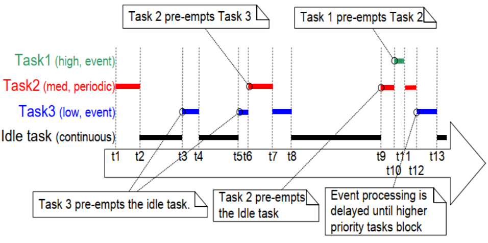

<a id="Pic4.12.3-1"></a>

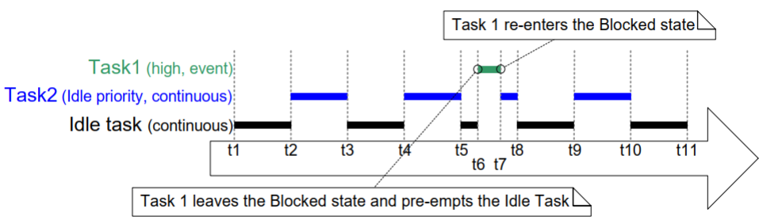

<a id="Pic4.12.3-2"></a>

[图4.12.3-2](#Pic4.12.3-2)中：

* 空闲任务和Task2
  * 空闲任务和Task 2均为连续处理任务，且两者优先级均为0（最低优先级）。调度器仅在没有更高优先级的任务可运行时，才会分配处理时间给优先级为0的任务，并通过时间片轮转的方式共享分配给优先级为0的任务的时间。每当发生时钟中断时，一个新的时间片开始，如上图所示，在时刻t1、t2、t3、t4、t5、t8、t9、t10和t11处发生时钟中断。
  * 空闲任务和任务2轮流进入运行状态，这可能导致两者在相同的时间片内部分时间都处于运行状态，例如在t5和t8之间发生。
* Task1
  * 任务1的优先级高于空闲优先级。任务1是一个事件驱动的任务，大部分时间处于阻塞状态，等待其感兴趣的事件，每当事件发生时，从阻塞状态转换到就绪状态。
  * 感兴趣的事件发生在时间t6。在t6时刻，任务1成为最高优先级且能够运行的任务，因此任务1在时间片中间抢占了空闲任务。事件处理在时间t7完成，此时任务1重新进入阻塞状态。

[图4.12.3-2](#Pic4.12.3-2)展示了应用程序编写者创建的任务与空闲任务共享处理时间。如果应用程序编写者创建的空闲优先级任务有工作要做，而空闲任务没有工作时，将如此多的处理时间分配给空闲任务可能并不理想。如果存在这样的情况，可以通过使用`configIDLE_SHOULD_YIELD`编译时配置常量来改变空闲任务的调度方式：

* 如果将 `configIDLE_SHOULD_YIELD `设置为 0，则空闲任务在其时间片的整个时间内保持在运行状态，除非被优先级更高的任务抢占。
* 如果 `configIDLE_SHOULD_YIELD` 被设置为 1，则空闲任务在每次循环迭代时，如果存在其他处于就绪状态的空闲优先级任务，就会自愿放弃其剩余分配的时间片。

在[图4.12.3-2](#Pic4.12.3-2)中展示的执行模式，是在将configIDLE_SHOULD_YIELD设置为0的情况下所观察到的现象。而在[图4.12.3-3](#Pic4.12.3-3)中展示的执行模式，则是在相同的场景下，将configIDLE_SHOULD_YIELD设置为1时所观察到的现象。

[图4.12.3-3](#Pic4.12.3-3)还表明，当配置项configIDLE_SHOULD_YIELD设置为1时，空闲任务释放CPU控制权后，后续被选中进入运行状态的任务不会执行一个完整的时片，而是执行空闲任务释放CPU控制权的那个时片中剩余的时间。

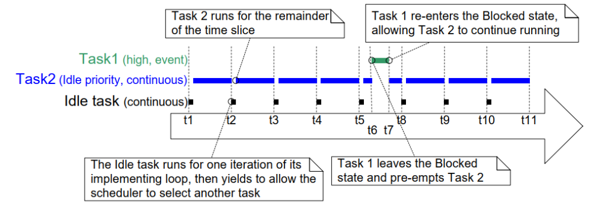

<a id="Pic4.12.3-3"></a>

### 优先级抢占调度算法不采用时间片轮转

优先级抢占式调度无需时间片轮转，其任务选择与抢占算法与前一节所述相同，但不对同等优先级的任务使用时间片来共享处理时间。

[表Table4.12.2-1](#Table4.12.2-1)显示了FreeRTOSConfig.h的设置，这些设置配置了FreeRTOS调度器使用优先级抢占调度，而不进行时间片轮转。

如[图4.12.3-2](#Pic4.12.3-2)所示，若采用时间片轮转机制，且最高优先级就绪队列中存在多个可运行的任务，则调度器会在每个实时操作系统时钟中断（该中断标记时间片结束）时选择一个新任务进入运行状态。若不采用时间片轮转机制，则调度器仅在下述任一情形下才会选择新任务进入运行状态：

* 一个更高优先级的任务进入了就绪状态。
* 运行状态的任务进入阻塞状态或暂停状态。

当不使用时间片轮转时，任务上下文切换次数少于使用时间片轮转时。因此，禁用时间片轮转可导致调度器的处理开销降低。然而，禁用时间片轮转也可能导致同等优先级的任务接收到的处理时间差异显著，如下图所示。鉴于此，不使用时间片轮转运行调度器被视为一种高级技术，仅应由经验丰富的用户使用。

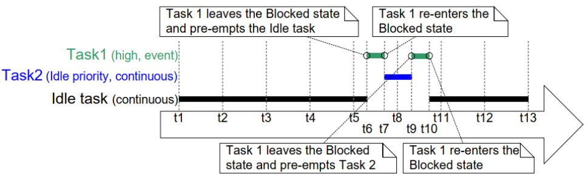

<a id="Pic4.12.4-1"></a>

根据[图4.12.4-1](#Pic4.12.4-1)，该图假设configIDLE_SHOULD_YIELD被设置为0：

* 中断事件发生于时间点t1、t2、t3、t4、t5、t8、t11、t12和t13。
* Task1：任务1是一个高优先级的、事件驱动的任务，其大部分时间处于阻塞状态，等待其关注的事件。每当该事件发生时，任务1会从阻塞状态转换到就绪状态（随后，由于它是最高优先级的就绪状态任务，会进一步转换到运行状态）。图4.21展示了任务1在时间t6至t7之间以及时间t9至t10之间处理事件的情形。
* Idle Task和Task2：
  * 空闲任务和任务2都是连续处理任务，且都具有优先级0（空闲优先级）。连续处理任务不会进入阻塞状态。
  * 时间片轮转机制未被使用，因此处于运行状态的低优先级空闲任务将持续保持在运行状态，直至被更高优先级的任务1抢占。
  * 在[图4.12.4-1](#Pic4.12.4-1)中，空闲任务在时间t1开始运行，并保持在运行状态直到被任务1在时间t6抢占，这是它在进入运行状态后超过四个完整周期的时间。
  * 任务2在时间t7开始运行，此时任务1重新进入阻塞状态，等待另一个事件。任务2保持在运行状态，直到在时间t9被任务1抢占，这发生在任务2进入运行状态后不到一个时钟周期的时间点。
  * 在t10时刻，空闲任务重新进入运行状态，尽管它已经获得的处理时间比任务2多出了四倍以上。

### 合作调度

本书重点关注抢占式调度，但FreeRTOS 同样也能使用合作式调度。[表Table4.12.2-1](#Table4.12.2-1)展示了FreeRTOSConfig.h的设置，这些设置将FreeRTOS的调度器配置为使用合作式调度。

在使用协作调度器的情况下（因此假设应用程序提供的中断服务例程不会显式地请求上下文切换），上下文切换仅在运行状态的任务进入阻塞状态时发生，或者运行状态的任务通过调用 `taskYIELD()` 显式地让出（手动请求重新调度）。任务不会被抢占，因此无法使用时间片轮转。

[图4.12.5-1](#Pic4.12.5-1)展示了协作调度器的行为。[图4.12.5-1](#Pic4.12.5-1)中的水平虚线表示任务处于就绪状态的时刻。

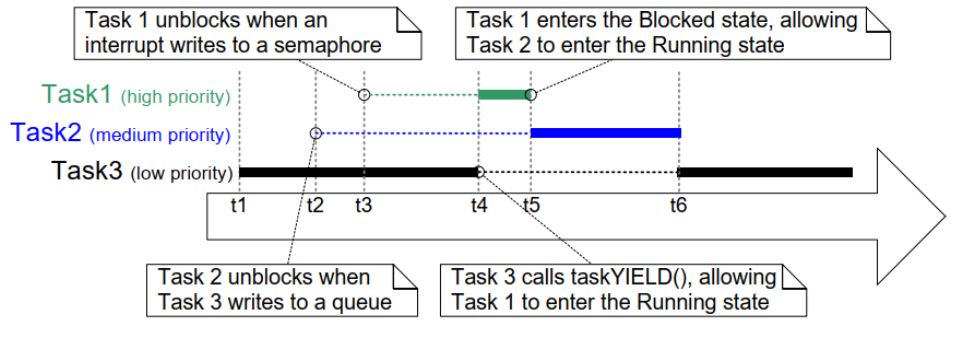

<a id="Pic4.12.5-1"></a>

上图中：

* Task1
  * Task1有着最高优先级。它初始处于阻塞状态，等待信号量。
  * 在时间点 (t~3~)，一个中断给信号量，导致任务1从阻塞状态（Blocked state）转变为就绪状态（Ready state）（中断给信号量的内容在第6章中有详细介绍）。
  * 在时间t3时，任务1是具有最高优先级的就绪状态任务，若此时采用抢占式调度器，任务1将变为运行状态任务。然而，由于当前使用的是协作式调度器，任务1将保持就绪状态直至时间t4，此时运行状态任务调用taskYIELD()函数。
* Task2
  * 任务 2 的优先级介于任务 1 和任务 3 之间。它从阻塞状态开始，等待任务 3 在时间 t2 发送给它的消息。
  * 在时间(t~2~)，任务2是就绪状态中优先级最高的任务。如果使用抢占式调度器，任务2将变为运行状态的任务。然而，由于使用了协作式调度器，任务2将保持在就绪状态，直到当前运行状态的任务进入阻塞状态或调用 `taskYIELD()`。
  * 运行中的任务在时间t4调用taskYIELD()，但到那时，任务1是最高优先级的就绪状态任务，因此任务2实际上直到任务1在时间t5再次进入阻塞状态时才成为运行状态的任务。
  * 在时间t6时，任务2重新进入阻塞状态以等待下一条消息，此时任务3再次成为最高优先级的就绪状态任务

在多任务应用程序中，应用程序作者必须确保资源不被多个任务同时访问，因为同时访问可能会导致资源受到污染。例如，考虑以下场景，其中访问的资源是 UART（串行端口）。两个任务向 UART 写入字符串；任务 1 写入 "abcdefghijklmnop"，任务 2 写入 "123456789"：

1. 任务 1 处于运行状态并开始写入其字符串。它将 "abcdefg" 写入 UART，但在进一步写入字符之前离开了运行状态。
2. 任务2进入运行状态，并向通用异步接收/发送器（UART）写入"123456789"，随后离开运行状态。
3. 任务1重新进入运行状态，并将其字符串中剩余的字符写入UAR。

在那种情况下，实际上被写入UART的内容是 "abcdefg123456789hijklmnop"。任务1所写入的字符串并未按照预期以不间断的序列写入到UART中，而是被破坏了，因为由任务2写入到UART的字符串出现在了其中。

使用协作调度器通常比使用抢占式调度器更容易避免同时访问引起的问题[^7]：

* 当使用抢占式调度器时，运行状态的任务可以在任何时间被抢占，包括在该任务与其他任务共享的资源处于不一致状态时。正如UART示例所展示的，让资源处于不一致状态可能会导致数据损坏。
* 当您使用协作式调度器时，您可以控制切换至另一任务的发生时机。因此，您可以确保在资源处于不一致状态时不会发生任务切换。
* 在上述UART示例中，可确保任务1在将其完整字符串写入UART之后才离开运行状态，并通过此方式消除因其他任务活动导致字符串损坏的可能性。

如[图4.12.5-1](#Pic4.12.5-1)所示，使用协作式调度器会导致系统响应性劣于使用抢占式调度器：

* 在预抢占调度器中，当任务成为最高优先级的就绪状态任务时，调度器立即开始运行该任务。这在必须在定义的时间周期内响应高优先级事件的实时系统中通常至关重要。
* 当使用协同调度器时，直到运行状态的任务进入阻塞状态或调用taskYIELD()之前，都不会切换到成为就绪状态最高优先级的任务。

# 队列管理

## 介绍

队列提供了任务间、任务与中断以及中断与任务的通信机制。

### 范围

本章包括：

* 如何创建队列
* 队列如何管理其包含的数据
* 如何给队列发送数据
* 如何从队列收到数据
* 阻塞在队列上的含义
* 如何对多个队列进行阻塞
* 如何覆盖队列中的数据
* 如何清空队列
* 任务优先级在写入和读取队列时的效应

本章节仅涵盖任务间通信。第7章将涵盖任务到中断和从中断到任务的通信。

## 队列特征

### 数据存储

队列可容纳有限数量、固定大小的数据项[^8]。队列所能容纳的最大项数称为其"长度"。队列的长度以及每个数据项的大小在队列创建时设定。

队列通常用作先进先出（FIFO）缓冲区，其中数据被写入队列的末尾（尾部）并从队列的开头（头部）移除。[图5.2.1-1](#Pic5.2.1-1)展示了作为FIFO使用的队列中数据被写入和读出的过程。同样，也有可能向队列的前端写入数据，并覆盖已处于队列前端的数据。

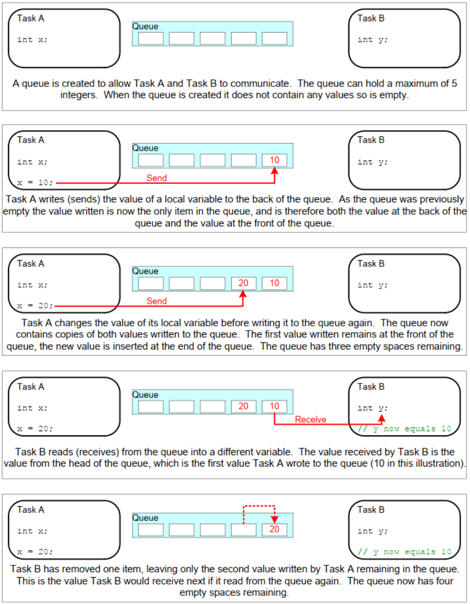

<a id="Pic5.2.1-1"></a>

存在两种实现队列行为的方式：

1. 队列复制：按副本排队是指发送到队列的数据会被逐字节复制到队列中。
1. 队列引用：引用排队意味着队列仅存储指向发送到队列的数据的指针，而不是数据本身。

FreeRTOS采用复制队列的方法，原因在于相较于引用队列的方法，它在功能上更为强大且使用更为简便，具体理由如下：

* 复制排队并不能阻止队列同时用于引用排队。例如，当待排队数据的大小使得将其复制到队列中变得不切实际时，可以将数据的指针复制到队列中代替数据本身。
* 一个栈变量可以直接被发送到队列中，尽管该变量在声明它的函数退出后将不再存在。
* 数据可以不经预先分配缓冲区来存储数据而直接发送至队列。之后，您需将数据复制至分配的缓冲区，并对缓冲区的引用进行队列化。
* 发送任务可以立即重新使用被发送到队列中的变量或缓冲区。
* 发送任务与接收任务是完全解耦的；应用程序设计者无需关心哪个任务“拥有”数据，或哪个任务负责释放数据。
* 实时操作系统（RTOS）全权负责分配用于存储数据的内存。
* 在受保护内存的系统中，对RAM的访问受到限制，因此，通过引用进行队列操作仅能在发送和接收任务都能访问引用数据的情况下实现。而通过复制进行队列操作则允许数据跨越内存保护边界进行传递。

### 多任务接入

队列是具有自身属性的独立对象，任何知晓其存在的任务或中断服务程序（ISR）均可访问。任意数量的任务可向同一队列写入，任意数量的任务可从同一队列读取。实践中，队列存在多个写入者是极为常见的，而队列存在多个读取者则相对少见得多。

### 队列读取阻塞

 当任务尝试从队列中读取数据时，它可以选择指定一个“阻塞”时间。这是任务保持在阻塞状态以等待数据从队列中变为可用的时间，如果队列已为空，则处于阻塞状态的任务等待数据从队列变为可用，当另一个任务或中断将数据放入队列时，该任务将自动移至就绪状态。如果在数据变为可用之前指定的阻止时间到期，则任务也将自动从阻止状态移动到就绪状态。

队列可以有多个读取器，因此单个队列中可能有多个等待数据的阻塞任务。在这种情况下，当数据可用时，只有一个任务被解除阻塞。解除阻塞的任务始终是等待数据的最高优先级任务。如果两个或多个阻塞任务具有相同的优先级，则未阻塞的任务是等待时间最长的任务。

### 队列写入阻塞

就像从队列中读取一样，任务可以在写入队列时指定阻塞时间。在这种情况下，阻塞时间是任务将保持在阻塞状态的最长时间，以等待队列中的空间变得可用（如果队列已满）。

队列可以有多个写入器，因此一个已满的队列可能有多个任务被阻塞，等待完成发送操作。在这种情况下，当队列上的空间可用时，只有一项任务会被解除阻塞。被解除阻塞的任务始终是等待空间的最高优先级任务。如果两个或多个阻塞任务具有相同的优先级，则解除阻塞的任务是等待时间最长的任务。

### 阻塞多个队列

队列可以分组为集合，允许任务进入阻塞状态以等待集合中任何队列上的数据可用。第 5.6 节，从多个队列接收，演示了队列集。

### 创建队列：静态分配和动态分配的队列

队列由句柄引用，句柄是 QueueHandle_t 类型的变量。队列在使用之前必须显式创建。

有两个 API 函数创建队列：xQueueCreate()、xQueueCreateStatic()。

每个队列需要两个 RAM 块，第一个用于保存其数据结构，第二个用于保存排队数据。 xQueueCreate() 从堆中（动态）分配所需的 RAM。 xQueueCreateStatic() 使用预先分配的 RAM 作为参数传递给函数。

## 使用队列

### xQueueCreate() API 函数

下面显示了 xQueueCreate() 函数原型。 xQueueCreateStatic() 有两个附加参数，分别指向预先分配的用于保存队列数据结构和数据存储区域的内存。

*==xQueueCreate的API函数==*

```c++
QueueHandle_t xQueueCreate(UBaseType_t uxQueueLength, UBaseType_t uxItemSize);
```

xQueueCreate的入参和出参：

* uxQueueLength：正在创建的队列在任一时间可以容纳的最大项目数。
* uxItemSize：可存储在队列中的每个数据项的大小（以字节为单位）。
* 出参：
  * 如果返回 NULL，则无法创建队列，因为 FreeRTOS 没有足够的堆内存来分配队列数据结构和存储区域。第 2 章提供有关 FreeRTOS 堆的更多信息。
  * 如果返回非 NULL 值，则队列创建成功，返回值是已创建队列的句柄。

xQueueReset() 是一个 API 函数，用于将先前创建的队列恢复到其原始的空状态。

### xQueueSendToBack() 和 xQueueSendToFront() API 函数

正如所料，xQueueSendToBack() 将数据发送到队列的后端（尾部），xQueueSendToFront() 将数据发送到队列的前端（头部）。

xQueueSend() 与 xQueueSendToBack() 等效且完全相同。

> 注意：切勿从中断服务例程中调用 xQueueSendToFront() 或 xQueueSendToBack()。应使用中断安全版本 xQueueSendToFrontFromISR() 和 xQueueSendToBackFromISR() 代替它们。这些内容将在第 7 章中进行描述。

```c++
BaseType_t xQueueSendToFront(QueueHandle_t xQueue, const void* pvItemToQueue, TickType_t xTicksToWait);
BaseType_t xQueueSendToBack(QueueHandle_t xQueue, const void* pvItemToQueue, TickType_t xTicksToWait);
```

xQueueSenToFront和xQueueSendToBack的入参和出参：

* xQueue：数据发送（写入）到的队列的句柄。队列句柄将从调用用于创建队列的 xQueueCreate() 或 xQueueCreateStatic() 返回
* pvItemToQueue：指向要复制到队列中的数据的指针。队列可以容纳的每个项目的大小是在创建队列时设置的，以便将许多字节从 pvItemToQueue 复制到队列存储区域中。
* xTicksToWait:
  * 如果队列已满，任务应保持在阻塞状态以等待队列上的空间变得可用的最长时间。
  * 如果 xTicksToWait 为零且队列已满，则 xQueueSendToFront() 和 xQueueSendToBack() 都将立即返回。
  * 区块时间以滴答周期为单位指定，因此它表示的绝对时间取决于滴答频率。宏 pdMS_TO_TICKS() 可用于将以毫秒为单位的时间转换为以刻度为单位的时间。
  * 如果 FreeRTOSConfig.h 中的 INCLUDE_vTaskSuspend 设置为 1，则将 xTicksToWait 设置为 portMAX_DELAY 将导致任务无限期等待（不会超时）。
* 两种返回值：
  * pdPASS：当数据成功发送到队列时返回 pdPASS。如果指定了阻塞时间（xTicksToWait 不为零），则调用任务有可能在函数返回之前被置于阻塞状态以等待队列中的空间变得可用，但在阻塞时间到期之前数据已成功写入队列。
  * errQUEUE_FULL（与 pdFAIL 相同的值）：如果由于队列已满而无法将数据写入队列，则返回 errQUEUE_FULL。如果指定了阻塞时间（xTicksToWait 不为零），则调用任务将被置于阻塞状态，以等待另一个任务或中断在队列中腾出空间，但指定的阻塞时间在此之前已过期。

### xQueueReceive() API函数

xQueueReceive() 从队列接收（读取）一个项目。收到的项目将从队列中删除。

> 注意：切勿从中断服务例程中调用 xQueueReceive()。第 7 章介绍了中断安全的 xQueueReceiveFromISR() API 函数。

```cpp
BaseType_t xQueueReceive(QueueHandle_t xQueue, void * const pvBuffer, TickType_t xTicksToWait);
```

xQueueReceive的入参和出参：

* xQueue：从中接收（读取）数据的队列的句柄。队列句柄将从调用用于创建队列的 xQueueCreate() 或 xQueueCreateStatic() 返回。
* pvBuffer：指向将接收到的数据复制到的内存的指针。队列保存的每个数据项的大小是在创建队列时设置的。 pvBuffer 指向的内存必须至少足够大以容纳那么多字节。
* xTicksToWait：如果队列已为空，则任务应保持在阻塞状态以等待队列上的数据可用的最长时间。
  * 如果 xTicksToWait 为零，并且队列已为空，则 xQueueReceive() 将立即返回。区块时间以滴答周期为单位指定，因此它表示的绝对时间取决于滴答频率。宏 pdMS_TO_TICKS() 可用于将以毫秒为单位的时间转换为以刻度为单位的时间。
  * 如果 FreeRTOSConfig.h 中的 INCLUDE_vTaskSuspend 设置为 1，则将 xTicksToWait 设置为 portMAX_DELAY 将导致任务无限期等待（不会超时）。
* 出参
  * pdPASS：当从队列中成功读取数据时，返回 pdPASS。如果指定了阻塞时间（xTicksToWait 不为零），则调用任务可能被置于阻塞状态以等待队列上的数据可用，但在阻塞时间到期之前已成功从队列中读取数据。
  * errQUEUE_FULL（与 pdFAIL 相同的值）：如果由于队列已满而无法将数据写入队列，则返回 errQUEUE_FULL。如果指定了阻塞时间（xTicksToWait 不为零），则调用任务将被置于阻塞状态，以等待另一个任务或中断在队列中腾出空间，但指定的阻塞时间在此之前已过期。

### uxQueueMessagesWaiting() API函数

uxQueueMessagesWaiting() 查询当前队列中的项目数。

> 注意：切勿从中断服务例程中调用 uxQueueMessagesWaiting()。应使用中断安全的 uxQueueMessagesWaitingFromISR() 来代替它

```cpp
UBaseType_t uxQueueMessageWaiting(QueueHandle_t xQueue);
```

uxQueueMessageWaiting的入参和出参:

* xQueue：正在查询的队列的句柄。队列句柄将从调用用于创建队列的 xQueueCreate() 或 xQueueCreateStatic() 返回。
* 出参：当前正在查询的队列中的项目数。如果返回零，则队列为空。

### 示例：从队列接收时阻塞

此示例演示创建队列、从多个任务向队列发送数据以及从队列接收数据。创建队列是为了保存 int32_t 类型的数据项。发送到队列的任务不指定阻塞时间，而从队列接收的任务则指定。

发送到队列的任务的优先级低于从队列接收的任务。这意味着队列不应该包含多个项目，因为一旦数据发送到队列，接收任务就会解除阻塞，抢占发送任务（因为它具有更高的优先级），并删除数据，使队列再次为空。

该示例创建了如下所示任务的两个实例，一个将值 100 连续写入队列，另一个将值 200 连续写入同一队列。任务参数用于将这些值传递到每个任务实例中。

```cpp

/* 声明一个 QueueHandle_t 类型的变量。它用于存储所有三个任务访问的队列的句柄。 */
QueueHandle_t xQueue;

static void vSenderTask(void *pvParameters)
{
    int32_t lValueToSend;
    BaseType_t xStatus;
    /* 创建此任务的两个实例，以便发送到队列的值通过任务参数传入 - 这样每个实例可以使用不同的值。创建队列是为了保存 int32_t 类型的值，因此将参数转换为所需的类型。 */
    lValueToSend = (int32_t)pvParameters;
    /* 与大多数任务一样，此任务是在无限循环内实现的。 */
    for (;;)
    {
        /* 将值发送到队列。
        第一个参数是数据发送到的队列。队列是在调度程序启动之前创建的，因此是在该任务开始执行之前创建的。
        第二个参数是要发送的数据的地址，本例中是lValueToSend的地址
        第三个参数是阻塞时间——如果队列已满，任务应保持在阻塞状态以等待队列上的空间变得可用的时间。在这种情况下，未指定阻塞时间，因为队列不应包含超过一项，因此永远不会满。
        */
        xStatus = xQueueSendToBack(xQueue, &lValueToSend, 0);
        if (xStatus != pdPASS)
        {
            /* 由于队列已满，发送操作无法完成，这一定是一个错误，因为队列不应包含超过一项的项目！ */
            vPrintString("Could not send to the queue.\r\n");
        }
    }
}
/*
从队列接收数据的任务的实现。接收任务指定阻塞时间为100毫秒，然后进入Blocked状态等待数据可用。当队列上有数据可用，或者 100 毫秒后没有数据可用时，它就会离开阻塞状态。在此示例中，有两个任务连续写入队列，因此 100 毫秒超时永远不会过期。
*/
static void vReceiverTask(void *pvParameters)
{
    /* 声明将保存从队列接收的值的变量。 */
    int32_t lReceivedValue;
    BaseType_t xStatus;
    const TickType_t xTicksToWait = pdMS_TO_TICKS(100);
    /* 该任务也是在无限循环内定义的。 */
    for (;;)
    {
        /* 此调用应该始终发现队列为空，因为此任务将立即删除写入队列的任何数据。 */
        if (uxQueueMessagesWaiting(xQueue) != 0)
        {
            vPrintString("Queue should have been empty!\r\n");
        }
        /* 从队列接收数据。
       第一个参数是要从中接收数据的队列。
       该队列是在调度程序启动之前创建的，因此也是在该任务第一次运行之前创建的
       第二个参数是将接收到的数据放入的缓冲区。在这种情况下，缓冲区只是一个变量的地址，该变量具有保存接收到的数据所需的大小。
       最后一个参数是阻塞时间——如果队列已经为空，任务将保持在阻塞状态以等待数据可用的最长时间。 */
        xStatus = xQueueReceive(xQueue, &lReceivedValue, xTicksToWait);
        if (xStatus == pdPASS)
        {
            /* 成功从队列接收到数据，打印出接收到的值。 */
            vPrintStringAndNumber("Received = ", lReceivedValue);
        }
        else
        {
            /* 即使等待 100ms 也没有从队列中收到数据。这一定是一个错误，因为发送任务是自由运行的并且将不断写入队列。 */
            vPrintString("Could not receive from the queue.\r\n");
        }
    }
}
/*
main() 函数的定义。这只是在启动调度程序之前创建队列和三个任务。创建的队列最多可容纳 5 个 int32_t 值，即使相对任务优先级意味着队列永远不会一次容纳超过一项。
*/
int main(void)
{
    /* 创建的队列最多可容纳 5 个值，每个值都足够大以容纳 int32_t 类型的变量。

    */
    xQueue = xQueueCreate(5, sizeof(int32_t));
    if (xQueue != NULL)
    {
        /* 创建将发送到队列的任务的两个实例。 task参数用于传递任务将写入队列的值，因此一个任务将连续向队列写入100，而另一个任务将连续向队列写入200。这两个任务均以优先级 1 创建。 */
        xTaskCreate(vSenderTask, "Sender1", 1000, (void *)100, 1, NULL);
        xTaskCreate(vSenderTask, "Sender2", 1000, (void *)200, 1, NULL);
        /* 创建将从队列中读取的任务。该任务以优先级 2 创建，因此高于发送者任务的优先级。 */
        xTaskCreate(vReceiverTask, "Receiver", 1000, NULL, 2, NULL);
        /* 启动调度程序，以便创建的任务开始执行。 */
        vTaskStartScheduler();
    }
    else
    {
        /* The queue could not be created. */
    }
    /* 如果一切顺利，那么 main() 将永远不会到达这里，因为调度程序现在将运行任务。如果 main() 确实到达此处，则可能没有足够的 FreeRTOS 堆内存可用于创建空闲任务。第 3 章提供了有关堆内存管理的更多信息。 */
    for (;;)
        ;
}
```

运行结果如下

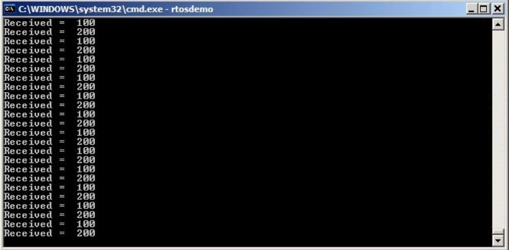

执行的顺序如下：

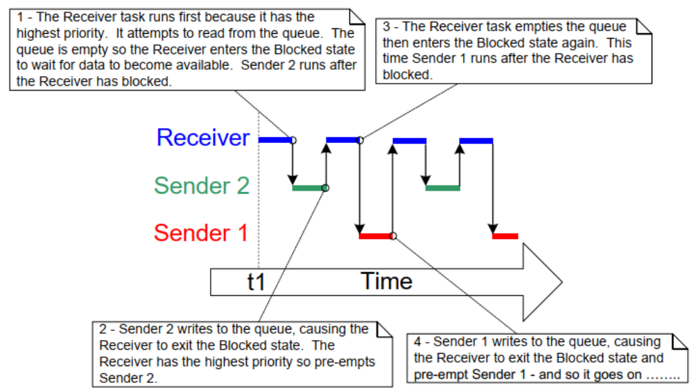

## 从多个来源接收数据

在 FreeRTOS 设计中，一项任务从多个源接收数据是很常见的。接收任务需要知道数据来自哪里，以确定如何处理它。这是一种易于实现的设计模式，它使用单个队列来传输包含数据值和数据源的结构，如[图5.4-1](#Pic5.4-1)所示。

*==在队列上发送结构的示例场景==*

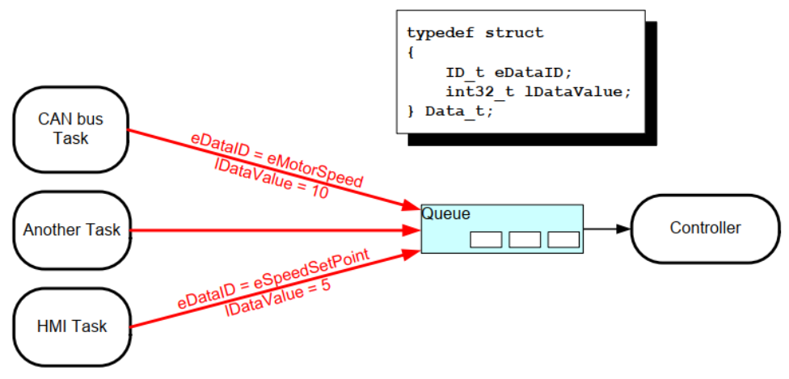

<a id="Pic5.4-1"></a>

如[图5.4-1](#Pic5.4-1)所示：

* 创建的队列包含 Data_t 类型的结构。该结构允许在一条消息中将数据值和指示数据含义的枚举类型发送到队列。
* 中央控制器任务执行主要系统功能。这必须对队列上传达给它的系统状态的输入和更改做出反应。
* CAN 总线任务用于封装 CAN 总线接口功能。当 CAN 总线任务接收并解码消息时，它将已解码的消息以 Data_t 结构发送到控制器任务。传输结构的 eDataID 成员告诉控制器任务数据是什么。在这里所示的情况下，它是电机速度值。传输结构的 lDataValue 成员告诉控制器任务实际的电机速度值。
* 人机界面 (HMI) 任务用于封装所有 HMI 功能。机器操作员可能可以通过多种方式输入命令和查询值，这些方式必须在 HMI 任务中检测和解释。当输入新命令时，HMI任务将命令以Data_t结构发送到控制器任务。传输结构的 eDataID 成员告诉控制器任务数据是什么。在这里所示的情况下，它是一个新的设定点值。传输结构的 lDataValue 成员告诉控制器任务实际的设定点值

第 (RB-TBD) 章展示了如何扩展此设计模式，以便控制器任务可以直接回复对结构进行排队的任务。

### 示例：发送到队列以及发送队列上的结构时阻塞

和示例5.3.5：从队列接收时阻塞时类似，但任务优先级相反，因此接收任务的优先级低于发送任务。此外，创建的队列保存结构而不是整数。

在示例5.3.5中，接收任务具有最高优先级，因此队列永远不会包含多个项目。

发生这种情况是因为一旦数据放入队列，接收任务就会抢占发送任务。

在例5.4.1中，发送任务具有较高的优先级，因此队列通常会满。这是因为，一旦接收任务从队列中删除一个项目，它就会被其中一个发送任务抢占，然后立即重新填充队列。然后，发送任务重新进入阻塞状态，等待队列上再次有可用空间。

```cpp
/* 定义一个枚举类型，用于标识数据的来源。 */
typedef enum
{
    eSender1,
    eSender2
} DataSource_t;
/* 定义将在队列上传递的结构类型。 */
typedef struct
{
    uint8_t ucValue;
    DataSource_t eDataSource;
} Data_t;
/* 声明将在队列上传递的两个 Data_t 类型的变量。 */
static const Data_t xStructsToSend[2] =
    {
        {100, eSender1}, /* Used by Sender1. */
        {200, eSender2}  /* Used by Sender2. */
};

/*
下面显示了发送任务的实现。发送任务指定的阻塞时间为100毫秒，因此每当队列满时，它就会进入Blocked状态，等待空间变得可用。当队列上有可用空间或 100 毫秒后没有空间可用时，它将离开阻塞状态。在此示例中，接收任务不断在队列中腾出空间，因此 100 毫秒的超时永远不会过期。
*/
static void vSenderTask(void *pvParameters)
{
    BaseType_t xStatus;
    const TickType_t xTicksToWait = pdMS_TO_TICKS(100);
    /* 与大多数任务一样，此任务是在无限循环内实现的。. */
    for (;;)
    {
        /* 发送到队列。
       第二个参数是正在发送的结构的地址。地址作为任务参数传入，所以直接使用pvParameters
       第三个参数是阻塞时间——如果队列已满，任务应保持在阻塞状态以等待队列上的空间变得可用的时间。指定阻塞时间是因为发送任务的优先级高于接收任务，因此队列预计会变满。当两个发送任务都处于阻塞状态时，接收任务将从队列中删除项目。*/
        xStatus = xQueueSendToBack(xQueue, pvParameters, xTicksToWait);
        if (xStatus != pdPASS)
        {
            /* 即使等待 100 毫秒，发送操作也无法完成。这一定是一个错误，因为一旦两个发送任务都处于阻塞状态，接收任务就应该在队列中腾出空间。 */
            vPrintString("Could not send to the queue.\r\n");
        }
    }
}

/*
接收任务的优先级最低，因此仅当两个发送任务都处于阻塞状态时才运行。
发送任务只有在队列已满时才会进入阻塞状态，因此接收任务只有在队列已满时才会执行。因此，即使它没有指定块时间，它也总是期望接收数据。
*/
static void vReceiverTask(void *pvParameters)
{
    /* Declare the structure that will hold the values received from the
    queue. */
    Data_t xReceivedStructure;
    BaseType_t xStatus;
    /* 该任务也是在无限循环内定义的。 */
    for (;;)
    {
        /* 由于该任务具有最低优先级，因此仅当发送任务处于阻塞状态时才会运行。仅当队列已满时，发送任务才会进入阻塞状态，因此该任务始终期望队列中的项目数等于队列长度，在本例中为 3。 */
        if (uxQueueMessagesWaiting(xQueue) != 3)
        {
            vPrintString("Queue should have been full!\r\n");
        }
        /* 从队列中接收
        第二个参数是将接收到的数据放入的缓冲区。在这种情况下，缓冲区只是一个变量的地址，该变量具有保存接收到的结构所需的大小。
        最后一个参数是阻塞时间——如果队列已经为空，任务将保持在阻塞状态以等待数据可用的最长时间。在这种情况下，不需要阻塞时间，因为该任务仅在队列已满时才会运行。*/
        xStatus = xQueueReceive(xQueue, &xReceivedStructure, 0);
        if (xStatus == pdPASS)
        {
            /* 成功从队列接收到数据，打印出接收到的值以及该值的来源。 */
            if (xReceivedStructure.eDataSource == eSender1)
            {
                vPrintStringAndNumber("From Sender 1 = ",
                                      xReceivedStructure.ucValue);
            }
            else
            {
                vPrintStringAndNumber("From Sender 2 = ",
                                      xReceivedStructure.ucValue);
            }
        }
        else
        {
            /* 队列中没有收到任何内容。这一定是一个错误，因为此任务只能在队列已满时运行。 */
            vPrintString("Could not receive from the queue.\r\n");
        }
    }
}

// main() 与前面的示例相比仅略有变化。创建队列来保存三个Data_t结构，发送和接收任务的优先级是相反的。
int main(void)
{
    /* 创建队列最多可容纳 3 个 Data_t 类型的结构。 */
    xQueue = xQueueCreate(3, sizeof(Data_t));
    if (xQueue != NULL)
    {
        /* 创建将写入队列的任务的两个实例。该参数用于传递任务将写入队列的结构体。
        因此一个任务将连续发送 xStructsToSend[ 0 ] 到队列，而另一个任务将连续发送 xStructsToSend[ 1 ]。
        这两个任务都是以优先级 2 创建的，该优先级高于接收者的优先级。 */
        xTaskCreate(vSenderTask, "Sender1", 1000, &(xStructsToSend[0]),
                    2, NULL);
        xTaskCreate(vSenderTask, "Sender2", 1000, &(xStructsToSend[1]),
                    2, NULL);
        /* 创建将从队列中读取的任务。该任务以优先级 1 创建，因此低于发送者任务的优先级 */
        xTaskCreate(vReceiverTask, "Receiver", 1000, NULL, 1, NULL);
        /* 启动调度程序，以便创建的任务开始执行。 */
        vTaskStartScheduler();
    }
    else
    {
        /* The queue could not be created. */
    }
    /* 如果一切顺利，那么 main() 将永远不会到达这里，因为调度程序现在将运行任务。如果 main() 确实到达此处，则可能没有足够的堆内存可用于创建空闲任务。第 3 章提供了有关堆内存管理的更多信息。 */
    for (;;)
        ;
}
```

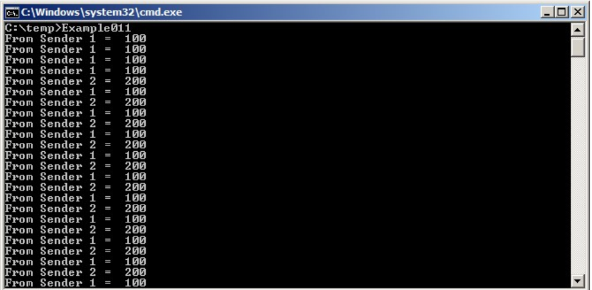

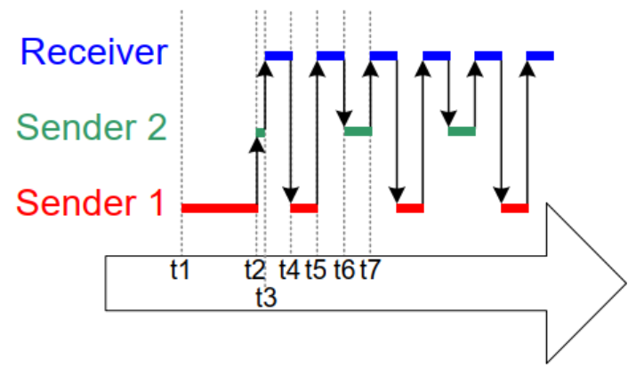

时刻解释：

* t1：任务发送者1执行并向队列发送3个数据项
* t2：队列已满，因此发送方 1 进入阻塞状态以等待其下一次发送完成。任务发送者 2 现在是可以运行的最高优先级任务，因此它进入正在运行状态。
* t3：任务发送者2发现队列已经满了，因此它进入阻塞状态以等待其第一次发送完成。 Task Receiver 现在是可以运行的最高优先级任务，因此它进入 Running 状态。
* t4：优先级高于接收任务优先级的两个任务正在等待队列上的可用空间，导致任务接收方在从队列中删除一项后立即被抢占。任务 Sender 1 和 Sender 2 具有相同的优先级，因此调度程序选择等待时间最长的任务作为将进入 Running 状态的任务，在本例中为任务 Sender 1。
* t5：任务发送者 1 向队列发送另一个数据项。队列中只有一个空间，因此任务 Sender 1 进入阻塞状态以等待其下一次发送完成。任务接收器再次是可以运行的最高优先级任务，因此它进入正在运行状态。任务发送器 1 现在已向队列发送了四个项目，而任务发送器 2 仍在等待将其第一个项目发送到队列。
* t6：优先级高于接收任务优先级的两个任务正在等待队列上的可用空间，因此任务接收方一旦从队列中删除一项，就会被抢占。这次Sender 2 的等待时间比Sender 1 长，因此Sender 2 进入Running 状态。
* t7：任务发送者 2 向队列发送一个数据项。队列中只有一个空间，因此发送方 2 进入阻塞状态以等待其下一次发送完成。任务 Sender 1 和 Sender 2 都在等待队列上的可用空间，因此任务 Receiver 是唯一可以进入 Running 状态的任务。

## 处理大型或可变大小数据

### 排队指针

如果队列中存储的数据大小很大，那么最好使用队列传输指向数据的指针，而不是将数据本身逐字节复制到队列中或从队列中复制出来。传输指针在处理时间和创建队列所需的 RAM 量方面都更加高效。然而，在对指针进行排队时，必须格外小心以确保：

* 所指向的 RAM 的所有者是明确定义的：当通过指针在任务之间共享内存时，必须确保两个任务不会同时修改内存内容，或采取任何其他可能导致内存内容无效或不一致的操作。理想情况下，在将指针发送到队列之前，只允许发送任务访问内存，并且在从队列接收到指针后，只允许接收任务访问内存。
* 所指向的 RAM 仍然有效：如果所指向的内存是动态分配的，或者是从预分配缓冲区池中获取的，那么只有一个任务应该负责释放内存。释放内存后，任何任务都不应尝试访问该内存。决不应该使用指针来访问已在任务堆栈上分配的数据。栈帧改变后数据将不再有效。

通过示例，下面演示了如何使用队列将指向缓冲区的指针从一个任务发送到另一个任务：

```cpp
/* 声明一个 QueueHandle_t 类型的变量来保存正在创建的队列的句柄。 */
QueueHandle_t xPointerQueue;
/* 创建一个最多可容纳 5 个指针的队列，在本例中为字符指针。 */
xPointerQueue = xQueueCreate(5, sizeof(char *));

/* 一个任务获取一个缓冲区，将一个字符串写入缓冲区，然后将缓冲区的地址发送到创建的队列。 */
void vStringSendingTask(void *pvParameters)
{
    char *pcStringToSend;
    const size_t xMaxStringLength = 50;
    BaseType_t xStringNumber = 0;
    for (;;)
    { /*获取至少为 xMaxStringLength 个字符大的缓冲区。
        prvGetBuffer() 的实现未显示 - 它可能从预分配缓冲区池中获取缓冲区，或者只是动态分配缓冲区
      */
        pcStringToSend = (char *)prvGetBuffer(xMaxStringLength);
        /* 字符串写入缓冲 */
        snprintf(pcStringToSend, xMaxStringLength, "String number %d\r\n",
                 xStringNumber);
        /* 递增计数器，使字符串在此任务的每次迭代中都不同。 */
        xStringNumber++;
        /* 将缓冲区的地址发送到创建的队列。缓冲区的地址存储在 pcStringToSend 变量中。*/
        xQueueSend(xPointerQueue,   /* 队列的句柄 */
                   &pcStringToSend, /* 指向缓冲区的指针的地址。 */
                   portMAX_DELAY);
    }
}

/* 从上面创建并写入下面的队列接收缓冲区地址的任务。缓冲区包含一个字符串，该字符串被打印出来。 */
void vStringReceivingTask(void *pvParameters)
{
    char *pcReceivedString;
    for (;;)
    {
        /* 接收缓冲区的地址。 */
        xQueueReceive(xPointerQueue,     /* 队列的句柄。 */
                      &pcReceivedString, /* 将缓冲区的地址存储在 pcReceivedString 中。 */
                      portMAX_DELAY);
        /* 缓冲区保存一个字符串，将其打印出来。 */
        vPrintString(pcReceivedString);
        /* 不再需要缓冲区 - 释放它以便可以释放或重新使用它。 */
        prvReleaseBuffer(pcReceivedString);
    }
}
```

### 使用队列接收指向缓冲区的指针[^9]

本书前面的章节演示了两种强大的设计模式；将结构发送到队列，并将指针发送到队列。组合这些技术允许任务使用单个队列从任何数据源接收任何数据类型。 FreeRTOS+TCP TCP/IP 堆栈的实现提供了如何实现这一点的实际示例

TCP/IP 堆栈在其自己的任务中运行，必须处理来自许多不同源的事件。不同的事件类型与不同类型和长度的数据相关联。 IPStackEvent_t 结构描述 TCP/IP 任务外部发生的所有事件，并发送到队列上的 TCP/IP 任务。清单 5.16 显示了 IPStackEvent_t 结构。 IPStackEvent_t结构的pvData成员是一个指针，可用于直接保存值，或指向缓冲区。

*==FreeRTOS+TCP中用于发送事件到TCP/IP栈任务的结构体==*

```cpp
/* TCP/IP 堆栈中用于识别事件的枚举类型的子集。 */
typedef enum
{
    eNetworkDownEvent = 0, /* 网络接口已丢失，或需要（重新）连接。 */
    eNetworkRxEvent,       /* 已从网络收到数据包。 */
    eTCPAcceptEvent,       /* 调用 FreeRTOS_accept() 来接受或等待新客户端。 */
    /*其他事件类型出现在此处，但未在此列表中显示。 */
} eIPEvent_t;
/* 描述事件的结构，并通过队列发送到 TCP/IP 任务。 */
typedef struct IP_TASK_COMMANDS
{
    /*标识事件的枚举类型。请参阅上面的 eIPEvent_t 定义。 */
    eIPEvent_t eEventType;
    /* 可以保存值或指向缓冲区的通用指针。 */
    void *pvData;
} IPStackEvent_t;

/*
    eNetworkRxEvent:从网络接收到数据包。
    网络接口使用 IPStackEvent_t 类型的结构将数据接收事件发送到 TCP/IP 任务。
    该结构的 eEventType 成员设置为 eNetworkRxEvent，该结构的 pvData 成员用于指向包含接收到的数据的缓冲区。
*/

void vSendRxDataToTheTCPTask(NetworkBufferDescriptor_t *pxRxedData)
{
    IPStackEvent_t xEventStruct;
    /* 完成IPStackEvent_t结构。接收到的数据存储在pxRxedData中。 */
    xEventStruct.eEventType = eNetworkRxEvent;
    xEventStruct.pvData = (void *)pxRxedData;
    /* 将 IPStackEvent_t 结构发送到 TCP/IP 任务。 */
    xSendEventStructToIPTask(&xEventStruct);
}

/*
    eTCPAcceptEvent：套接字用于接受或等待来自客户端的连接。
    调用 FreeRTOS_accept() 的任务使用 IPStackEvent_t 类型的结构将接受事件发送到 TCP/IP 任务。
    该结构的 eEventType 成员设置为 eTCPAcceptEvent，该结构的 pvData 成员设置为正在接受连接的套接字的句柄。
*/

void vSendAcceptRequestToTheTCPTask(Socket_t xSocket)
{
    IPStackEvent_t xEventStruct;
    /* 完成IPStackEvent_t结构。 */
    xEventStruct.eEventType = eTCPAcceptEvent;
    xEventStruct.pvData = (void *)xSocket;
    /* 将 IPStackEvent_t 结构发送到 TCP/IP 任务。 */
    xSendEventStructToIPTask(&xEventStruct);
}

/*
    eNetworkDownEvent：网络需要连接或重新连接。
    网络接口使用 IPStackEvent_t 类型的结构将网络关闭事件发送到 TCP/IP 任务。
    该结构的 eEventType 成员设置为 eNetworkDownEvent。网络宕机事件不与任何数据关联，因此不使用该结构的 pvData 成员。
*/

void vSendNetworkDownEventToTheTCPTask(Socket_t xSocket)
{
    IPStackEvent_t xEventStruct;
    /* 完成IPStackEvent_t结构。 */
    xEventStruct.eEventType = eNetworkDownEvent;
    xEventStruct.pvData = NULL; /* 未使用，但为了完整性设置为 NULL。 */
    /* 将 IPStackEvent_t 结构发送到 TCP/IP 任务。 */
    xSendEventStructToIPTask(&xEventStruct);
}

IPStackEvent_t xReceivedEvent;
/* 阻止网络事件队列，直到接收到事件，或者 xNextIPSleep 滴答过去但未接收到事件。
   eEventType 设置为 eNoEvent，以防对 xQueueReceive() 的调用因为超时而不是因为收到事件而返回。 */
xReceivedEvent.eEventType = eNoEvent;
xQueueReceive(xNetworkEventQueue, &xReceivedEvent, xNextIPSleep);
/* Which event was received, if any? */
switch (xReceivedEvent.eEventType)
{
case eNetworkDownEvent:
    /* 尝试（重新）建立连接。此事件不与任何数据关联。 */
    prvProcessNetworkDownEvent();
    break;
case eNetworkRxEvent:
    /* 网络接口收到新数据包。指向接收到的数据的指针存储在接收到的 IPStackEvent_t 结构的 pvData 成员中。处理接收到的数据。 */
    prvHandleEthernetPacket((NetworkBufferDescriptor_t *)(xReceivedEvent.pvData));
    break;
case eTCPAcceptEvent:
    /* 调用了 FreeRTOS_accept() API 函数。正在接受连接的套接字的句柄存储在接收到的 IPStackEvent_t 结构的 pvData 成员中。 */
    xSocket = (FreeRTOS_Socket_t *)(xReceivedEvent.pvData);
    xTCPCheckNewClient(xSocket);
    break;
    /* 其他事件类型的处理方式相同，此处不再展示。 */
}
```

## 从多个队列接收

### 队列集

应用程序设计通常需要单个任务来接收不同大小的数据、具有不同含义的数据以及来自不同来源的数据。上一节演示了如何使用接收结构的单个队列以简洁有效的方式完成此操作。然而，有时应用程序的设计者会遇到限制其设计选择的约束，因此需要对某些数据源使用单独的队列。例如，集成到设计中的第三方代码可能假设存在专用队列。在这种情况下，可以使用“队列集”

队列集允许任务从多个队列接收数据，而任务无需轮询每个队列来确定哪个队列（如果有）包含数据。

与使用接收结构的单个队列实现相同功能的设计相比，使用队列集从多个源接收数据的设计不太整洁，效率也较低。因此，建议仅在设计限制使得绝对有必要使用队列集时才使用队列集。

以下部分描述了如何使用以下设置的队列：

* 创建一个队列集
* 添加队列到集合：信号量也可以添加到队列集中。信号量将在本书后面进行描述。
* 从队列集中读取以确定该集中的哪些队列包含数据。

当作为集合成员的队列接收数据时，接收队列的句柄被发送到队列集合，并在任务调用从队列集合读取的函数时返回。因此，如果从队列集中返回队列句柄，则知道该句柄引用的队列包含数据，然后任务可以直接从该队列读取

> 注意：如果队列是队列集的成员，则每次从队列集接收到其句柄时都必须从队列中读取，并且在从队列集接收到其句柄之前不得从队列中读取。

通过在 FreeRTOSConfig.h 中将 configUSE_QUEUE_SETS 编译时配置常量设置为 1 来启用队列集功能。

### xQueueCreateSet函数

队列集必须在使用之前显式创建。在撰写本文时，尚未实现 xQueueCreateSetStatic()。然而队列集本身就是队列，因此可以通过使用特制的 xQueueCreateStatic() 调用来使用预分配的内存创建队列。

队列集由句柄引用，句柄是 QueueSetHandle_t 类型的变量。 xQueueCreateSet() API 函数创建队列集并返回引用所创建队列集的 QueueSetHandle_t。

```cpp
QueueSetHandle_t xQueueCreateSet( const UBaseType_t uxEventQueueLength);
```

xQueueCreateSet的入参和出参：

* uxEventQueueLength
  * 当作为队列集成员的队列接收数据时，接收队列的句柄被发送到队列集。 uxEventQueueLength 定义正在创建的队列集在任一时间可以容纳的最大队列句柄数。
  * 仅当集合内的队列接收到数据时，队列句柄才会发送到队列集。如果队列已满，则无法接收数据，因此如果队列集中的所有队列都已满，则无例如，如果集合中有 3 个空队列，并且每个队列的长度为 5，则在集合中的所有队列都已满之前，集合中的队列总共可以接收 15 个项目（三个队列乘以每个队列 5 个项目）。在该示例中，uxEventQueueLength 必须设置为 15，以保证队列集可以接收发送给它的每个项目。法将队列句柄发送到队列集。因此，队列集一次必须保存的最大项目数是该队列中每个队列的长度之和。
  * 信号量也可以添加到队列集中。本书稍后将介绍信号量。为了计算必要的 uxEventQueueLength，二进制信号量的长度为 1，互斥体的长度为 1，计数信号量的长度由信号量的最大计数值给出。
  * 作为另一个示例，如果队列集将包含长度为 3 的队列和二进制信号量（长度为 1），则 uxEventQueueLength 必须设置为 4（三加一）。
* QueueSetHandle_t
  * 如果返回 NULL，则无法创建队列集，因为 FreeRTOS 没有足够的堆内存来分配队列集数据结构和存储区域。第 3 章提供有关 FreeRTOS 堆的更多信息.
  * 如果返回非 NULL 值，则队列集创建成功，返回值是已创建队列集的句柄。

### xQueueAddToSet函数

xQueueAddToSet() 将队列或信号量添加到队列集中。信号量将在本书后面进行描述。

```cpp
BaseType_t xQueueAddToSet(QueueSetMemberHandle_t xQueueOrSemaphore, QueueHandle_t xQueueSet);
```

xQueueAddToSet入参出参：

* xQueueOrSemaphore
  * 正在添加到队列集中的队列或信号量的句柄。队列句柄和信号量句柄都可以转换为 QueueSetMemberHandle_t 类型。
* 返回值：两种可能返回值
  * pdPASS：队列集创建成功
  * pdFAIL：队列或信号量不能加入队列集
* 队列和二进制信号量只有在空时才能添加到集合中。仅当计数信号量为零时，才可以将计数信号量添加到集合中。队列和信号量一次只能是一组的成员。

### xQueueSelectFromSet函数

xQueueSelectFromSet() 从队列集中读取队列句柄。

当作为集合成员的队列或信号量接收数据时，接收队列或信号量的句柄被发送到队列集合，并在任务调用 xQueueSelectFromSet() 时返回。如果从对 xQueueSelectFromSet() 的调用返回句柄，则已知该句柄引用的队列或信号量包含数据，并且调用任务必须直接从队列或信号量读取。

> 注意：不要从属于集合成员的队列或信号量读取数据，除非首先从调用 xQueueSelectFromSet() 返回了队列或信号量的句柄。每次调用 xQueueSelectFromSet() 返回队列句柄或信号量句柄时，仅从队列或信号量中读取一项。

```cpp
QueueSetMemberHandle_t xQueueSelectFromSet(QueueSetHandle_t xQueueSet, const TickType_t xTicksToWait);
```

xQueueSelectFromSet入参和出参：

* xQueueSet：从中接收（读取）队列句柄或信号量句柄的队列集的句柄。队列集句柄将从调用用于创建队列集的 xQueueCreateSet() 返回。
* xTicksToWait
  * 如果队列集中的所有队列和信号量都为空，则调用任务应保持在阻塞状态以等待从队列集中接收队列或信号量句柄的最长时间。
  * 如果 xTicksToWait 为零，则当集合中的所有队列和信号量都为空时，xQueueSelectFromSet() 将立即返回。
  * 区块时间以滴答周期为单位指定，因此它表示的绝对时间取决于滴答频率。宏 pdMS_TO_TICKS() 可用于将以毫秒为单位的时间转换为以刻度为单位的时间
  * 如果 FreeRTOSConfig.h 中的 INCLUDE_vTaskSuspend 设置为 1，则将 xTicksToWait 设置为 portMAX_DELAY 将导致任务无限期等待（不会超时）。
* 出参
  * 非 NULL 的返回值将是已知包含数据的队列或信号量的句柄。如果指定了阻塞时间（xTicksToWait 不为零），则调用任务可能被置于阻塞状态以等待集合中的队列或信号量中的数据变得可用，但在阻塞时间到期之前已成功从队列集中读取句柄。句柄QueueSetMemberHandle_t 类型返回，该类型可以转换为 QueueHandle_t 类型或 SemaphoreHandle_t 类型。
  * 如果返回值为 NULL，则无法从队列集中读取句柄。如果指定了阻塞时间（xTicksToWait 不为零），则调用任务将置于阻塞状态，以等待另一个任务或中断将数据发送到集合中的队列或信号量，但阻塞时间在此之前已过期。

### 示例: 使用队列集

此示例创建两个发送任务和一个接收任务。发送任务通过两个单独的队列将数据发送到接收任务，每个任务一个队列。将两个队列添加到一个队列集中，接收任务从队列集中读取以确定两个队列中哪一个包含数据。任务、队列和队列集都是在 main() 中创建的。

发送任务写入的队列是同一队列集的成员。每次任务发送到队列之一时，队列的句柄都会发送到队列集。接收任务调用xQueueSelectFromSet()从队列集中读取队列句柄。接收任务从集合中接收到队列句柄后，知道接收到的句柄引用的队列包含数据，因此直接从队列中读取数据。它从队列中读取的数据是一个指向字符串的指针，接收任务将其打印出来。

如果对 xQueueSelectFromSet() 的调用超时，则返回 NULL。在例 5.3 中，xQueueSelectFromSet() 的调用具有无限的阻塞时间，因此它永远不会超时，并且只能返回一个有效的队列句柄。

因此，接收任务在使用返回值之前不需要检查xQueueSelectFromSet()是否返回NULL。

xQueueSelectFromSet() 仅当句柄引用的队列包含数据时才返回队列句柄，因此从队列读取时无需使用阻塞时间。

```cpp
/* 声明两个 QueueHandle_t 类型的变量。两个队列都添加到同一队列集中。 */
static QueueHandle_t xQueue1 = NULL, xQueue2 = NULL;
/* 声明 QueueSetHandle_t 类型的变量。这是两个队列添加到的队列集。 */
static QueueSetHandle_t xQueueSet = NULL;

/*
第一个发送任务使用 xQueue1 每 100 毫秒向接收任务发送一个字符指针。
第二个发送任务使用xQueue2每隔200毫秒向接收任务发送一个字符指针。字符指针指向标识发送任务的字符串。清单 5.25 显示了这两个任务的实现。
*/
void vSenderTask1(void *pvParameters)
{
    const TickType_t xBlockTime = pdMS_TO_TICKS(100);
    const char *const pcMessage = "Message from vSenderTask1\r\n";
    /* As per most tasks, this task is implemented within an infinite loop. */
    for (;;)
    {
        /* Block for 100ms. */
        vTaskDelay(xBlockTime);
        /* 将此任务的字符串发送到 xQueue1。即使队列只能容纳一项，也没有必要使用阻塞时间。
        这是因为从队列中读取的任务的优先级高于本任务的优先级；一旦该任务写入队列，它就会被从队列读取的任务抢占，
        因此在调用 xQueueSend() 返回时队列将再次为空。出块时间设置为0。 */
        xQueueSend(xQueue1, &pcMessage, 0);
    }
}
/*-----------------------------------------------------------*/
void vSenderTask2(void *pvParameters)
{
    const TickType_t xBlockTime = pdMS_TO_TICKS(200);
    const char *const pcMessage = "Message from vSenderTask2\r\n";
    /* As per most tasks, this task is implemented within an infinite loop. */
    for (;;)
    {
        /* Block for 200ms. */
        vTaskDelay(xBlockTime);
        /* 将此任务的字符串发送到 xQueue1。即使队列只能容纳一项，也没有必要使用阻塞时间。
        这是因为从队列中读取的任务的优先级高于本任务的优先级；一旦该任务写入队列，它就会被从队列读取的任务抢占，
        因此在调用 xQueueSend() 返回时队列将再次为空。出块时间设置为0。 */
        xQueueSend(xQueue2, &pcMessage, 0);
    }
}

void vReceiverTask(void *pvParameters)
{
    QueueHandle_t xQueueThatContainsData;
    char *pcReceivedString;
    /* 与大多数任务一样，此任务是在无限循环内实现的。 */
    for (;;)
    {
        /* 阻塞队列集以等待集合中的队列之一包含数据。
        将从 xQueueSelectFromSet() 返回的 QueueSetMemberHandle_t 值转换为 QueueHandle_t，
        因为已知该集合的所有成员都是队列（队列集合不包含任何信号量）。 */
        xQueueThatContainsData = (QueueHandle_t)xQueueSelectFromSet(
            xQueueSet, portMAX_DELAY);
        /* 从队列集合中读取时使用了不确定的阻塞时间，因此 xQueueSelectFromSet() 将不会返回，除非集合中的队列之一包含数据，
        并且 xQueueThatContainsData 不能为 NULL。从队列中读取。没有必要指定阻塞时间，因为已知队列包含数据。出块时间设置为0。 */
        xQueueReceive(xQueueThatContainsData, &pcReceivedString, 0);
        /* Print the string received from the queue. */
        vPrintString(pcReceivedString);
    }
}

int main(void)
{
    /* 创建两个队列，它们都发送字符指针。接收任务的优先级高于发送任务的优先级，因此队列中任何时刻都不会包含超过一项的项目*/
    xQueue1 = xQueueCreate(1, sizeof(char *));
    xQueue2 = xQueueCreate(1, sizeof(char *));
    /* 创建队列集。将向集合中添加两个队列，每个队列可包含 1 个项目，因此队列集一次必须保存的最大队列句柄数为 2（2 个队列乘以每个队列 1 个项目）。 */
    xQueueSet = xQueueCreateSet(1 * 2);
    /* 2个队列加入队列集 */
    xQueueAddToSet(xQueue1, xQueueSet);
    xQueueAddToSet(xQueue2, xQueueSet);
    /* 创建任务发送队列 */
    xTaskCreate(vSenderTask1, "Sender1", 1000, NULL, 1, NULL);
    xTaskCreate(vSenderTask2, "Sender2", 1000, NULL, 1, NULL);
    /* 创建从队列集中读取数据的任务，以确定两个队列中哪一个包含数据。 */
    xTaskCreate(vReceiverTask, "Receiver", 1000, NULL, 2, NULL);
    /* 启动调度程序，以便创建的任务开始执行。 */
    vTaskStartScheduler();
    /*正常情况下，vTaskStartScheduler() 不应返回，因此以下几行永远不会执行。 */
    for (;;)
        ;
    return 0;
}
```

[图5.6.5-1](#Pic5.6.5-1)上面代码生成的输出。可以看出，接收任务从两个发送任务接收到字符串。 vSenderTask1() 使用的块时间是 vSenderTask2() 使用的块时间的一半，这导致 vSenderTask1() 发送的字符串打印频率是 vSenderTask2() 发送的字符串的两倍。

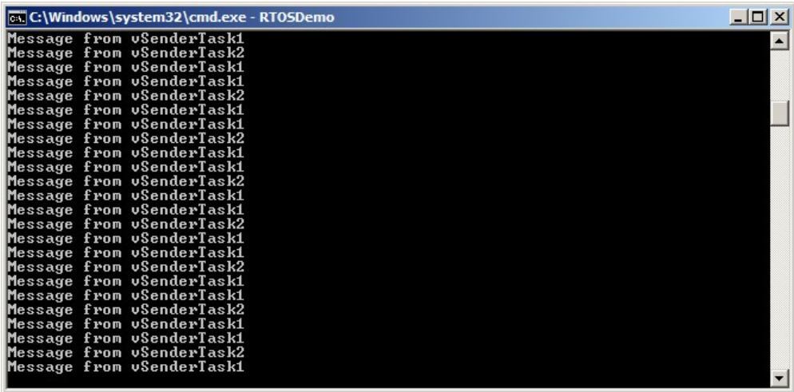

<a id="Pic5.6.5-1"></a>

### 更现实的队列集用例

示例5.6.5演示了一个非常简单的情况；队列集只包含队列，并且它包含的两个队列都用于发送字符指针。在实际应用程序中，队列集可能同时包含队列和信号量，并且队列可能并不都保存相同的数据类型。在这种情况下，在使用 xQueueSelectFromSet() 返回的值之前，有必要测试该返回值。示例5.6.6演示了当集合具有以下成员时如何使用 xQueueSelectFromSet() 返回的值：

* 二进制信号量
* 读取字符指针的队列
* 读取uint32_t值的队列

```cpp
/* 从中接收字符指针的队列的句柄。 */
QueueHandle_t xCharPointerQueue;
/* T用于接收 uint32_t 类型值的队列句柄 */
QueueHandle_t xUint32tQueue;
/* 二进制信号量句柄  */
SemaphoreHandle_t xBinarySemaphore;
/* 包含上述两个队列和二进制信号量的队列集合 */
QueueSetHandle_t xQueueSet;

void vAMoreRealisticReceiverTask(void *pvParameters)
{
    QueueSetMemberHandle_t xHandle;
    char *pcReceivedString;
    uint32_t ulRecievedValue;
    const TickType_t xDelay100ms = pdMS_TO_TICKS(100);
    for (;;)
    {
        /* 在队列集合上阻塞等待最多 100ms，直到集合中的某个成员包含数据 */
        xHandle = xQueueSelectFromSet(xQueueSet, xDelay100ms);
        /* 检查 xQueueSelectFromSet() 的返回值。如果返回值为 NULL，
    则表示 xQueueSelectFromSet() 调用超时。如果返回值不为 NULL，
    则返回值将是集合中某个成员的句柄。QueueSetMemberHandle_t 类型的值
    可以转换为 QueueHandle_t 或 SemaphoreHandle_t。是否需要显式转换取决于编译器。 */
        if (xHandle == NULL)
        {
            /* xQueueSelectFromSet() 调用超时 */
        }
        else if (xHandle == (QueueSetMemberHandle_t)xCharPointerQueue)
        {
            /* xQueueSelectFromSet() 返回了接收字符指针的队列句柄。
        从该队列读取数据。已知队列包含数据，因此阻塞时间设为 0。 */
            xQueueReceive(xCharPointerQueue, &pcReceivedString, 0);
            /* 可以在此处处理接收到的字符指针... */
        }
        else if (xHandle == (QueueSetMemberHandle_t)xUint32tQueue)
        {
            /* xQueueSelectFromSet() 返回了接收 uint32_t 类型的队列句柄。
        从该队列读取数据。已知队列包含数据，因此阻塞时间设为 0。 */
            xQueueReceive(xUint32tQueue, &ulRecievedValue, 0);
            /* 可以在此处处理接收到的值...  */
        }
        else if (xHandle == (QueueSetMemberHandle_t)xBinarySemaphore)
        {
            /* xQueueSelectFromSet() 返回了二进制信号量的句柄。
            现在获取信号量。已知信号量可用，因此阻塞时间设为 0。*/
            xSemaphoreTake(xBinarySemaphore, 0);
            /* 可以在获取信号量后执行必要的处理... */
        }
    }
}
```

## 使用队列创建邮箱

嵌入式社区内的术语尚未达成共识，“邮箱”在不同的 RTOS 中具有不同的含义。在本书中，术语“邮箱”用于指代长度为 1 的队列。队列可以被描述为邮箱，因为它在应用程序中的使用方式，而不是因为它与队列有功能差异：

* 队列用于将数据从一个任务发送到另一任务，或从中断服务例程发送到任务。发送者将一个项目放入队列中，接收者从队列中删除该项目。数据通过队列从发送方传递到接收方。
* 邮箱用于保存可由任何任务或任何中断服务例程读取的数据。数据不会通过邮箱，而是保留在邮箱中，直到被覆盖。发件人覆盖邮箱中的值。接收方从邮箱中读取该值，但不会从邮箱中删除该值

本章介绍两个队列 API 函数，它们使队列能够用作邮箱。

```cpp
/* 邮箱可以容纳固定大小的数据项。数据项的大小是在创建邮箱（队列）时设置的。在此示例中，创建邮箱来保存Example_t 结构。
   Example_t 包含一个时间戳，允许邮箱中保存的数据记录邮箱上次更新的时间。
   本示例中使用的时间戳仅用于演示目的 - 邮箱可以保存应用程序编写者想要的任何数据，并且数据不需要包含时间戳。*/
typedef struct xExampleStructure
{
    TickType_t xTimeStamp;
    uint32_t ulValue;
} Example_t;
/* 邮箱是一个队列，因此它的句柄存储在QueueHandle_t类型的变量中。 */
QueueHandle_t xMailbox;
void vAFunction(void)
{
    /* 创建将用作邮箱的队列。队列的长度为 1，以允许它与 xQueueOverwrite() API 函数一起使用，如下所述。 */
    xMailbox = xQueueCreate(1, sizeof(Example_t));
}
```

### xQueueOverwrite 函数

与 xQueueSendToBack() API 函数一样，xQueueOverwrite() API 函数将数据发送到队列。与 xQueueSendToBack() 不同，如果队列已满，则 xQueueOverwrite() 会覆盖队列中已有的数据。

xQueueOverwrite() 只能与长度为 1 的队列一起使用。覆盖模式总是写入队列的前端并更新队列的前端指针，但不会更新等待的消息。如果定义了 configASSERT，则当队列长度 > 1 时将发生断言。

> 注意：切勿从中断服务例程中调用 xQueueOverwrite()。应使用中断安全版本 xQueueOverwriteFromISR() 来代替它。

```cpp
BaseType_t xQueueOverwrite( QueueHandle_t xQueue, const void * pvItemToQueue );
```

xQueueOverwrite入参和出参：

* xQueue：数据发送（写入）到的队列的句柄。队列句柄将从调用用于创建队列的 xQueueCreate() 或 xQueueCreateStatic() 返回。
* pvItemToQueue：指向要复制到队列中的数据的指针。队列可以容纳的每个项目的大小是在创建队列时设置的，因此这么多字节将从pvItemToQueue复制到队列存储区域。
* 出参：即使队列已满，xQueueOverwrite() 也会写入队列，因此 pdPASS 是唯一可能的返回值。

```cpp
void vUpdateMailbox(uint32_t ulNewValue)
{
    /* Example_t was defined in Listing 5.28. */
    Example_t xData;
    /* 将新数据写入Example_t结构中。*/
    xData.ulValue = ulNewValue;
    /* 使用 RTOS 滴答计数作为存储在 Example_t 结构中的时间戳。 */
    xData.xTimeStamp = xTaskGetTickCount(); /* 使用 RTOS 滴答计数作为存储在 Example_t 结构中的时间戳。 */
    xQueueOverwrite(xMailbox, &xData);
}
```

### xQueuePeek函数

xQueuePeek()从队列接收（读取）项目，而不从队列中删除该项目。

xQueuePeek()从队列头接收数据，而不修改队列中存储的数据，也不修改数据在队列中存储的顺序。

> 注意：切勿从中断服务例程中调用 xQueuePeek()。应使用中断安全版本 xQueuePeekFromISR() 代替它。

xQueuePeek()与xQueueReceive()具有相同的函数参数和返回值。

```cpp
BaseType_t xQueuePeek(QueueHandle_t xQueue,
                      void *const pvBuffer,
                      TickType_t xTicksToWait);

BaseType_t vReadMailbox(Example_t *pxData)
{
    TickType_t xPreviousTimeStamp;
    BaseType_t xDataUpdated;
    /* 该函数使用从邮箱接收到的最新值更新Example_t结构。在被新数据覆盖之前，记录 *pxData 中已包含的时间戳。 */
    xPreviousTimeStamp = pxData->xTimeStamp;
    /* 使用邮箱中包含的数据更新 pxData 指向的 Example_t 结构。
    如果此处使用 xQueueReceive()，则邮箱将保留为空，并且任何其他任务都无法读取数据。
    使用 xQueuePeek() 而不是 xQueueReceive() 可确保数据保留在邮箱中。
    指定了阻塞时间，因此如果邮箱为空，则调用任务将置于阻塞状态以等待邮箱包含数据。
    使用无限块时间，因此没有必要检查从 xQueuePeek() 返回的值，因为 xQueuePeek() 仅当数据可用时才会返回。 */
    xQueuePeek(xMailbox, pxData, portMAX_DELAY); /* 如果自上次调用此函数以来从邮箱读取的值已更新，则返回 pdTRUE。否则返回 pdFALSE。*/
    if (pxData->xTimeStamp > xPreviousTimeStamp)
    {
        xDataUpdated = pdTRUE;
    }
    else
    {
        xDataUpdated = pdFALSE;
    }
    return xDataUpdated;
}
```

# 软件定时器管理

## 章节简介和范围

软件定时器用于安排函数在未来的设定时间执行，或者以固定频率定期执行。软件定时器执行的函数称为软件定时器的回调函数。

软件定时器由 FreeRTOS 内核实现并受其控制。它们不需要硬件支持，并且与硬件定时器或硬件计数器无关。

请注意，根据 FreeRTOS 使用创新设计确保最大效率的理念，软件计时器不会使用任何处理时间，除非实际执行软件计时器回调函数。

软件定时器功能是可选的。要包含软件定时器功能：

* 将 FreeRTOS 源文件 FreeRTOS/Source/timers.c 构建为项目的一部分。
* 在应用程序的 FreeRTOSConfig.h 头文件中定义下面详细说明的常量：
  * configUSE_TIMERS：在FreeRTOSConfig.h中设置为1
  * configTIMER_TASK_PRIORITY：将定时器服务任务的优先级设置在 0 和 ( configMAX_PRIORITIES - 1 ) 之间。
  * configTIMER_QUEUE_LENGTH：设置定时器命令队列在任一时刻可以容纳的未处理命令的最大数量。
  * configTIMER_TASK_STACK_DEPTH：设置分配给定时器服务任务的堆栈大小（以字为单位，而不是字节）

### 范围

  本章包括：

* 软件定时器的特性与任务的特性相比。
* RTOS 守护进程任务
* 定时器命令队列。
* 一次性软件定时器和周期性软件定时器之间的区别。
* 如何创建、启动、重置和更改软件计时器的周期。

## 软件定时器回调函数

软件定时器回调函数以 C 函数的形式实现。它们唯一的特别之处是它们的原型，它必须返回 void，并采用软件计时器的句柄作为其唯一参数。回调函数原型如下所示。

```cpp
void ATimerCallback(TimerHandle_t xTimer);
```

软件定时器回调函数从头到尾执行，并以正常方式退出。它们应该保持较短，并且不得进入阻塞状态。

> 注意：正如我们将看到的，软件定时器回调函数在 FreeRTOS 调度程序启动时自动创建的任务上下文中执行。因此，软件定时器回调函数切勿调用 FreeRTOS API 函数，否则会导致调用任务进入阻塞状态，这一点至关重要。可以调用 xQueueReceive() 等函数，但前提是函数的 xTicksToWait 参数（指定函数的阻塞时间）设置为 0。调用 vTaskDelay() 等函数是不行的，因为调用 vTaskDelay() 始终会将调用任务置于阻塞状态。

## 软件定时器的属性和状态

### 软件定时器的周期

软件定时器的“周期”是软件定时器启动和软件定时器回调函数执行之间的时间。

### 一次性和自动重新加载计时器

有两种软件计时器：

* 一次性计时器：一旦启动，一次性计时器将仅执行其回调函数一次。一次性计时器可以手动重新启动，但不会自行重新启动。
* 自动重新加载计时器：一旦启动，自动重新加载计时器将在每次到期时重新启动，从而定期执行其回调函数。

下图显示了一次性定时器和自动重载定时器之间的行为差异。垂直虚线标记了滴答中断发生的时间。

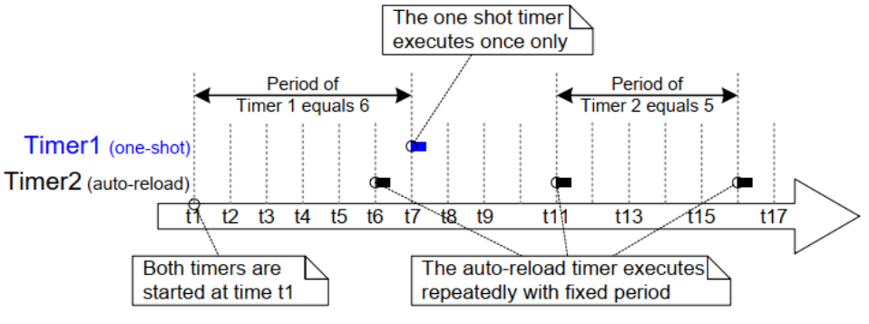

* Timer1：定时器 1 是一个单次定时器，周期为 6 个滴答声。它在时间 t1 启动，因此其回调函数在 6 个时钟周期后的时间 t7 执行。由于定时器1是一次性定时器，其回调函数不会再次执行
* Timer2：定时器 2 是一个自动重载定时器，周期为 5 个滴答声。它在时间 t1 启动，因此其回调函数在时间 t1 之后每 5 个周期执行一次。在上图中，时间为 t6、t11 和 t16。

### 软件定时器状态

软件定时器状态有以下两种：

* 休眠：休眠软件定时器存在，并且可以通过其句柄引用，但未运行，因此其回调函数不会执行。
* 运行：运行软件定时器将在自软件定时器进入运行状态或自上次重置软件定时器以来等于其周期的时间过去后执行其回调函数。

下面两图分别显示自动重载计时器和一次性计时器的休眠和运行状态之间可能的转换。两个图之间的主要区别在于计时器到期后进入的状态；自动重载定时器执行回调函数后重新进入运行状态，一次性定时器执行回调函数后进入休眠状态。

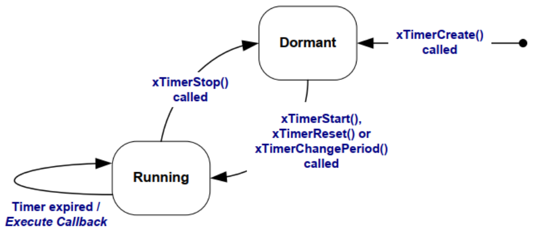

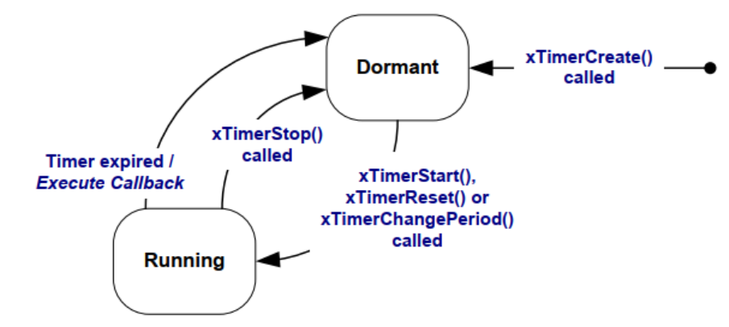

xTimerDelete() API 函数删除计时器。计时器可以随时删除。

```cpp
BaseType_t xTimerDelete(TimerHandle_t xTimer, TickType_t xTicksToWait);
/*
xTimer：正在删除的计时器的句柄。
xTicksToWait：指定调用任务应保持在阻塞状态以等待删除命令成功发送到计时器命令队列的时间（以时钟周期为单位）（如果在调用 xTimerDelete() 时队列已满）。如果在调度程序启动之前调用 xTimerDelete()，则 xTicksToWait 将被忽略。
返回值：
pdPASS：如果命令成功发送到定时器命令队列，则返回 pdPASS。
pdFAIL：如果即使在 xBlockTime 周期过去后仍无法将删除命令发送到计时器命令队列，则将返回 pdFAIL。
/*
```

## 软件定时器的上下文

### RTOS 守护进程（定时器服务）任务

所有软件定时器回调函数都在同一 RTOS 守护程序（或“定时器服务”）任务的上下文中执行[^10]。

守护进程任务是一个标准的 FreeRTOS 任务，在调度程序启动时自动创建。它的优先级和堆栈大小分别由 configTIMER_TASK_PRIORITY 和 configTIMER_TASK_STACK_DEPTH 编译时配置常量设置。这两个常量都在 FreeRTOSConfig.h 中定义。

软件定时器回调函数不得调用会导致调用任务进入阻塞状态的 FreeRTOS API 函数，因为这样做会导致守护任务进入阻塞状态。

### 定时器命令队列

软件计时器 API 函数将命令从调用任务发送到称为“计时器命令队列”的队列上的守护程序任务。如下图所示。命令示例包括“启动计时器”、“停止计时器”和“重置计时器”。

定时器命令队列是一个标准的 FreeRTOS 队列，在调度程序启动时自动创建。定时器命令队列的长度由 FreeRTOSConfig.h 中的 configTIMER_QUEUE_LENGTH 编译时配置常量设置。

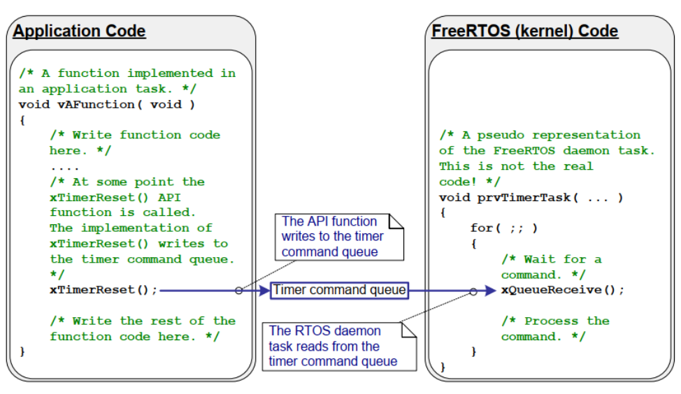

### 守护进程任务调度

守护进程任务的调度与任何其他 FreeRTOS 任务一样；当它是能够运行的最高优先级任务时，它只会处理命令或执行计时器回调函数。下面两图演示了 configTIMER_TASK_PRIORITY 设置如何影响执行模式。

下图显示了当守护任务的优先级低于调用 xTimerStart() API 函数的任务的优先级时的执行模式。

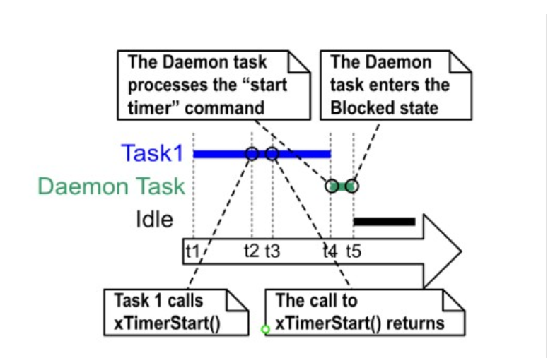

其中任务1的优先级高于守护任务的优先级，守护任务的优先级高于Idle任务的优先级：

* t1时间：任务1处于运行状态，守护任务处于阻塞状态。如果有命令发送到定时器命令队列，守护任务将离开阻塞状态，在这种情况下，它将处理该命令，或者如果软件定时器到期，在这种情况下，它将执行软件定时器的回调函数。
* t2时间：任务 1 调用 xTimerStart()。xTimerStart() 向定时器命令队列发送命令，导致守护任务离开阻塞状态。任务 1 的优先级高于守护任务的优先级，因此守护任务不会抢占任务 1。任务1仍处于运行状态，守护任务已离开阻塞状态并进入就绪状态。
* t3时间：任务 1 完成 xTimerStart() API 函数的执行。任务1从函数开始到函数结束执行xTimerStart()，没有离开Running状态。
* t4时间：任务 1 调用 API 函数，导致其进入阻塞状态。守护任务现在是Ready状态下优先级最高的任务，因此调度程序选择守护任务作为进入Running状态的任务。然后守护任务开始处理任务 1 发送到定时器命令队列的命令。

> 注意：正在启动的软件计时器的到期时间是从“启动计时器”命令发送到计时器命令队列的时间开始计算的，而不是从守护程序任务从计时器命令队列接收到“启动计时器”命令的时间开始计算。

* t5时间：守护任务已完成处理任务 1 发送给它的命令，并尝试从计时器命令队列接收更多数据。定时器命令队列为空，因此守护任务重新进入Blocked状态。如果命令被发送到计时器命令队列，或者软件计时器到期，守护程序任务将再次离开阻塞状态。Idle任务现在是Ready状态下优先级最高的任务，因此调度器选择Idle任务作为进入Running状态的任务。

下图显示了与上图类似的场景，但这次守护任务的优先级高于调用 xTimerStart() 的任务的优先级。

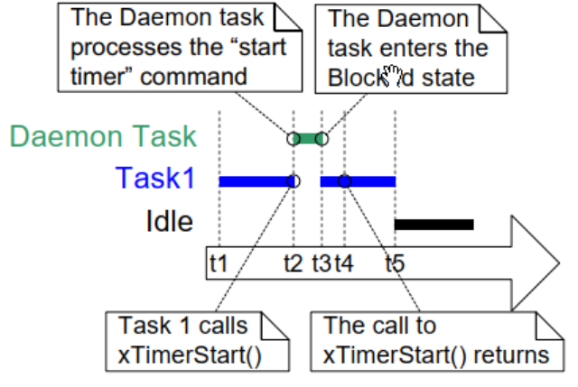

其中守护任务的优先级高于任务1的优先级，任务1的优先级高于Idle任务的优先级：

* t1时间：和之前一样，任务 1 处于运行状态，守护任务处于阻塞状态。
* t2时间：任务1调用xTimerStart()。xTimerStart() 向定时器命令队列发送命令，导致守护任务离开阻塞状态。守护任务的优先级高于任务1的优先级，因此调度程序选择守护任务作为进入运行状态的任务。任务 1 在完成执行 xTimerStart() 函数之前被守护任务抢占，现在处于就绪状态。守护任务开始处理任务1发送到定时器命令队列的命令。
* t3时间：守护任务已完成处理任务 1 发送给它的命令，并尝试从计时器命令队列接收更多数据。定时器命令队列为空，因此守护任务重新进入Blocked状态。任务1现在是Ready状态中优先级最高的任务，因此调度程序选择Task 1作为进入Running状态的任务。
* t4时间：任务 1 在执行完 xTimerStart() 函数之前就被守护任务抢占，只有在重新进入 Running 状态后才退出（从）xTimerStart() 函数。
* t5时间：任务 1 调用 API 函数，导致其进入阻塞状态。 Idle任务现在是Ready状态下优先级最高的任务，因此调度器选择Idle任务作为进入Running状态的任务。

在图 6.5 所示的场景中，从任务 1 向定时器命令队列发送命令到守护任务接收并处理该命令之间经过了一段时间。在图6.6所示的场景中，在任务1从发送命令的函数返回之前，守护任务已经接收并处理了任务1发送给它的命令。

发送到定时器命令队列的命令包含时间戳。时间戳用于计算应用程序任务发送的命令与守护程序任务处理的同一命令之间经过的任何时间。例如，如果发送“启动计时器”命令来启动周期为 10 个时钟周期的计时器，则时间戳用于确保正在启动的计时器在命令发送后 10 个时钟周期到期，而不是在守护程序任务处理命令后的 10 个时钟周期到期。

## 创建并启动软件定时器

### xTimerCreate函数

FreeRTOS 还包含 xTimerCreateStatic() 函数，该函数在编译时静态分配创建计时器所需的内存：软件计时器必须在使用之前显式创建。

软件定时器由 TimerHandle_t 类型的变量引用。 xTimerCreate() 用于创建软件定时器并返回 TimerHandle_t 来引用它创建的软件定时器。软件定时器是在休眠状态下创建的。

软件计时器可以在调度程序运行之前创建，也可以在调度程序启动后从任务创建。

```cpp
TimerHandle_t xTimerCreate(const char* const pcTimerName, const TickType_t xTimerPeriodInTicks,
                           const BastType_t xAutoReload, void* const pvTimerID,
                           TimerCallbackFunction_t pxCallbackFunction);
```

xTimerCreate入参和出参：

* pcTimerName：计时器的描述性名称。 FreeRTOS 不会以任何方式使用它。它纯粹是作为调试辅助工具而包含在内。通过人类可读的名称来识别计时器比尝试通过句柄来识别计时器要简单得多。
* xTimerPeriodInTicks：计时器的周期以刻度为单位指定。 pdMS_TO_TICKS() 宏可用于将以毫秒为单位的时间转换为以刻度为单位的时间。不能为 0。
* xAutoReload：将 xAutoReload 设置为 pdTRUE 以创建自动重新加载计时器。将 xAutoReload 设置为 pdFALSE 以创建一次性计时器。
* pvTimerID：每个软件定时器都有一个ID值。 ID 是一个空指针，应用程序编写者可以将其用于任何目的。当多个软件定时器使用同一个回调函数时，ID 特别有用，因为它可用于提供定时器特定的存储。本章的示例演示了定时器 ID 的使用。pvTimerID 为正在创建的任务的 ID 设置初始值。
* pxCallbackFunction：软件定时器回调函数只是前面提到的ATimerCallback函数。 pxCallbackFunction 参数是指向函数的指针（实际上，只是函数名称），用作正在创建的软件计时器的回调函数。
* 出参
  * 如果返回 NULL，则无法创建软件计时器，因为没有足够的堆内存可供 FreeRTOS 分配必要的数据结构
  * 如果返回非NULL值，则表明软件定时器创建成功。返回值是创建的定时器的句柄
  * 第 3 章提供了有关堆内存管理的更多信息。

### xTimerStart函数

xTimerStart()用于启动处于休眠状态的软件定时器，或重置（重新启动）处于运行状态的软件定时器。 xTimerStop() 用于停止处于运行状态的软件定时器。停止软件定时器与将定时器转换为休眠状态相同。

xTimerStart() 可以在调度程序启动之前调用，但是完成此操作后，软件计时器直到调度程序启动时才会真正启动。

> 注意：切勿从中断服务例程中调用 xTimerStart()。应使用中断安全版本 xTimerStartFromISR() 来代替它。

```cpp
BaseType_t xTimerStart(TimerHandle_t xTimer, TickType_t xTicksToWait);
```

xTimerStart入参和出参：

* xTimer：正在启动或重置的软件定时器的句柄。该句柄将从调用用于创建软件计时器的 xTimerCreate() 返回。
* xTicksToWait：
  * xTimerStart() 使用计时器命令队列将“启动计时器”命令发送到守护程序任务。 xTicksToWait 指定调用任务应保持在阻塞状态以等待计时器命令队列上的空间变得可用的最长时间（如果队列已满）。
  * 如果 xTicksToWait 为零且计时器命令队列已满，xTimerStart() 将立即返回。
  * 区块时间以滴答周期为单位指定，因此它表示的绝对时间取决于滴答频率。宏 pdMS_TO_TICKS() 可用于将以毫秒为单位的时间转换为以刻度为单位的时间。
  * 如果在 FreeRTOSConfig.h 中将 INCLUDE_vTaskSuspend 设置为 1，则将 xTicksToWait 设置为 portMAX_DELAY 将导致调用任务无限期地保持在阻塞状态（没有超时），以等待计时器命令队列中的空间变得可用。
  * 如果在启动调度程序之前调用 xTimerStart()，则忽略 xTicksToWait 的值，并且 xTimerStart() 的行为就像 xTicksToWait 已设置为零一样。
* 出参：两种可能
  * pdPASS：仅当“启动计时器”命令成功发送到计时器命令队列时，才会返回 pdPASS。
    * 如果守护任务的优先级高于调用 xTimerStart() 的任务的优先级，则调度程序将确保在 xTimerStart() 返回之前处理启动命令。这是因为一旦定时器命令队列中有数据，守护任务就会抢占调用 xTimerStart() 的任务。
    * 如果指定了阻塞时间（xTicksToWait 不为零），则调用任务有可能在函数返回之前被置于阻塞状态以等待计时器命令队列中的空间变得可用，但在阻塞时间到期之前数据已成功写入计时器命令队列。
  * pdFAIL：如果由于队列已满而无法将“启动计时器”命令写入计时器命令队列，则将返回 pdFAIL。如果指定了阻塞时间（xTicksToWait 不为零），则调用任务将被置于阻塞状态，以等待守护进程任务在计时器命令队列中腾出空间，但指定的阻塞时间在此之前已过期。

### 示例6.1：创建一次性和自动重新加载计时器

```cpp
/* 分配给一次性定时器和自动重新加载定时器的周期分别为 3.333 秒和半秒。 */
#define mainONE_SHOT_TIMER_PERIOD pdMS_TO_TICKS(3333)
#define mainAUTO_RELOAD_TIMER_PERIOD pdMS_TO_TICKS(500)
int main(void)
{
    TimerHandle_t xAutoReloadTimer, xOneShotTimer;
    BaseType_t xTimer1Started, xTimer2Started;
    /* 创建一次性计时器，并将创建的计时器的句柄存储在 xOneShotTimer 中。 */
    xOneShotTimer = xTimerCreate(
        /* 软件计时器的文本名称 - FreeRTOS 不使用。 */
        "OneShot",
        /* 软件定时器的周期（以滴答为单位）。 */
        mainONE_SHOT_TIMER_PERIOD,
        /* 将 uxAutoRealod 设置为 pdFALSE 会创建一次性软件计时器。 */
        pdFALSE,
        /* 此示例不使用计时器 ID。 */
        0,
        /* 正在创建的软件定时器要使用的回调函数。 */
        prvOneShotTimerCallback);
    /* 创建自动重载计时器，并将创建的计时器的句柄存储在 xAutoReloadTimer 中。 */
    xAutoReloadTimer = xTimerCreate(
        /* 软件计时器的文本名称 - FreeRTOS 不使用。 */
        "AutoReload",
        /* 软件定时器的周期（以滴答为单位）。 */
        mainAUTO_RELOAD_TIMER_PERIOD,
        /* 将 uxAutoRealod 设置为 pdTRUE 会创建一个自动重新加载计时器。 */
        pdTRUE,
        /* 此示例不使用计时器 ID。 */
        0,
        /* 正在创建的软件定时器要使用的回调函数。 */
        prvAutoReloadTimerCallback);
    /* 检查软件定时器是否已创建。 */
    if ((xOneShotTimer != NULL) && (xAutoReloadTimer != NULL))
    {
        /* 启动软件计时器，使用块时间 0（无块时间）。调度程序尚未启动，因此此处指定的任何块时间都将被忽略。*/
        xTimer1Started = xTimerStart(xOneShotTimer, 0);
        xTimer2Started = xTimerStart(xAutoReloadTimer, 0);
        /* xTimerStart() 的实现使用计时器命令队列，如果计时器命令队列已满，xTimerStart() 将失败。
        定时器服务任务在调度程序启动之前不会创建，因此发送到命令队列的所有命令都将保留在队列中，
        直到调度程序启动后。检查对 xTimerStart() 的两次调用是否已通过。 */
        if ((xTimer1Started == pdPASS) && (xTimer2Started == pdPASS))
        {
            /* Start the scheduler. */
            vTaskStartScheduler();
        }
    }
    /* As always, this line should not be reached. */
    for (;;)
        ;
}

static void prvOneShotTimerCallback(TimerHandle_t xTimer)
{
    TickType_t xTimeNow;
    /* 获取当前的滴答数。 */
    xTimeNow = xTaskGetTickCount();
    /* 输出一个字符串来显示回调执行的时间。 */
    vPrintStringAndNumber("One-shot timer callback executing", xTimeNow);
    /* 文件范围变量。*/
    ulCallCount++;
}

static void prvAutoReloadTimerCallback(TimerHandle_t xTimer)
{
    TickType_t xTimeNow;
    /* 获取当前的滴答数。 */
    xTimeNow = xTaskGetTickCount();
    /* 输出一个字符串来显示回调执行的时间。 */
    vPrintStringAndNumber("Auto-reload timer callback executing", xTimeNow);
    ulCallCount++;
}
```

下图显示了自动重载定时器的回调函数以500个周期(半秒)的固定周期执行，一次性定时器的回调函数仅在周期计数为3333时执行一次。

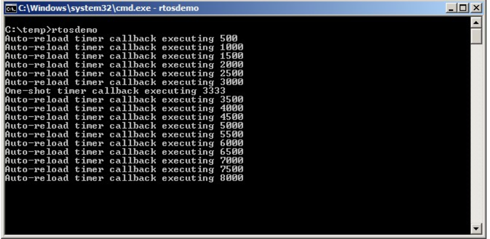

## 计时器 ID


[^1]: 第4.13节描述了调度算法。
[^2]: 这是一种过度简化，因为heap_2存储了堆区域内各块大小信息，因此这两个拆分块的总量实际上会小于25。
[^3]: 这是一个简化处理，因为heap_4用于存储堆区内部块大小的信息，因此两个分裂后的块实际总和将少于200字节。
[^4]: 截图显示，在执行下一个任务之前，每个任务恰好打印一次其消息。这是使用FreeRTOS Windows模拟器产生的仿真场景。Windows模拟器并非真正实时。此外，向Windows控制台写入需要相对较长的时间，并导致一系列Windows系统调用。在具有快速且非阻塞打印功能的真实嵌入式目标上执行相同代码，可能导致在切换到其他任务运行之前，每个任务多次打印其字符串。
[^5]: 值得注意的是，时间片结束并不是调度器选择新任务运行的唯一地点。正如我们将在本书中展示的那样，当当前执行的任务进入阻塞状态后，调度器也会立即选择一个新任务运行，或者当一个中断将一个更高优先级的任务移动到就绪状态时。
[^6]: 即使在使用FreeRTOS的特殊低功耗特性时，情况也是如此，在这种情况下，运行FreeRTOS的微控制器将进入低功耗模式，如果应用程序创建的任务都无法执行。
[^7]: 本书后文将介绍在任务之间安全共享资源的方法。FreeRTOS本身提供的资源，如队列和信号量，总是可以在任务之间安全共享。
[^8]: FreeRTOS消息缓冲，如在待定章节中所述，提供了一种比持有可变长度消息的队列更轻量级的替代方案。
[^9]: FreeRTOS 消息缓冲区是保存可变长度数据的队列的轻量级替代方案
[^10]: 该任务过去被称为“定时器服务任务”，因为最初它仅用于执行软件定时器回调函数。现在，同一任务也用于其他目的，因此它被称为“RTOS 守护程序任务”这一更通用的名称。 