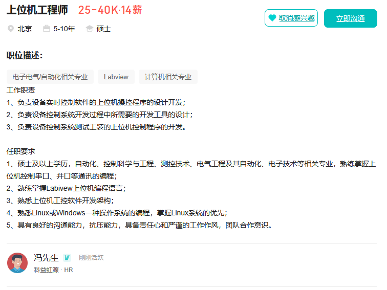

# 目标岗位




# 总体规划

系统层+控制软件+并发+通信

ChatGpt

* https://chatgpt.com/g/g-p-68fb9e2b00bc81919086423ac5b23901-gong-zuo-ti-sheng/shared/c/68fba1ce-d9f4-8322-ba41-571015669aa4?owner_user_id=user-11EIlO4Dk22i3Em5q6tXqT3e

* https://chatgpt.com/g/g-p-68fb9e2b00bc81919086423ac5b23901-gong-zuo-ti-sheng/c/698a0e44-f9a4-8324-942a-16826a3dc311

## 知识点

### RTOS

RTOS：(Read-Time Operating System, 实时操作系统)，比如VxWorks、FreeRTOS(开源)

* 特性
  * 确定性：任务响应时间固定，比如1s内必须完成
  * 任务优先级调度：哪个任务更重要、优先级更高，内核实时切换
  * 轻量级多任务：占用内存少，适合嵌入式环境
  * 无内存分页：直接访问内存，防止延时
  * 任务同步机制：信号量、消息队列、互斥锁等

> VxWorks屏蔽了底层调度器原理，只关注工程使用层，包括创建任务、信号量和消息队列、网络通信和驱动适配、在Workbench里配置BSP；
>
> FreeRTOS可以实现任务调度算法是怎么写的(时间片、优先级)、信号量和消息队列如何实现、上下文切换、Tick中断驱动调度

### BSP

BSP(Board Support Package, 板级支持包)，连接操作系统内核和硬件桥梁

> RTOS内核本身不懂硬件(CPU寄存器、定时器、中断、串口...)
>
> BSP就是告诉RTOS：硬件是这样工作的

一个典型的VxWorks BSP或FreeRTOS移植包，大致包括以下部分

* startup.S/bootrom.c
  * 启动代码，初始化CPU、内存、堆栈，比如上电后第一步执行的汇编
* hwig/
  * 硬件接口层(Timer、UART、Ethernet)，比如初始化中断控制器
* config.h/bsp.h
  * 硬件配置宏定义，比如CPU型号、主频、外设基址
* linker script(.Id)
  * 内存布局搅拌，比如ROM/RAM段划分
* sysLib.c
  * 系统初始化函数(sysHwInit、sysClkInit等)，VxWorks特有
* Makefile
  * 编译该BSP构建规则，比如指定CPU架构、编译选项

```bash
   ┌──────────┐
   │ Bootloader│  ← 由厂商提供（U-Boot、ROM Monitor等）
   └────┬──────┘
        │
        ▼
   ┌──────────┐
   │   BSP    │  ← 初始化CPU/内存/中断/时钟/串口
   └────┬──────┘
        │
        ▼
   ┌──────────┐
   │ RTOS内核 │  ← 调度任务、信号量、驱动注册
   └────┬──────┘
        │
        ▼
   ┌──────────┐
   │ 应用程序 │  ← taskSpawn()/main()
   └──────────┘
```

### 中断和时钟

* 中断：让CPU**立即打断当前任务**，去执行更紧急事件的机制
  * 在RTOS中作用
    * 响应外部事件(如串口收到数据、网络包到达)
    * 触发任务调度(让RTOS根据优先级切换任务)
    * 维持实时性(保证系统对关键事件的快速反应)
* 时钟中断：系统中最固定、最有规律的中断，由一个硬件定时器定期触发，`sysClkConnect、sysClkEnable`
  * 在RTOS中作用
    * 更新系统时间
    * 触发任务延时(vTaskDelay等)
    * 检查定时器任务
    * 实现时间片轮转

## 目标规划

|      阶段      |                      目标                      | 关键字                          | 产出                |
| :------------: | :--------------------------------------------: | ------------------------------- | ------------------- |
|  RTOS内核仿真  |            Linux上模拟小型RTOS内核             | 任务调度/信号量/定时器/消息队列 | `miniRTOS`项目      |
|  任务通信系统  |          实现跨任务通信和RPC通用框架           | socket/RPC/Protobuf/gRPC        | `ninComm`项目       |
| 控制层与上位机 | 模拟多任务控制系统(生产线或机器人)并用Qt可视化 | 并发/数据可视化/状态同步        | Qt界面+后端协同     |
|  系统架构整合  |      形成一个完整的`工业实时系统模拟平台`      | 模块化/多线程调度/实时日志      | `miniIndustrialSim` |

## 总体项目架构图

```bash
+--------------------------------------------------------------+
|                          Qt GUI                              |
|             (状态监控 + 参数配置 + 日志查看)                 |
+---------------------------↑----------------------------------+
|                      miniComm 通信层                         |
|    RPC/gRPC 模拟接口 + 心跳 + 数据共享 + 异步队列             |
+---------------------------↑----------------------------------+
|                       miniRTOS 内核层                        |
|   任务管理 | 调度器 | 信号量 | 消息队列 | 时间片 | 内存池     |
+---------------------------↑----------------------------------+
|                   模拟驱动/控制任务                          |
|   模拟电机 / 传感器 / 控制逻辑 / 异步数据刷新               |
+--------------------------------------------------------------+
```

### 学习内容与价值

| 能力           | 内容                     | 实际价值             |
| -------------- | ------------------------ | -------------------- |
| 实时调度       | 模拟任务优先级、时间片   | 掌握RTOS调度机制     |
| 并发编程       | 信号量、消息队列、任务池 | 提升并发编程能力     |
| 通信框架设计   | RPC/gRPC/PubSub          | 掌握分布式通信思想   |
| 系统框架设计   | 模块化+解耦+分层         | 学习工业控制软件架构 |
| 上位机集成     | Qt+实时数据同步          | 提升完整系统能力     |
| 调试与性能分析 | 日志、延迟、统计分析     | 符合工程开发流程     |

**工业控制系统仿真平台（软件模拟）**

- 独立设计并实现 RTOS-like 内核（任务调度、信号量、队列）
- 构建任务通信框架（基于 gRPC 异步通信）
- 设计 Qt 上位机，实时显示任务状态与通信延迟
- 支持任务优先级调度、超时检测与心跳机制
- 模拟工业控制系统完整架构，完全在 PC 上运行

# 项目

## miniRTOS(模拟实时内核)

* 目标：实现“任务调度+信号量+队列”的最小实时系统
* 技术点
  * C++实现线程池(模拟任务)
  * 条件变量/信号量实现任务同步
  * 实时任务模拟"Tick ISR"
  * 每个任务分配优先级+超时检测
* 产出
  * `task_create(taskFunc, priority)`
  * `sem_take/sem_give`
  * `msgQ_send/msgQ_recv`
  * 调度器自动轮转任务

### miniComm(通信框架)

* 实现任务间通信层

* 技术点

  * gRPC(或自定义轻量RPC)
  * Protobuf定义任务间消息格式
  * 实现发布/订阅机制(pubsub)
  * 实现TCP keep-alive、重连、心跳

* 产出

  * `ServiceRegister`模块(管理服务)
  * `TaskComm`类(封装发送/接收接口)
  * 异步RPC调用机制
  * 日志与状态上报

### Qt上位机(系统监控)

* 目标：Qt界面实时显示RTOS系统的任务状态与通信数据
* 技术点
  * QTableWidget显示任务信息(名称、优先级、状态)
  * QCustomPlot/QChar绘制实时波形(CPU、通信延迟)
  * QTimer+异步刷新机制
  * 通过socket或gRPC调取数据
* 产出
  * 实时任务状态界面
  * 通信性能监控曲线
  * 参数设置窗口(修改调度周期、优先级)

### miniIndustrialSim(整合)

* 目标：将RTOS内核、通信层、Qt界面整合为一个完整可运行系统
* 模拟场景示例(机器人生产线模拟)
  * TaskA：读取传感器数据(周期任务)
  * TaskB：计算控制量(高优先级任务)
  * TaskC：发送命令给执行器
  * miniComm：模拟外部通信(gRPC Client)
  * Qt：显示每个任务运行时间、消息队列深度、延迟
* 最终输出效果(Qt)
  * 各任务状态灯闪烁
  * 任务间消息延迟曲线
  * 系统CPU占用率模拟
  * 死锁检测、优先级反转实验按钮

## 高频数据采集+实时绘图

**高频数据采集 + 实时绘图**

- 1~5kHz
- 丢包 / 抖动
- Qt 绘图不卡

### 采集进程完整最小代码骨架

#### 内存序(memory_order)

c++11定义在`atomic.h`中

`背景`：多线程程序中，有三个层面会影响指令顺序

* 编译器优化重排
* CPU指令乱序执行
* 多核缓存一致性协议

默认下，CPU可以改变指令执行顺序，只要单线程语义不变，但是多线程中顺序十分重要。

C++内存模型允许告诉编译器：我对这个原子操作的顺序要求有多严格。

举个例子：

```cpp
std::atomic<int> flag = 0;
int data = 0;

Thread A:
data = 42;
flag.store(1, std::memory_order_relaxed);

Thread B:
if(flag.load(std::memory_order_relaxed))
    std::cout << data;

/*
 上述代码结果不一定打印42
 因为CPU可能重排为：
 	flag = 1
 	data = 42
 或者ThreadA在Core0，ThreadB在Core1，即使执行顺序不变
 	data = 42
 	flag = 1
 实际发生
 	1. data=42进入Core0的store buffer
 	2. flag=1进入Core0的store buffer
 	3. flag先被刷新到共享内存
 	4. data还在store buffer中
 所以线程B可能看到：
 	flag == 1
 	data == 0
*/

// 正确方法
Thread A:
data = 42;
flag.store(1, std::memory_order_release);
// release保证store之前的所有写都不能重排到store之后

Thread B:
// acquire保证load之后的读都不能重排到load之前
if(flag.load(std::memory_order_acquire))
    std::cout << data;

data = 42
↓
release(flag=1)
↓
acquire(flag==1)
↓
读取 data
```

内存序有下面类型：

| 类型    | 强度              | 用途               |
| ------- | ----------------- | ------------------ |
| relaxed | 最弱              | 只保证原子性       |
| acquire | 读屏障            | 保证后续读不被重排 |
| release | 写屏障            | 保证之前写不被重排 |
| acq_rel | acquire + release | 读写               |
| seq_cst | 最强              | 全局顺序一致       |

#### Linux下设置当前线程为实时调度线程

头文件`pthread.h`和`sched.h`

`SCHED_FIFO`特点：

* 先到先执行
* 不会被普通线程抢占
* 只有更高优先级线程才能打断
* 不时间片轮转(除非显示让出CPU)

普通线程默认`SCHED_OTHER`

```cpp
void set_realtime_priority(int priority)
{
    sched_param param;
    param.sched_priority = priority; //数字越大优先级越高

    if (pthread_setschedparam(
            pthread_self(),
            SCHED_FIFO, // Linux实时调度策略
            &param) != 0)
    {
        perror("Failed to set RT priority");
    }
}
```


### Qt实时绘图线程安全版

### Ring Buffer / DMA模型

描述：“PC上模拟呢一个DMA+Ring Buffer数据采集模型，生产者线程模拟硬件DMA连续写入，消费者线程模拟应用任务读取，并处理了写快读慢导致的数据覆盖问题。”

介绍：高速数据在生产者和消费者之间零拷贝、低阻塞流动的经典设备架构，是一种硬件+软件共同遵守的数据流模型。

环形缓冲区(Ring Buffer)：想象有一个首尾相连的数组

* 写指针走到尾->回到头
* 读指针追着写指针走
* 永不realloc
* 永不移动数据  

```cpp
[ ][ ][ ][ ][ ][ ][ ][ ]
 ↑                 ↑
read              write
```

主要是解决4个痛点：

| 普通队列    | Ring Buffer |
| ----------- | ----------- |
| malloc/free | 固定内存    |
| memcpy      | 原地读写    |
| cache抖动   | cache友好   |
| 容易阻塞    | 可无锁      |

**设备系统最怕抖动**，所以选用Ring Buffer。

DMA(Direct Memory Access) = 硬件直接写内存

* 不经过CPU
* 不走线程
* 不管代码完成度

软件只需要提前分配一块连续内存，告诉DMA起始地址和长度，最后按照规则"读走已经写好的数据"

DMA配Ring Buffer原因：

* DMA写到尾不能停
* 不能频繁换地址

所以就可以把"硬件DMA"映射到PC模拟项目

模拟关系：

| 真实设备    | PC模拟   |
| ----------- | -------- |
| 传感器      | 采集线程 |
| DMA控制器   | 写线程   |
| ISR         | 定时唤醒 |
| Ring Buffer | 固定数组 |
| 应用任务    | 处理线程 |


## 多客户端设备服务

**多客户端设备服务**

- 同时 5~10 个客户端
- 不互相阻塞
- 限流 / 超时

## “伪 RTOS”线程池

**“伪 RTOS”线程池**

- 优先级队列
- 超时检测
- 负载自适应

